

# 🎮 Awesome AI Games

### 793 curated game units. 520 qualifying source repositories.

  

 

> **A curated field guide to games attributed to GPT-6 Astra, Claude Opus, or Claude Fable.** 
> Every listed unit maps to a qualifying GitHub source repository. The model-evidence grade is visible on every entry.

---

## Top games by screenshot

Rank 30 games by the score of each game's best manually reviewed screenshot, not by source-quality score. Review composition, scene detail, visual coherence, and readable gameplay. Reward polished stylized art as well as realism; discount title cards, menus, concept art, and frames that do not show play. Treat this as a visual impression, not a runtime playtest or proof of AAA production quality. Select a thumbnail or title to inspect every image's score, rating method, and reason on the game's Markdown page. Secondary images use relative frame adjustments, not independent manual reviews.

<table>
<tr>
<td align="center" width="33%"><a href="games/turbo-kart-rally/readme.md">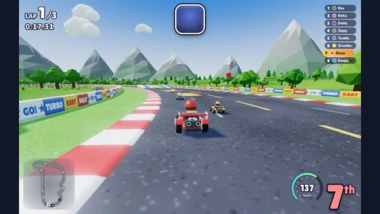</a> <a href="games/turbo-kart-rally/readme.md"><strong>Turbo Kart Rally</strong></a> · 📸 9.8/10</td>
<td align="center" width="33%"><a href="games/neural-sight/readme.md">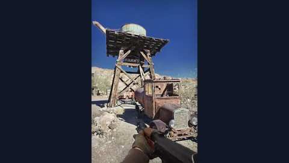</a> <a href="games/neural-sight/readme.md"><strong>Neural Sight</strong></a> · 📸 9.7/10</td>
<td align="center" width="33%"><a href="games/kart-royale/readme.md">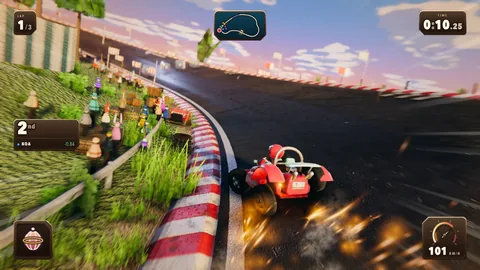</a> <a href="games/kart-royale/readme.md"><strong>Kart Royale</strong></a> · 📸 9.5/10</td>
</tr>
<tr>
<td align="center" width="33%"><a href="games/nerd-of-duty/readme.md">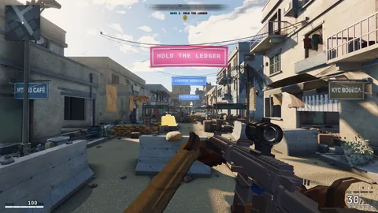</a> <a href="games/nerd-of-duty/readme.md"><strong>Nerd of Duty</strong></a> · 📸 9.4/10</td>
<td align="center" width="33%"><a href="games/vector-rush/readme.md">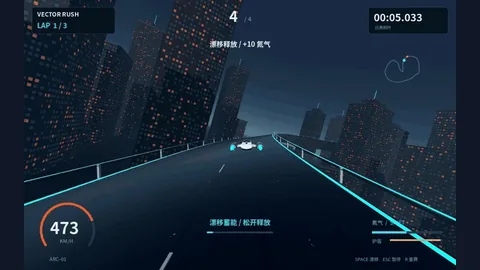</a> <a href="games/vector-rush/readme.md"><strong>VECTOR RUSH</strong></a> · 📸 9.3/10</td>
<td align="center" width="33%"><a href="games/turbo-kart-grand-prix/readme.md">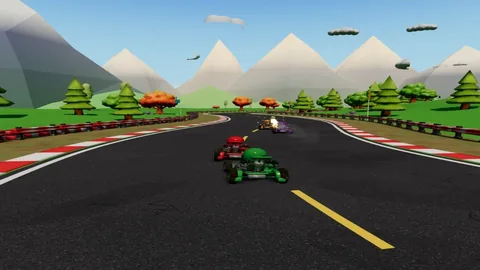</a> <a href="games/turbo-kart-grand-prix/readme.md"><strong>Turbo Kart Grand Prix</strong></a> · 📸 9.2/10</td>
</tr>
<tr>
<td align="center" width="33%"><a href="games/iridium-reach/readme.md">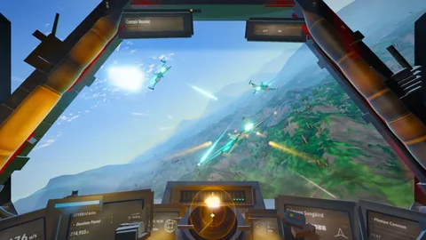</a> <a href="games/iridium-reach/readme.md"><strong>Iridium Reach</strong></a> · 📸 9.0/10</td>
<td align="center" width="33%"><a href="games/silent-meridian/readme.md">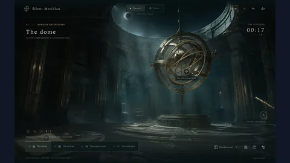</a> <a href="games/silent-meridian/readme.md"><strong>Silent Meridian</strong></a> · 📸 9.0/10</td>
<td align="center" width="33%"><a href="games/world-of-claudecraft/readme.md">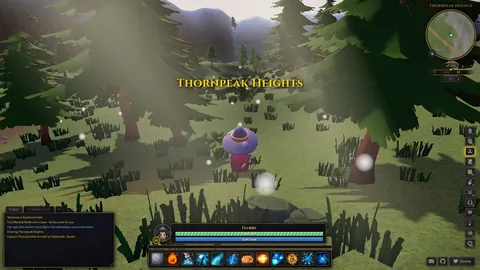</a> <a href="games/world-of-claudecraft/readme.md"><strong>World of ClaudeCraft</strong></a> · 📸 9.0/10</td>
</tr>
<tr>
<td align="center" width="33%"><a href="games/kindle/readme.md">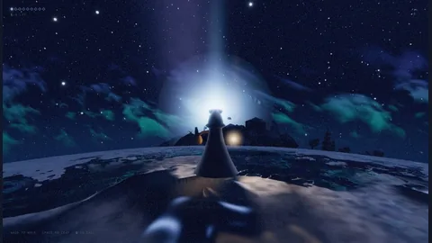</a> <a href="games/kindle/readme.md"><strong>KINDLE</strong></a> · 📸 8.9/10</td>
<td align="center" width="33%"><a href="games/sunbreak-downhill-club/readme.md">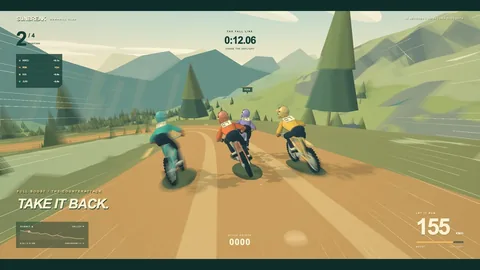</a> <a href="games/sunbreak-downhill-club/readme.md"><strong>SUNBREAK — Downhill Club</strong></a> · 📸 8.9/10</td>
<td align="center" width="33%"><a href="games/fishslop/readme.md">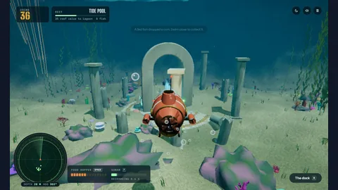</a> <a href="games/fishslop/readme.md"><strong>Fishslop</strong></a> · 📸 8.8/10</td>
</tr>
<tr>
<td align="center" width="33%"><a href="games/overrun-dockyard-nine/readme.md">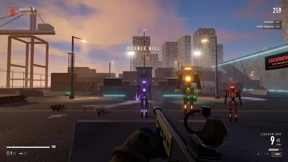</a> <a href="games/overrun-dockyard-nine/readme.md"><strong>OVERRUN: Dockyard Nine</strong></a> · 📸 8.8/10</td>
<td align="center" width="33%"><a href="games/fall-line/readme.md">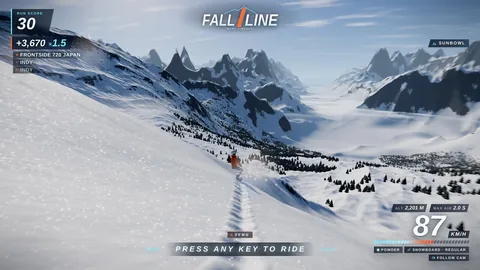</a> <a href="games/fall-line/readme.md"><strong>Fall Line</strong></a> · 📸 8.7/10</td>
<td align="center" width="33%"><a href="games/little-flock/readme.md">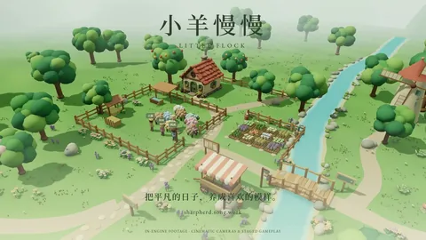</a> <a href="games/little-flock/readme.md"><strong>Little Flock · 小羊慢慢</strong></a> · 📸 8.7/10</td>
</tr>
<tr>
<td align="center" width="33%"><a href="games/the-hourglass-city/readme.md">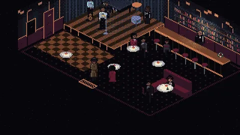</a> <a href="games/the-hourglass-city/readme.md"><strong>The Hourglass City</strong></a> · 📸 8.7/10</td>
<td align="center" width="33%"><a href="games/turbo-kart-rush/readme.md">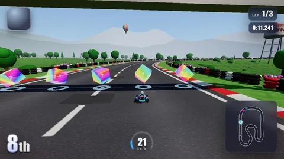</a> <a href="games/turbo-kart-rush/readme.md"><strong>Turbo Kart Rush</strong></a> · 📸 8.7/10</td>
<td align="center" width="33%"><a href="games/turbo-kart-rush-claudio41cg-max-rio-rush-cross/readme.md">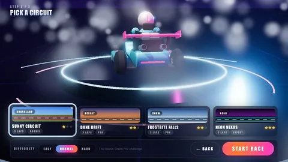</a> <a href="games/turbo-kart-rush-claudio41cg-max-rio-rush-cross/readme.md"><strong>Turbo Kart Rush</strong></a> · 📸 8.7/10</td>
</tr>
<tr>
<td align="center" width="33%"><a href="games/rally-navigator/readme.md">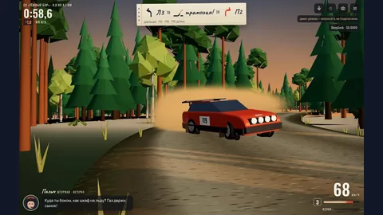</a> <a href="games/rally-navigator/readme.md"><strong>Rally Navigator</strong></a> · 📸 8.6/10</td>
<td align="center" width="33%"><a href="games/rogue-squadron-the-battle-of-yavin/readme.md">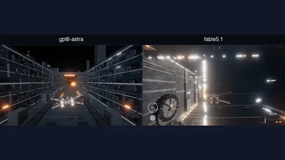</a> <a href="games/rogue-squadron-the-battle-of-yavin/readme.md"><strong>Rogue Squadron — The Battle of Yavin</strong></a> · 📸 8.6/10</td>
<td align="center" width="33%"><a href="games/clawd-pop-3d/readme.md">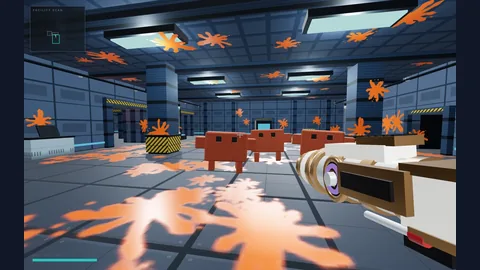</a> <a href="games/clawd-pop-3d/readme.md"><strong>Clawd Pop 3D</strong></a> · 📸 8.5/10</td>
</tr>
<tr>
<td align="center" width="33%"><a href="games/the-black-sedan/readme.md">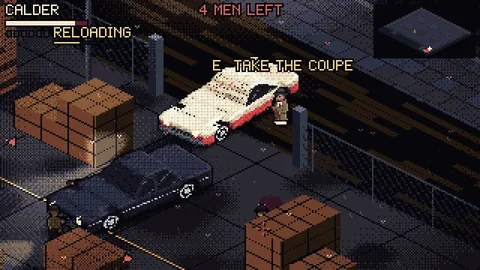</a> <a href="games/the-black-sedan/readme.md"><strong>The Black Sedan</strong></a> · 📸 8.5/10</td>
<td align="center" width="33%"><a href="games/luma-the-garden-of-light/readme.md">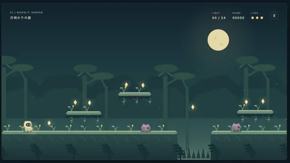</a> <a href="games/luma-the-garden-of-light/readme.md"><strong>LUMA — The Garden of Light</strong></a> · 📸 8.3/10</td>
<td align="center" width="33%"><a href="games/barista-shift/readme.md">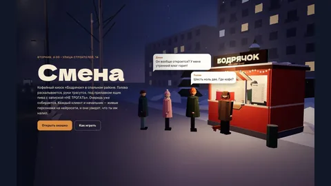</a> <a href="games/barista-shift/readme.md"><strong>Barista Shift</strong></a> · 📸 8.2/10</td>
</tr>
<tr>
<td align="center" width="33%"><a href="games/nova-lancer/readme.md">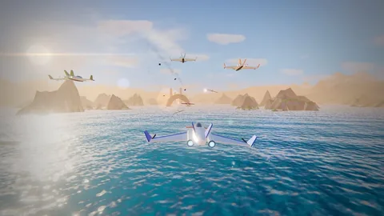</a> <a href="games/nova-lancer/readme.md"><strong>Nova Lancer</strong></a> · 📸 8.2/10</td>
<td align="center" width="33%"><a href="games/operation-ironhold/readme.md">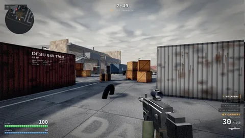</a> <a href="games/operation-ironhold/readme.md"><strong>Operation Ironhold</strong></a> · 📸 8.2/10</td>
<td align="center" width="33%"><a href="games/saber-descent/readme.md">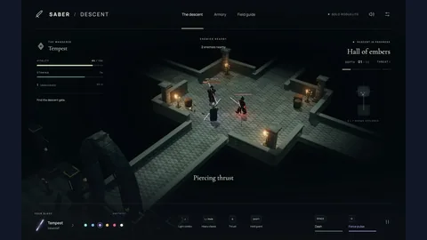</a> <a href="games/saber-descent/readme.md"><strong>Saber / Descent</strong></a> · 📸 8.2/10</td>
</tr>
<tr>
<td align="center" width="33%"><a href="games/tater-s-flight-sim/readme.md">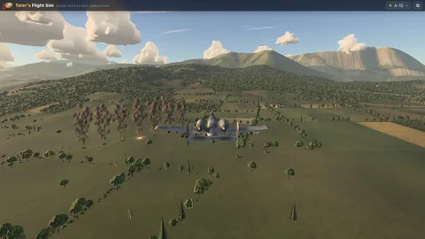</a> <a href="games/tater-s-flight-sim/readme.md"><strong>Tater's Flight Sim</strong></a> · 📸 8.2/10</td>
<td align="center" width="33%"><a href="games/buildyourtown/readme.md">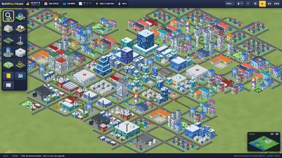</a> <a href="games/buildyourtown/readme.md"><strong>BuildYourTown</strong></a> · 📸 8.1/10</td>
<td align="center" width="33%"><a href="games/driftlands/readme.md">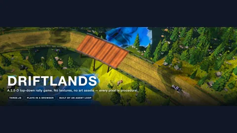</a> <a href="games/driftlands/readme.md"><strong>DRIFTLANDS</strong></a> · 📸 8.0/10</td>
</tr>
</table>

## Browse by model

Select a model to browse its ranked games and screenshots. Count each multi-model game on every matching model page; do not sum these counts for a collection total. Keep broad and unspecified model labels separate from versioned labels.

| Model | Game units | Source repositories |
| --- | ---: | ---: |
| [Claude Fable 5](models/claude-fable-5.md) | **205** | 97 |
| [Claude Opus 5](models/claude-opus-5.md) | **126** | 111 |
| [Claude Fable 5.1](models/claude-fable-5-1.md) | **125** | 57 |
| [GPT-6 Astra](models/gpt-6-astra.md) | **109** | 80 |
| [Claude Opus 4.6](models/claude-opus-4-6.md) | **83** | 69 |
| [Claude Opus 4.8](models/claude-opus-4-8.md) | **67** | 53 |
| [Claude Opus 5.5](models/claude-opus-5-5.md) | **61** | 30 |
| [Claude Opus 4.7](models/claude-opus-4-7.md) | **25** | 25 |
| [Claude Opus 4.5](models/claude-opus-4-5.md) | **13** | 13 |
| [Codex](models/codex.md) | **7** | 7 |
| [Claude Opus 4](models/claude-opus-4.md) | **4** | 2 |
| [GPT-6](models/gpt-6.md) | **4** | 4 |
| [Claude Code](models/claude-code.md) | **2** | 2 |
| [Claude Opus](models/claude-opus.md) | **2** | 2 |
| [ChatGPT 5.6 Soul](models/chatgpt-5-6-soul.md) | **1** | 1 |
| [Codex Opus 4.8](models/codex-opus-4-8.md) | **1** | 1 |
| [GPT-5.6 Sol](models/gpt-5-6-sol.md) | **1** | 1 |

## Top games today

> Rank the highest-rated repositories verified in this curation run on **2026-09-26**.

| Rank | Game | Score | Model | Verified date |
| ---: | --- | ---: | --- | --- |
| 1 | [**Long Wind**](games/long-wind/readme.md) | ⭐ **9.0** | Claude Opus 5.5 | 2026-09-26 |
| 2 | [**Ponpoko Kart**](games/ponpoko-kart/readme.md) | ⭐ **8.8** | Claude Opus 5.5 | 2026-09-26 |
| 3 | [**HELLAS — Greek Civilization**](games/hellas-greek-civilization/readme.md) | ⭐ **8.5** | GPT-6 Astra | 2026-09-26 |
| 4 | [**Sky Rings**](games/sky-rings/readme.md) | ⭐ **8.4** | Claude Opus 5.5 | 2026-09-26 |
| 5 | [**F1 Racing Game**](games/f1-racing-game/readme.md) | ⭐ **8.3** | Claude Opus 5.5 | 2026-09-26 |
| 6 | [**Harbor Master**](games/harbor-master/readme.md) | ⭐ **8.2** | Claude Opus 5.5 | 2026-09-26 |
| 7 | [**League of Legends Simulation**](games/league-of-legends-simulation/readme.md) | ⭐ **8.1** | Claude Opus 5.5 | 2026-09-26 |
| 8 | [**High Effort Strategy Game**](games/high-effort-strategy-game/readme.md) | ⭐ **7.6** | Claude Opus 5.5 | 2026-09-26 |

## New source repositories yesterday and today

Repository creation on **2026-09-25–2026-09-26** is not proof of game publication. Inspect the source and model-evidence links before using an entry.

| Repository | Game units | Model | Created (UTC) |
| --- | ---: | --- | --- |
| [Long Wind](games/long-wind/readme.md) ([source](https://github.com/jbang2004/long-wind)) | 1 | Claude Opus 5.5 | 2026-09-26 |
| [Ponpoko Kart](games/ponpoko-kart/readme.md) ([source](https://github.com/tanuu5/ponpoko-kart)) | 1 | Claude Opus 5.5 | 2026-09-25 |
| [Harbor Master](games/harbor-master/readme.md) ([source](https://github.com/hirosichen/ai-harbor-master-game)) | 1 | Claude Opus 5.5 | 2026-09-25 |
| [Vibe Games Arcade](games/league-of-legends-simulation/readme.md) ([source](https://github.com/icebear0828/vibe-games)) | 4 | Claude Opus 5.5 | 2026-09-25 |
| [Opus 5.5 Strategy Game Comparison](games/low-effort-strategy-game/readme.md) ([source](https://github.com/Barty-Bart/opus-55-effort-comparison)) | 6 | Claude Opus 5.5 | 2026-09-25 |
| [Sky Rings](games/sky-rings/readme.md) ([source](https://github.com/hirosichen/ai-sky-rings-game)) | 1 | Claude Opus 5.5 | 2026-09-25 |
| [F1 Racing Game](games/f1-racing-game/readme.md) ([source](https://github.com/hirosichen/ai-f1-racing-game)) | 1 | Claude Opus 5.5 | 2026-09-25 |
| [GPT-6 Astra One-Sentence Games](games/hellas-greek-civilization/readme.md) ([source](https://github.com/MXMX0811/gpt-6-astra-game)) | 2 | GPT-6 Astra | 2026-09-25 |
| [Claude Opus 5.5 One-Shot 3D Games — 3 Projects](games/pelican-bike-xiiyioozzz-opus55-3d-games/readme.md) ([source](https://github.com/xiiyioozzz/opus55-3d-games)) | 3 | Claude Opus 5.5 | 2026-09-25 |

## Top games this week

> Rank the highest-rated games with publication or qualifying gameplay evidence from **2026-09-20** through **2026-09-26**.

| Rank | Game | Score | Model | Evidence date |
| ---: | --- | ---: | --- | --- |
| 1 | [**Barista Shift**](games/barista-shift/readme.md) | ⭐ **9.5** | Claude Opus 5.5 | 2026-09-23 |
| 2 | [**OVERRUN: Dockyard Nine**](games/overrun-dockyard-nine/readme.md) | ⭐ **8.5** | Claude Opus 5.5 | 2026-09-22 |

## Top games this month

> Rank the highest-rated games with publication or qualifying gameplay evidence from **2026-09-01** through **2026-09-26**.

| Rank | Game | Score | Model | Evidence date |
| ---: | --- | ---: | --- | --- |
| 1 | [**Unfit for Print**](games/unfit-for-print/readme.md) | ⭐ **9.7** | Claude Opus 5 | 2026-09-11 |
| 2 | [**chess3dastra**](games/chess3dastra/readme.md) | ⭐ **9.6** | GPT-6 Astra | 2026-09-11 |
| 3 | [**Skylark Run**](games/skylark-run/readme.md) | ⭐ **9.6** | Claude Opus 5 | 2026-09-11 |
| 4 | [**Barista Shift**](games/barista-shift/readme.md) | ⭐ **9.5** | Claude Opus 5.5 | 2026-09-23 |
| 5 | [**Bubble Pop**](games/bubble-pop/readme.md) | ⭐ **9.5** | Claude Fable 5.1 | 2026-09-10 |
| 6 | [**Grand Theft Astra**](games/grand-theft-astra/readme.md) | ⭐ **9.5** | Claude Fable 5.1 | 2026-09-10 |
| 7 | [**SUNBREAK — Downhill Club**](games/sunbreak-downhill-club/readme.md) | ⭐ **9.5** | GPT-6 Astra | 2026-09-05 |
| 8 | [**Battle City**](games/battle-city-nickblack1919-battle-city/readme.md) | ⭐ **9.4** | Claude Opus 5 | 2026-09-11 |
| 9 | [**Gravity Box — Campaign 100**](games/gravity-box-campaign-100/readme.md) | ⭐ **9.4** | GPT-6 Astra, GPT-5.6 Sol | 2026-09-08 |
| 10 | [**Haynes Quest**](games/haynes-quest/readme.md) | ⭐ **9.4** | Claude Fable 5.1 | 2026-09-11 |
| 11 | [**7 Minutes — City Crisis**](games/7-minutes-city-crisis/readme.md) | ⭐ **9.3** | GPT-6 | 2026-09-08 |
| 12 | [**Balloon Pop**](games/balloon-pop/readme.md) | ⭐ **9.3** | Claude Opus 4.8 | 2026-09-10 |
| 13 | [**NULLSPACE**](games/nullspace/readme.md) | ⭐ **9.3** | GPT-6 Astra, Codex | 2026-09-04 |
| 14 | [**P(DOOM)**](games/p-doom/readme.md) | ⭐ **9.3** | GPT-6 Astra, Codex | 2026-09-06 |
| 15 | [**PirateSeas**](games/pirateseas/readme.md) | ⭐ **9.3** | Claude Opus 5, Claude Fable 5.1 | 2026-09-15 |
| 16 | [**Rift Chess**](games/rift-chess/readme.md) | ⭐ **9.3** | GPT-6 Astra | 2026-09-07 |
| 17 | [**Robo Open**](games/robo-open/readme.md) | ⭐ **9.3** | GPT-6 Astra, Codex | 2026-09-05 |
| 18 | [**Turbo Kart Rush**](games/turbo-kart-rush-claudio41cg-max-rio-rush-cross/readme.md) | ⭐ **9.3** | Claude Fable 5.1 | 2026-09-09 |
| 19 | [**Explottens: Survival**](games/explottens-survival/readme.md) | ⭐ **9.2** | Claude Opus 5 | 2026-09-11 |
| 20 | [**Mystic Onslaught**](games/mystic-onslaught/readme.md) | ⭐ **9.2** | Claude Fable 5 | 2026-09-15 |

## Top-rated picks

> **Start here. These projects have the strongest combined evidence, scope, and source quality. Ratings do not replace evidence grades.**

| Game | Score | Built with | Evidence |
| --- | ---: | --- | --- |
| [**Commander Simulator**](games/commander-simulator/readme.md) | ⭐ **9.7** | Claude Fable 5.1, ChatGPT 5.6 Soul, GPT-6 Astra | [✓ direct model evidence](https://github.com/tuitamogamer-gpt/mtg-commander-simulator#your-first-game) |
| [**Unfit for Print**](games/unfit-for-print/readme.md) | ⭐ **9.7** | Claude Opus 5 | [✓ direct model evidence](https://github.com/PPO-GG/unfit-for-print/commit/3e70231203788c184f9453381894acb234b0bdfa) |
| [**2048**](games/2048-patricker-treant/readme.md) | ⭐ **9.6** | Claude Fable 5 | [✓ direct model evidence](https://github.com/patricker/treant/commit/68aff75c3204e0b362625e4fb72a01f72cd13fad) |
| [**chess3dastra**](games/chess3dastra/readme.md) | ⭐ **9.6** | GPT-6 Astra | [≈ creator-reported model evidence](https://github.com/yortch/chess3dastra/commit/fd76149969af950523c6827a057c4171f8cf3f9d) |
| [**CYBER SUNDAY**](games/cyber-sunday/readme.md) | ⭐ **9.6** | Claude Opus 5 | [✓ direct model evidence](https://github.com/influenza-dotcom/3D-RPG/commit/40b621ce679e98674ecb40851912fb48b82aa82) |
| [**OpenSamguk**](games/opensamguk/readme.md) | ⭐ **9.6** | Claude Opus 4.8 | [✓ direct model evidence](https://github.com/peppone-choi/opensamguk/commit/a4dc4d43d0554d6297cd98f6d5d3e5b3b3811a93) |
| [**Skylark Run**](games/skylark-run/readme.md) | ⭐ **9.6** | Claude Opus 5 | [✓ direct model evidence](https://github.com/jackpepper-vibe/SkylarkRun/commit/44f2aa94dc069523d8a4e30090231486f82d31a3) |
| [**Barista Shift**](games/barista-shift/readme.md) | ⭐ **9.5** | Claude Opus 5.5 | [✓ repository-level model evidence](https://github.com/swan4er/opus-100-projects/blob/main/README.md) |
| [**Bong — 末法残土**](games/bong/readme.md) | ⭐ **9.5** | Claude Opus 5 | [✓ direct model evidence](https://github.com/Kizunad/Bong/commit/3ec765b4138f5d82479ef3eaf9c8b5009d2068d3) |
| [**Bubble Pop**](games/bubble-pop/readme.md) | ⭐ **9.5** | Claude Fable 5.1 | [✓ direct model evidence](https://github.com/gberry747-lab/gabriels-animation-studio/commit/f3e68b8fc0165f1cbace50f6204a83192a5ceb79) |
| [**Deepshaft**](games/deepshaft/readme.md) | ⭐ **9.5** | Claude Opus 5 | [✓ direct model evidence](https://github.com/ben-gy/deepshaft/commit/51e8cdce6bb91b7c8a23f2e92a4aec28846a10b7) |
| [**General Orders: Sengoku Jidai**](games/general-orders-sengoku-jidai/readme.md) | ⭐ **9.5** | Claude Opus 4.8 | [✓ direct model evidence](https://github.com/Toribash67/sengoku_jidai/commit/8210aa89e5c1298137e7b412bb2d07b8b9d43080) |
| [**Grand Theft Astra**](games/grand-theft-astra/readme.md) | ⭐ **9.5** | Claude Fable 5.1 | [✓ direct model evidence](https://github.com/angelaborowski/grand-theft-astra/commit/c5e718d48430f9bd97e006c7bacd6d7eeb45ef7) |
| [**Just Five More Minutes**](games/just-five-more-minutes/readme.md) | ⭐ **9.5** | Claude Fable 5 | [✓ direct model evidence](https://github.com/Giftedx/just-five-more-minutes/commit/32d1eeacf551c0d2e8f9536732cc03c44eb7ed45) |
| [**Knife Dodge**](games/knife-dodge/readme.md) | ⭐ **9.5** | Claude Fable 5.1 | [✓ direct model evidence](https://github.com/Karanvir1729/ninja-knife-dodge/commit/0283ea60e91257905f1fc93ff4e1a548db3be078) |

## What is this?

This is a curated index of playable game units with public GitHub source and evidence that connects them to GPT-6 Astra, Claude Opus, or Claude Fable. “Curated” does not mean every attribution has the same strength: the per-entry evidence grade states whether the model claim is direct, creator-reported, repository-level, or inferred.

The source of truth is [games.json](games.json). It was last verified on **2026-09-26**.

Browse [the awesome-list index](awesomelists.md) for verified game catalogs with their counted entry totals.

Browse [latest game additions by date](latest-games.md) to compare each source repository's creation time with the date this collection first recorded it.

Browse [AI game generators and engines](ai-game-generators.md) for tools that build or edit playable games from prompts.

Browse [Claude Opus 5.5 release-week games](opus-5.5-games.md) for direct source and model-evidence links.

Browse [publication-date rankings](rankings/README.md) for daily, weekly, and monthly reports. These reports exclude games without a reliable publication or qualifying evidence date. The audit keeps repository creation dates separate from publication dates.

The dataset stores source-derived reconstruction prompts without presenting them as original transcripts. Newly expanded Opus 5.5 entries link to their per-game prompt notes.

## Collection at a glance

| Signal | Result |
| --- | ---: |
| Counted game units | **793** |
| Qualifying source repositories | **520** |
| Dataset records, including related or excluded records | **600** |
| Low-quality game units moved to bad-games.md | **28** (28 repositories) |
| Other non-game records moved to other.md | **52** |
| WebGL-family game units, across all categories | **240** |
| Non-browser engine game units | **255** |
| Game units with screenshot links | **181** |
| Game units with direct prompt links | **17** |
| Game units with source-derived prompt fields | **793** |
| Game units with exact publication dates | **287** (152 repositories) |
| Game units with repository creation dates | **793** (520 repositories) |

## Verification snapshot

The list contains **793** game units from **520** qualifying repositories. The dataset also retains **80** related or excluded records for audit history. Each row uses one of these model-evidence grades.

| Grade | Meaning | Game units |
| --- | --- | ---: |
| ✓ Direct | A public primary source directly attributes the listed model. | **520** |
| ≈ Creator report | The creator attributes the listed model. | **229** |
| △ Repository trail | A repository, directory, or topic trail supports the model claim. | **42** |
| ? Inferred | The model attribution is inferred and should be independently checked. | **2** |

## More records

- ⚠️ [Bad games](bad-games.md) — **28** low-quality game units excluded from the curated library
- 📦 [Other](other.md) — **52** related, derivative, forked, or non-game records

## How to use this guide

- Select a game title to open its local per-game note in [games/](games/).
- Select the repository link inside the note to open the canonical GitHub source.
- Select **files** to inspect linked gameplay source. Select **play** for a published demo.
- Read the evidence grade before relying on a model-attribution claim. The rating is a curation aid, not a benchmark.

Each compact row shows **source-quality rating**, **model**, **technology**, **model-evidence grade**, and relevant source links. Rows with usable screenshots also show a separate 📸 **screenshot rating**. FLOPS estimates remain in the dataset but are omitted here because they are static, low-confidence estimates.

## Method

> **Proof over promises. Repository evidence decides what gets counted.**

- Verify the canonical GitHub repository URL. Record its numeric ID when public API metadata is available.
- Inspect the README, entry point, and gameplay source. Confirm input, rules or objectives, and game state.
- Place native-engine games in the dedicated non-browser section.
- Record model evidence as direct, creator-reported, repository-level, directory/topic trail, or inferred. Link every grade to its public evidence URL. Do not present weaker evidence as direct confirmation.
- Treat source inspection as proof that the code exists. Treat it separately from runtime playtesting.
- Do not count catalogs, skills, screenshots, visual-only scenes, empty repositories, unchanged forks, or prompt-only projects.
- Keep source records in [games.json](games.json). Keep rejected candidates in [research/candidates.json](research/candidates.json). Run the validator and regenerate the README and model pages after each dataset edit.

## Rating and data notes

The **0–10 rating** uses source completeness, playable mechanics, scope, tests or deployment, and model-evidence strength. It is a curation estimate, not a review score or performance benchmark. The dataset keeps a FLOPS field as a low-confidence static FP32-work estimate at 60 FPS; it is not measured device performance or model-training compute.

## Per-game notes

Open the [games/](games/) directory or the [per-game notes index](games/README.md) to read a short source-backed note for every named game unit. Each note links model evidence, gameplay source, and available screenshot assets. Use the placeholder only when the repository and related-source scan found no screenshot.

## Ranking reports

Open [rankings/](rankings/README.md) for generated top games this week, top games this month, and daily rankings for the last seven dates. Read each row's date basis before treating it as a publication date.

## Contributing

Follow [the contribution guide](CONTRIBUTING.md). Provide the canonical repository, model-evidence URL, playable-source path, and evidence notes. Validate the dataset and regenerate the README and model pages before opening a pull request.

## Sources and limitations

Primary GitHub repository evidence is preferred. Creator reports and repository trails are useful discovery evidence but are not equivalent to direct model attribution. A source inspection confirms that code exists; it does not claim that a current live demo was playtested unless the record states it. This project follows the practical principle in [Google’s AI-search guidance](https://developers.google.com/search/docs/fundamentals/ai-optimization-guide): publish clear, original, useful, crawlable information instead of special markup or artificial content tricks.

## Star this collection

If source-backed AI game history should stay searchable, [**star the repository**](https://github.com/AgentsLoop/awesome-opus-5.5-games).
