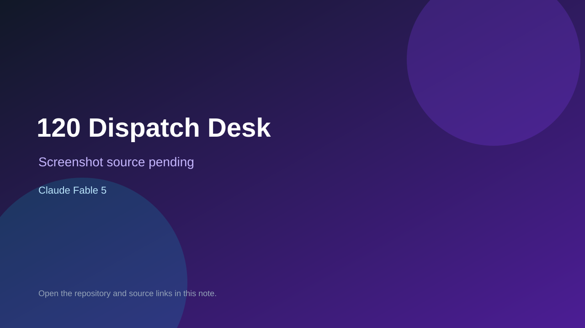

# 120 Dispatch Desk

> Verified game note.

## At a glance

- **Score:** 8.8/10
- **Model:** Claude Fable 5
- **Technology:** React 19, TypeScript, Vite, Leaflet, Playwright, Native web
- **Estimated FP32 operations/s at 60 FPS:** 110,000,000 (low confidence; static estimate, not measured).
- **Rating basis:** A substantial playable narrative game with concurrent lines, dispatch decisions, route/map state, many scenarios, first-aid minigames, audio, persistent progress, current polish and test evidence.
- **Verified:** 2026-09-15
- **Repository:** [https://github.com/1989-12-13/BuddyGame](https://github.com/1989-12-13/BuddyGame)
- **Evidence:** [direct model evidence](https://github.com/1989-12-13/BuddyGame/commit/90cde035fe862952c47565745077ad18ba57701b)

## Screenshots

No screenshot source is recorded yet. Keep the placeholder until a repository, awesome list, or creator source provides an image.

## Model attribution

Open the evidence link above. Evidence grade: **direct model evidence**.

## Source description

The README documents a playable public-service emergency-dispatch narrative game. The source contains a multi-line dispatch loop, timed calls, caller questioning, location and route planning, ambulance dispatch, handoff, scoring/evaluation, shift endings, persistent progress and seven interactive CPR/first-aid mini-games. The current repository received substantial gameplay/UI and test updates on 2026-09-14 and 2026-09-15, including the workbench and dispatch flow; earlier gameplay and minigame commits carry exact Claude Fable 5 trailers. Count one independent game with fresh two-day implementation evidence; no public hosted demo was found.

### Gameplay source

- [https://github.com/1989-12-13/BuddyGame/blob/master/README.md](https://github.com/1989-12-13/BuddyGame/blob/master/README.md)
- [https://github.com/1989-12-13/BuddyGame/commit/90cde035fe862952c47565745077ad18ba57701b](https://github.com/1989-12-13/BuddyGame/commit/90cde035fe862952c47565745077ad18ba57701b)

## Verification notes

- **Status:** verified_source
- **Counted units in repository:** 1
- **Units covered by this note:** 1
- **Discovery:** GitHub game commit search dated 2026-09-13..2026-09-15; https://github.com/1989-12-13/BuddyGame

[Back to the awesome list](../../README.md)
