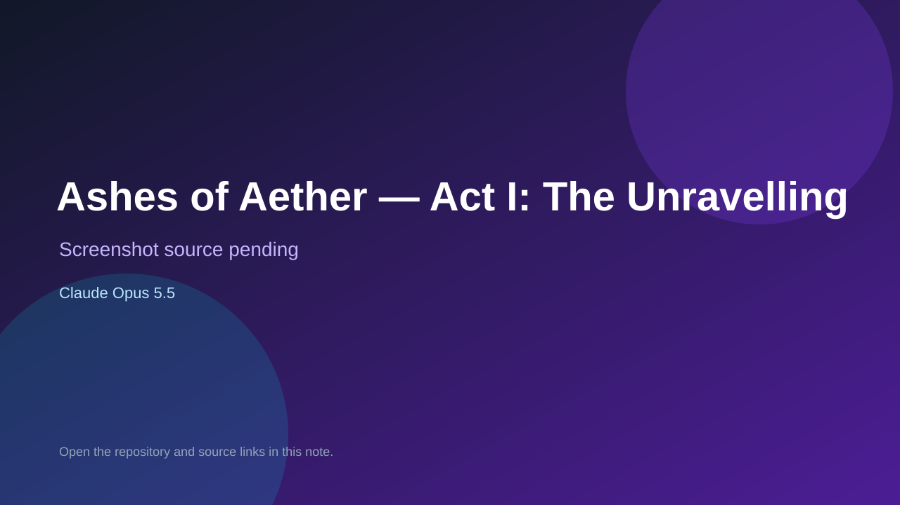

# Ashes of Aether — Act I: The Unravelling

> Top-list entry: **today** (#1), **this week** (#5).

## At a glance

- **Score:** 9.1/10
- **Model:** Claude Opus 5.5
- **Technology:** Python, JavaScript, Three.js, HTML/CSS, Browser
- **Estimated FP32 operations/s at 60 FPS:** 2,600,000,000 (low confidence; static estimate, not measured).
- **Rating basis:** Extensive source-verified RPG systems, a stateful campaign, playable 3D and text interfaces, and automated playthrough tests; no public live deployment was identified or playtested.
- **Verified:** 2026-09-25
- **Repository:** [https://github.com/0xPatrickMartin/AshesOfAether](https://github.com/0xPatrickMartin/AshesOfAether)
- **Evidence:** [creator-reported model evidence](https://github.com/0xPatrickMartin/AshesOfAether)

## Screenshots

No screenshot source is recorded yet. Keep the placeholder until a repository, awesome list, or creator source provides an image.

## Model attribution

Open the evidence link above. Evidence grade: **creator-reported model evidence**.

## Source description

A source-backed turn-based browser RPG with a Three.js world, server-authoritative combat and exploration, quests, progression, saves, and multiple endings. The repository description explicitly names Claude Opus 5.5, so classify attribution as creator-reported. Inspect the README, engine, client, and tests; do not claim runtime playtesting. The README states that the game generates its art and sound in code and provides no screenshot assets or hosted demo.

### Gameplay source

- [https://github.com/0xPatrickMartin/AshesOfAether/blob/main/ashes/engine/game.py](https://github.com/0xPatrickMartin/AshesOfAether/blob/main/ashes/engine/game.py)
- [https://github.com/0xPatrickMartin/AshesOfAether](https://github.com/0xPatrickMartin/AshesOfAether)

## Verification notes

- **Status:** verified_source
- **Counted units in repository:** 1
- **Units covered by this note:** 1
- **Discovery:** GitHub repository search: "Claude Opus 5.5" game created:2026-09-24..2026-09-25 (checked 2026-09-25; UTC+07:00 date filter)

[Back to the awesome list](../../README.md)
