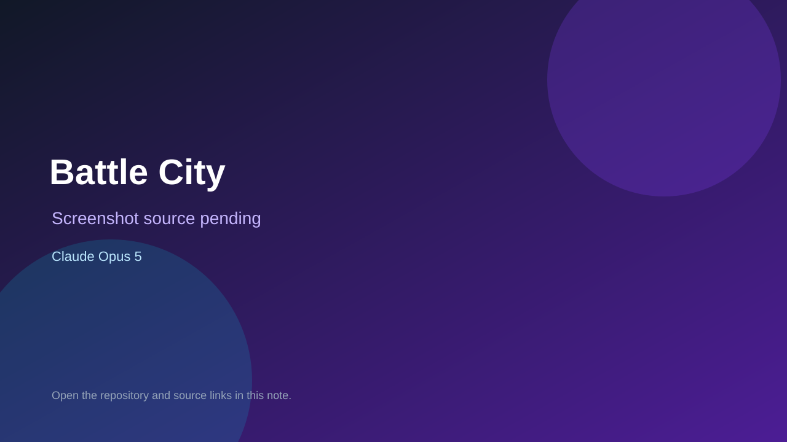

# Battle City

> Verified game note.

## At a glance

- **Score:** 8.6/10
- **Model:** Claude Opus 5
- **Technology:** HTML5 Canvas, JavaScript ES6+, CSS3, Browser
- **Estimated FP32 operations/s at 60 FPS:** 180,000,000 (low confidence; static estimate, not measured).
- **Rating basis:** The project has a complete browser entry point, documented controls and objective, multiple enemy and terrain systems, progression, persistence and direct Opus attribution.
- **Verified:** 2026-09-15
- **Repository:** [https://github.com/yumo-zs/tank-battle](https://github.com/yumo-zs/tank-battle)
- **Evidence:** [direct model evidence](https://github.com/yumo-zs/tank-battle/commit/b4014790104d47001c03cfe1856bb43761a36fbd)

## Screenshots

No screenshot source is recorded yet. Keep the placeholder until a repository, awesome list, or creator source provides an image.

## Model attribution

Open the evidence link above. Evidence grade: **direct model evidence**.

## Source description

The repository is a new HTML5 Canvas Battle City game. Its README documents a runnable index.html entry point, movement, shooting, pause/restart controls, a base-defense objective, enemy types, destructible terrain, power-ups, progression, score persistence and Web Audio. The source tree contains index.html, game.js and style.css. The cited creation commit contains an exact Co-Authored-By: Claude Opus 5 trailer. Count one browser game unit.

### Gameplay source

- [https://github.com/yumo-zs/tank-battle/blob/main/README.md](https://github.com/yumo-zs/tank-battle/blob/main/README.md)
- [https://github.com/yumo-zs/tank-battle/commit/b4014790104d47001c03cfe1856bb43761a36fbd](https://github.com/yumo-zs/tank-battle/commit/b4014790104d47001c03cfe1856bb43761a36fbd)

## Verification notes

- **Status:** verified_source
- **Counted units in repository:** 1
- **Units covered by this note:** 1
- **Discovery:** GitHub commit search for game Co-Authored-By Claude Opus, committer-date 2026-09-13..2026-09-15; https://github.com/yumo-zs/tank-battle

[Back to the awesome list](../../README.md)
