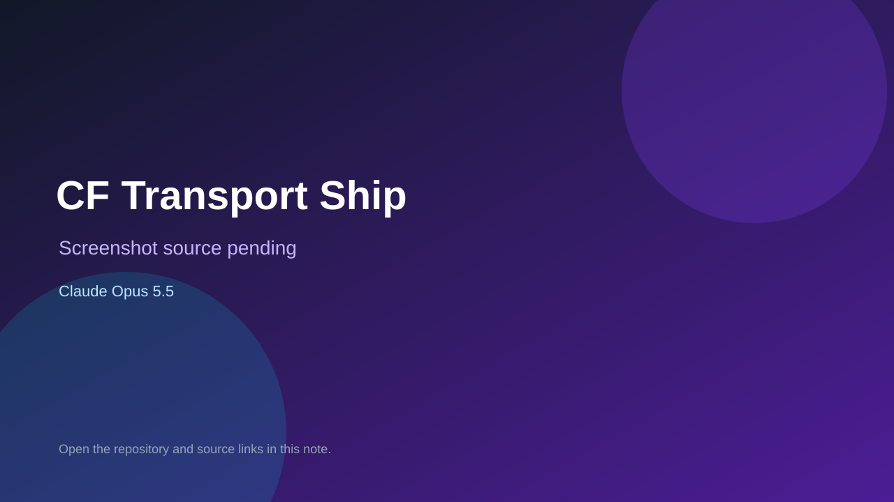

# CF Transport Ship

> Verified game note.

## At a glance

- **Score:** 8.8/10
- **Model:** Claude Opus 5.5
- **Technology:** Three.js, JavaScript, WebGL, Browser
- **Estimated FP32 operations/s at 60 FPS:** 1,900,000,000 (low confidence; static estimate, not measured).
- **Rating basis:** A first-person team shooter with bot combat, weapon handling, a recognizable map layout, and touch input.
- **Verified:** 2026-09-25
- **Repository:** [https://github.com/xiiyioozzz/opus55-3d-games](https://github.com/xiiyioozzz/opus55-3d-games)
- **Evidence:** [creator-reported model evidence](https://github.com/xiiyioozzz/opus55-3d-games/blob/main/README.md)
- **Live demo:** [open demo](https://games.xdullboy.com/transport-ship/)

## Screenshots

No screenshot source is recorded yet. Keep the placeholder until a repository, awesome list, or creator source provides an image.

## Model attribution

Open the evidence link above. Evidence grade: **creator-reported model evidence**.

## Source description

Count three separately playable Three.js games: Pelican Bike, CF Transport Ship, and QQ Speed. The README documents each gameplay loop, controls, build, and live deployment. The repository README explicitly attributes all three games to Claude Opus 5.5 in Claude Code and says each is a separate one-shot build. Inspect each game folder and linked live deployment. The README contains no screenshot assets; do not invent screenshot ratings.

### Gameplay source

- [https://github.com/xiiyioozzz/opus55-3d-games/blob/main/cf-transport-ship/src/game.js](https://github.com/xiiyioozzz/opus55-3d-games/blob/main/cf-transport-ship/src/game.js)
- [https://github.com/xiiyioozzz/opus55-3d-games/blob/main/README.md](https://github.com/xiiyioozzz/opus55-3d-games/blob/main/README.md)

## Verification notes

- **Status:** verified_source
- **Counted units in repository:** 3
- **Units covered by this note:** 1
- **Discovery:** GitHub repository search: "Claude Opus 5.5" game created:2026-09-24..2026-09-25 (checked 2026-09-25; UTC+07:00 date filter)

[Back to the awesome list](../../README.md)
