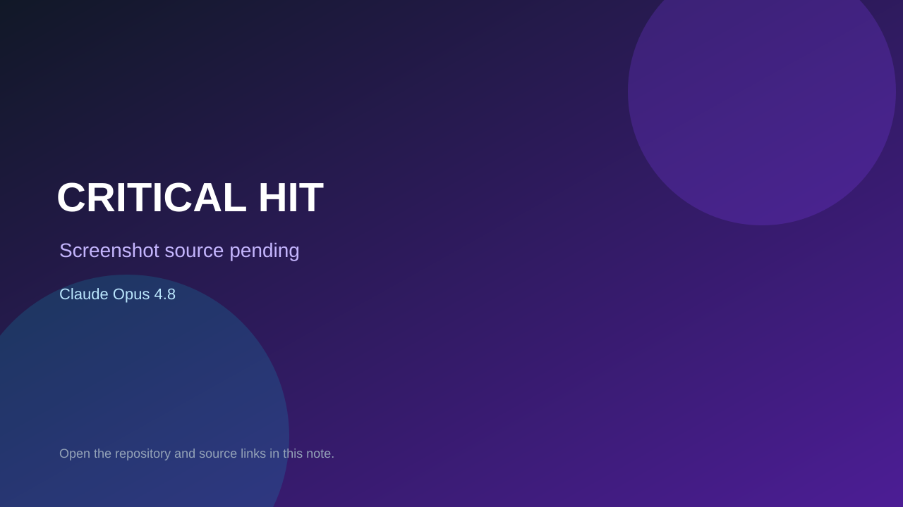

# CRITICAL HIT

> Verified game note.

## At a glance

- **Score:** 9.0/10
- **Model:** Claude Opus 4.8
- **Technology:** Pygame-ce, Python, Native desktop
- **Estimated FP32 operations/s at 60 FPS:** 900,000,000 (low confidence; static estimate, not measured).
- **Rating basis:** Substantial fighting-game source with roster, modes, combat, AI, projectiles, scenes, netcode and tests, plus direct Opus attribution.
- **Verified:** 2026-09-10
- **Repository:** [https://github.com/thequantummenece/Critical_Hit](https://github.com/thequantummenece/Critical_Hit)
- **Evidence:** [direct model evidence](https://github.com/thequantummenece/Critical_Hit/commit/9f2fc6bde5edb7d20c0104a1cfec115e6320c990)

## Screenshots

No screenshot source is recorded yet. Keep the placeholder until a repository, awesome list, or creator source provides an image.

## Model attribution

Open the evidence link above. Evidence grade: **direct model evidence**.

## Source description

The initial commit is titled CRITICAL HIT — 2D fighting game in Python/pygame-ce. It contains a 10-fighter roster, arcade/VS CPU/local/online modes, fighter/AI/combat/moves/projectile source, scenes, arenas, audio, netcode and tests. The commit page shows a direct Claude Opus 4.8 trailer.

### Gameplay source

- [https://github.com/thequantummenece/Critical_Hit/blob/main/main.py](https://github.com/thequantummenece/Critical_Hit/blob/main/main.py)
- [https://github.com/thequantummenece/Critical_Hit/commit/9f2fc6bde5edb7d20c0104a1cfec115e6320c990](https://github.com/thequantummenece/Critical_Hit/commit/9f2fc6bde5edb7d20c0104a1cfec115e6320c990)

## Verification notes

- **Status:** verified_source
- **Counted units in repository:** 1
- **Units covered by this note:** 1
- **Discovery:** GitHub commit search for Pygame game Co-Authored-By Claude Opus; https://github.com/thequantummenece/Critical_Hit

[Back to the awesome list](../../README.md)
