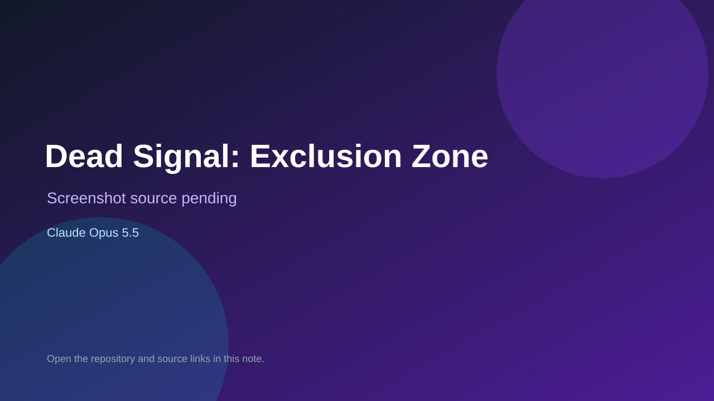

# Dead Signal: Exclusion Zone

> Top-list entry: **today** (#3), **this week** (#3).



## At a glance

- **Score:** 9.2/10
- **Model:** Claude Opus 5.5
- **Technology:** Three.js, TypeScript, Vite, WebGL, Browser
- **Estimated FP32 operations/s at 60 FPS:** 1,800,000,000 (low confidence; static estimate, not measured).
- **Rating basis:** Substantial FPS systems, enemy AI, mission state, tests, and playable source; no runtime playtest performed.
- **Verified:** 2026-09-24
- **Repository:** [https://github.com/bridge-mind/claude-opus-5.5-zombies-game](https://github.com/bridge-mind/claude-opus-5.5-zombies-game)
- **Evidence:** [creator-reported model evidence](https://github.com/bridge-mind/claude-opus-5.5-zombies-game/blob/main/README.md)

## Screenshots

No screenshot source is recorded yet. Keep the placeholder until a repository, awesome list, or creator source provides an image.

## Model attribution

Open the evidence link above. Evidence grade: **creator-reported model evidence**.

## Source description

First-person extraction-survival shooter with keyboard/mouse input, fixed-tick game loop, zombie AI, weapons, two contracts, upgrades, helicopter extraction, and failure on death or timeout. The README explicitly credits Claude Opus 5.5.

### Gameplay source

- [https://github.com/bridge-mind/claude-opus-5.5-zombies-game/blob/main/README.md](https://github.com/bridge-mind/claude-opus-5.5-zombies-game/blob/main/README.md)

## Reverse-engineered prompt

Reconstruct this prompt from the verified source; it is not an original prompt transcript. See [prompt evidence](https://github.com/bridge-mind/claude-opus-5.5-zombies-game/blob/main/README.md).

```text
Build Dead Signal: Exclusion Zone as a playable game using Three.js, TypeScript, Vite, WebGL, Browser. First-person extraction-survival shooter with keyboard/mouse input, fixed-tick game loop, zombie AI, weapons, two contracts, upgrades, helicopter extraction, and failure on death or timeout. The README explicitly credits Claude Opus 5.5. Preserve controls, game state, objective, failure and restart behavior shown in the source. This is a source-derived reconstruction prompt, not the original prompt.
```

## Verification notes

- **Status:** verified_source
- **Counted units in repository:** 1
- **Units covered by this note:** 1
- **Discovery:** GitHub repository search: opus-5.5 created 2026-09-17..2026-09-24; https://github.com/bridge-mind/claude-opus-5.5-zombies-game

[Back to the awesome list](../../README.md)
