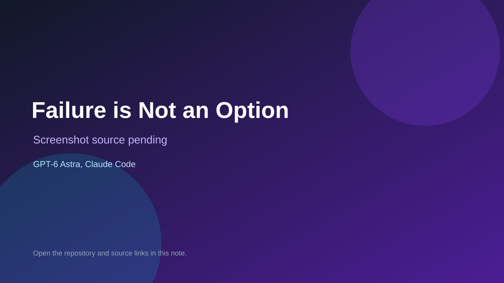

# Failure is Not an Option

> Verified game note.

## At a glance

- **Score:** 9.0/10
- **Model:** GPT-6 Astra, Claude Code
- **Technology:** TypeScript, Vite, HTML/CSS, Browser
- **Estimated FP32 operations/s at 60 FPS:** 900,000,000 (low confidence; static estimate, not measured).
- **Rating basis:** Evidence-based estimate from a public live demo, complete chapter flow, meaningful decisions, alternate outcomes, validation, browser tests, save/import checks and explicit Astra contribution; reduced slightly for demo scope rather than full release.
- **Verified:** 2026-09-10
- **Repository:** [https://github.com/dan-lee-odinson/failure-is-not-an-option](https://github.com/dan-lee-odinson/failure-is-not-an-option)
- **Evidence:** [direct model evidence](https://github.com/dan-lee-odinson/failure-is-not-an-option#failure-is-not-an-option)
- **Live demo:** [open demo](https://finaogame.com/demo/)
- **Additional live link:** [open demo](https://finaogame.com)

## Screenshots

No screenshot source is recorded yet. Keep the placeholder until a repository, awesome list, or creator source provides an image.

## Model attribution

Open the evidence link above. Evidence grade: **direct model evidence**.

## Source description

The README identifies a playable browser narrative strategy game and provides a public demo. It credits GPT-6 Astra with design, content and independent review, and Claude Code with the schema, simulation core, application and tests. The repository contains TypeScript simulation and renderer code, a complete Gemini VIII chapter, preparation and return decisions, causal debrief, Gemini IX-A planning, saves, validation, Vitest coverage, Playwright tests and deploy workflows. The public demo opened at its BEGIN screen. Count one browser game unit and preserve the split model attribution.

### Gameplay source

- [https://github.com/dan-lee-odinson/failure-is-not-an-option#failure-is-not-an-option](https://github.com/dan-lee-odinson/failure-is-not-an-option#failure-is-not-an-option)

## Verification notes

- **Status:** verified
- **Counted units in repository:** 1
- **Units covered by this note:** 1
- **Discovery:** https://api.github.com/search/repositories?q=%22GPT-6%22+playable+game+in%3Areadme

[Back to the awesome list](../../README.md)
