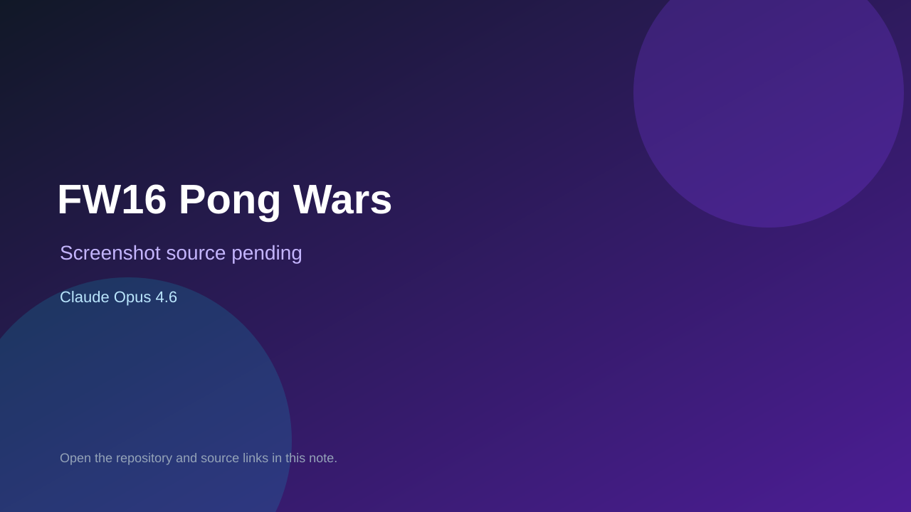

# FW16 Pong Wars

> Verified game note.

## At a glance

- **Score:** 7.8/10
- **Model:** Claude Opus 4.6
- **Technology:** Rust, Native desktop, Windows, Framework Laptop 16 LED Matrix
- **Estimated FP32 operations/s at 60 FPS:** 120,000,000 (low confidence; static estimate, not measured).
- **Rating basis:** Direct game source, release artifacts, clear controls and configuration, real hardware target, screenshot and explicit Opus build credit.
- **Verified:** 2026-09-10
- **Repository:** [https://github.com/boobcactus/fw16-pongwars](https://github.com/boobcactus/fw16-pongwars)
- **Evidence:** [direct model evidence](https://github.com/boobcactus/fw16-pongwars#usage)

## Screenshots

No screenshot source is recorded yet. Keep the placeholder until a repository, awesome list, or creator source provides an image.

## Model attribution

Open the evidence link above. Evidence grade: **direct model evidence**.

## Source description

The README documents a real Rust Pong Wars game with one- or two-module play, configurable balls, speed, brightness, pause/resume, reset, settings and a Windows executable or installer release. It provides controls, installation, source build instructions and a screenshot. The acknowledgements explicitly credit Windsurf and Claude Opus 4.6 as enabling the build. Classify it as a non-browser native engine game.

### Gameplay source

- [https://github.com/boobcactus/fw16-pongwars](https://github.com/boobcactus/fw16-pongwars)
- [https://github.com/boobcactus/fw16-pongwars#usage](https://github.com/boobcactus/fw16-pongwars#usage)

## Verification notes

- **Status:** verified_source_and_release
- **Counted units in repository:** 1
- **Units covered by this note:** 1
- **Discovery:** GitHub code search: "Claude Opus 4.6" game; https://github.com/boobcactus/fw16-pongwars

[Back to the awesome list](../../README.md)
