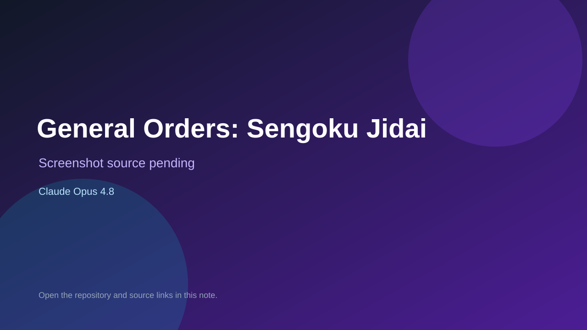

# General Orders: Sengoku Jidai

> Verified game note.

## At a glance

- **Score:** 9.5/10
- **Model:** Claude Opus 4.8
- **Technology:** TypeScript, React, SVG, Node.js, SQLite, Browser multiplayer
- **Estimated FP32 operations/s at 60 FPS:** 650,000,000 (low confidence; static estimate, not measured).
- **Rating basis:** Source-complete multiplayer board-game implementation with deterministic rules, local and online play, AI opponents, authoritative hidden-information views, persistence, SVG rendering, tests and exact Opus gameplay attribution.
- **Verified:** 2026-09-10
- **Repository:** [https://github.com/Toribash67/sengoku_jidai](https://github.com/Toribash67/sengoku_jidai)
- **Evidence:** [direct model evidence](https://github.com/Toribash67/sengoku_jidai/commit/8210aa89e5c1298137e7b412bb2d07b8b9d43080)

## Screenshots

No screenshot source is recorded yet. Keep the placeholder until a repository, awesome list, or creator source provides an image.

## Model attribution

Open the evidence link above. Evidence grade: **direct model evidence**.

## Source description

The README documents a playable web implementation of the board game General Orders: Sengoku Jidai with local hotseat and online named-seat/invite-link play. The source contains a deterministic rules engine, hex-map land and sea movement, armies, navies, operation cards, authoritative server views, persistence, SVG board rendering, AI opponents, game-over flow and unit/integration tests. The cited gameplay HUD commit adds round clock, initiative and game-over behavior and contains repeated exact Co-Authored-By: Claude Opus 4.8 trailers. Count the current board game once; exclude the dev-only terrain generator and documentation plans.

### Gameplay source

- [https://github.com/Toribash67/sengoku_jidai#readme](https://github.com/Toribash67/sengoku_jidai#readme)
- [https://github.com/Toribash67/sengoku_jidai/commit/8210aa89e5c1298137e7b412bb2d07b8b9d43080](https://github.com/Toribash67/sengoku_jidai/commit/8210aa89e5c1298137e7b412bb2d07b8b9d43080)

## Verification notes

- **Status:** verified_source
- **Counted units in repository:** 1
- **Units covered by this note:** 1
- **Discovery:** GitHub commit search for Co-Authored-By Claude Opus game; https://github.com/Toribash67/sengoku_jidai

[Back to the awesome list](../../README.md)
