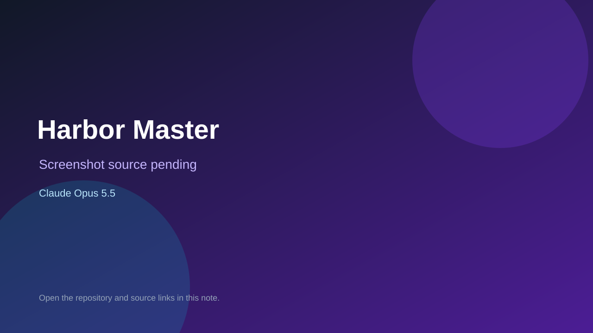

# Harbor Master

> Top-list entry: **today** (#6).

## At a glance

- **Score:** 8.2/10
- **Model:** Claude Opus 5.5
- **Technology:** Three.js, JavaScript, WebGL, Browser
- **Estimated FP32 operations/s at 60 FPS:** 1,500,000,000 (low confidence; static estimate, not measured).
- **Rating basis:** Source-backed gameplay mechanics, creator-reported model attribution and documented run path; no fresh runtime playtest.
- **Verified:** 2026-09-26
- **Repository:** [https://github.com/hirosichen/ai-harbor-master-game](https://github.com/hirosichen/ai-harbor-master-game)
- **Evidence:** [creator-reported model evidence](https://github.com/hirosichen/ai-harbor-master-game/blob/main/README.md)
- **Live demo:** [open demo](https://vibe-harbor-master.pages.dev)

## Screenshots

No screenshot source is recorded yet. Keep the placeholder until a repository, awesome list, or creator source provides an image.

## Model attribution

Open the evidence link above. Evidence grade: **creator-reported model evidence**.

## Source description

A superyacht docking simulator with twin-engine and thruster controls, wind, collision penalties and a position-and-heading docking goal. Source main.js defines controls and dock-state checks. Repository creation date is not treated as a game publication date; live demos were not playtested.

### Gameplay source

- [https://github.com/hirosichen/ai-harbor-master-game/blob/main/main.js](https://github.com/hirosichen/ai-harbor-master-game/blob/main/main.js)
- [https://github.com/hirosichen/ai-harbor-master-game/blob/main/README.md](https://github.com/hirosichen/ai-harbor-master-game/blob/main/README.md)

## Verification notes

- **Status:** verified_source
- **Counted units in repository:** 1
- **Units covered by this note:** 1
- **Discovery:** GitHub repository search: model/game, created:2026-09-25..2026-09-26 (checked 2026-09-26)

[Back to the awesome list](../../README.md)
