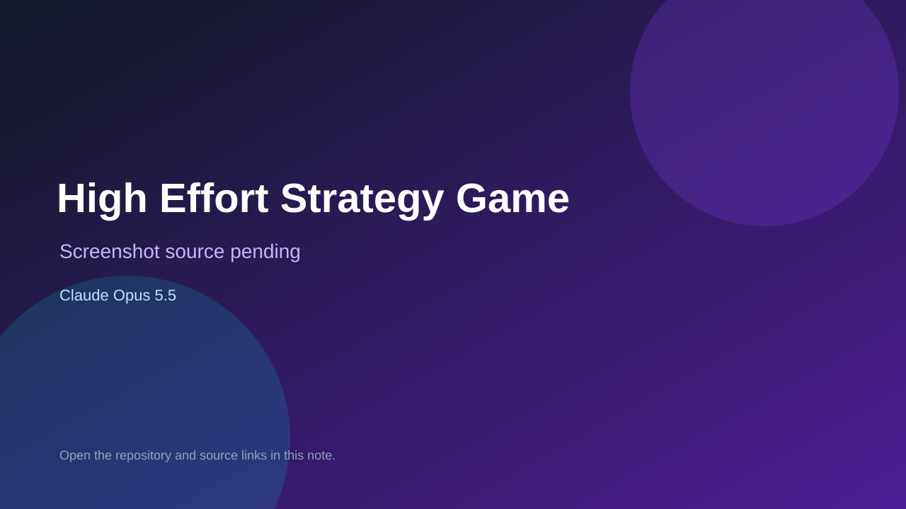

# High Effort Strategy Game

> Top-list entry: **today** (#8).

## At a glance

- **Score:** 7.6/10
- **Model:** Claude Opus 5.5
- **Technology:** JavaScript, HTML, CSS, Browser
- **Estimated FP32 operations/s at 60 FPS:** 1,500,000,000 (low confidence; static estimate, not measured).
- **Rating basis:** Six playable browser strategy-game builds generated from a common prompt at different Opus 5.5 effort levels, plus a special prompt. Each games/* directory contains source and an HTML entry point. No hosted demo is claimed.
- **Verified:** 2026-09-26
- **Repository:** [https://github.com/Barty-Bart/opus-55-effort-comparison](https://github.com/Barty-Bart/opus-55-effort-comparison)
- **Evidence:** [creator-reported model evidence](https://github.com/Barty-Bart/opus-55-effort-comparison/blob/main/README.md)

## Screenshots

No screenshot source is recorded yet. Keep the placeholder until a repository, awesome list, or creator source provides an image.

## Model attribution

Open the evidence link above. Evidence grade: **creator-reported model evidence**.

## Source description

Six playable browser strategy-game builds generated from a common prompt at different Opus 5.5 effort levels, plus a special prompt. Each games/* directory contains source and an HTML entry point. No hosted demo is claimed. Repository creation date is not treated as a game publication date; live demos were not playtested.

### Gameplay source

- [https://github.com/Barty-Bart/opus-55-effort-comparison/blob/main/games/high/index.html](https://github.com/Barty-Bart/opus-55-effort-comparison/blob/main/games/high/index.html)
- [https://github.com/Barty-Bart/opus-55-effort-comparison/blob/main/README.md](https://github.com/Barty-Bart/opus-55-effort-comparison/blob/main/README.md)

## Verification notes

- **Status:** verified_source
- **Counted units in repository:** 6
- **Units covered by this note:** 1
- **Discovery:** GitHub repository search: model/game, created:2026-09-25..2026-09-26 (checked 2026-09-26)

[Back to the awesome list](../../README.md)
