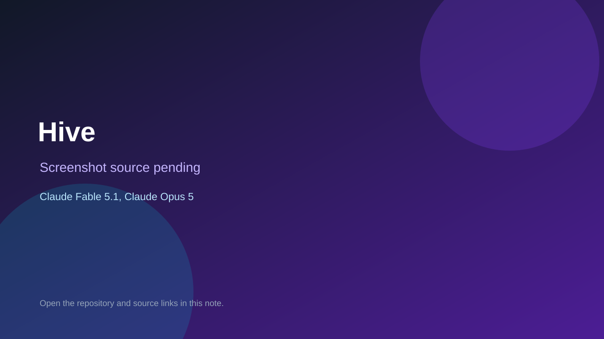

# Hive

> Verified game note.

## At a glance

- **Score:** 9.0/10
- **Model:** Claude Fable 5.1, Claude Opus 5
- **Technology:** TypeScript, Deno, HTML, CSS, PWA, GitHub Pages
- **Verified:** 2026-09-15
- **Repository:** [https://github.com/JakeAve/airgap](https://github.com/JakeAve/airgap)
- **Evidence:** [direct model evidence](https://github.com/JakeAve/airgap/commit/344e9d333dad28a0b4645962b3dbe68ec9d3902a)
- **Live demo:** [open demo](https://jakeave.github.io/airgap/)

## Screenshots

No screenshot source is recorded yet. Keep the placeholder until a repository, awesome list, or creator source provides an image.

## Model attribution

Open the evidence link above. Evidence grade: **direct model evidence**.

## Source description

The repository is a browser PWA/library of independent two-player games whose moves are exchanged by sound or QR. The public source contains separate playable pages and game logic for Checkers, Chess, Hive, Swarm, Packet Storm, Spaceships (a Battleship-style game), and Tic-Tac-Toe, with rules, state transitions, turn handling, codecs, UI input and end states. The dated commits Add checkers (#3), Add chess (#6), and Add Swarm (#5) contain exact Co-Authored-By: Claude Fable 5.1 trailers; Packet Storm and other current gameplay commits contain exact Claude Opus 5 trailers. Count seven independently playable game units in one repository; the repository was created 2026-09-11 and received game/effects work on 2026-09-15.

### Gameplay source

- [https://github.com/JakeAve/airgap/blob/main/README.md](https://github.com/JakeAve/airgap/blob/main/README.md)
- [https://github.com/JakeAve/airgap/blob/main/static/checkers.html](https://github.com/JakeAve/airgap/blob/main/static/checkers.html)
- [https://github.com/JakeAve/airgap/blob/main/static/chess.html](https://github.com/JakeAve/airgap/blob/main/static/chess.html)
- [https://github.com/JakeAve/airgap/blob/main/static/packetstorm.html](https://github.com/JakeAve/airgap/blob/main/static/packetstorm.html)
- [https://github.com/JakeAve/airgap/blob/main/static/spaceships.html](https://github.com/JakeAve/airgap/blob/main/static/spaceships.html)
- [https://github.com/JakeAve/airgap/blob/main/static/swarm.html](https://github.com/JakeAve/airgap/blob/main/static/swarm.html)
- [https://github.com/JakeAve/airgap/blob/main/static/tictactoe.html](https://github.com/JakeAve/airgap/blob/main/static/tictactoe.html)
- [https://github.com/JakeAve/airgap/tree/main/src/games](https://github.com/JakeAve/airgap/tree/main/src/games)
- [https://github.com/JakeAve/airgap/commit/344e9d333dad28a0b4645962b3dbe68ec9d3902a](https://github.com/JakeAve/airgap/commit/344e9d333dad28a0b4645962b3dbe68ec9d3902a)

## Verification notes

- **Status:** verified_source
- **Counted units:** 7
- **Discovery:** GitHub commit search for Claude Fable 5.1 dated 2026-09-13..2026-09-15; https://github.com/JakeAve/airgap

[Back to the awesome list](../../README.md)
