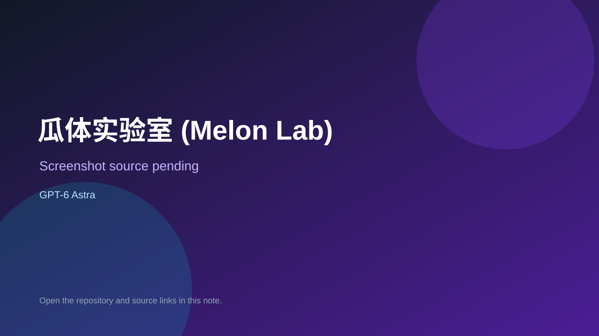

# 瓜体实验室 (Melon Lab)

> Verified game note.

## At a glance

- **Score:** 8.1/10
- **Model:** GPT-6 Astra
- **Technology:** HTML, JavaScript, Canvas 2D, Three.js, Browser
- **Estimated FP32 operations/s at 60 FPS:** 900,000,000 (low confidence; static estimate, not measured).
- **Rating basis:** Evidence-based estimate from two complete one-shot game artifacts with distinct mechanics, prompts, source trees and standalone HTML files; reduced for no hosted demo and limited automated evidence.
- **Verified:** 2026-09-10
- **Repository:** [https://github.com/celia827/Game-Melon-Field-Lab](https://github.com/celia827/Game-Melon-Field-Lab)
- **Evidence:** [direct model evidence](https://github.com/celia827/Game-Melon-Field-Lab#-gpt-6-astra-one-shot-)

## Screenshots

No screenshot source is recorded yet. Keep the placeholder until a repository, awesome list, or creator source provides an image.

## Model attribution

Open the evidence link above. Evidence grade: **direct model evidence**.

## Source description

The README explicitly attributes two one-shot experiments to GPT-6 Astra and preserves the original prompts. The repository contains two separate browser game directories, standalone HTML artifacts, source JavaScript, Canvas/Three.js runtime code and a Mosswing design/play image. Melon Lab implements fruit merging and physics; Mosswing implements one-tap 3D flight with gravity, gaps, score and one-hit failure. The code hashes differ from the Ayi1337 reference repository, so this is not an unchanged fork; count two source-backed game units under this repository. No hosted deployment was found, so do not claim live browser verification.

### Gameplay source

- [https://github.com/celia827/Game-Melon-Field-Lab/tree/master/melon-lab](https://github.com/celia827/Game-Melon-Field-Lab/tree/master/melon-lab)
- [https://github.com/celia827/Game-Melon-Field-Lab#-gpt-6-astra-one-shot-](https://github.com/celia827/Game-Melon-Field-Lab#-gpt-6-astra-one-shot-)

## Verification notes

- **Status:** verified
- **Counted units in repository:** 2
- **Units covered by this note:** 1
- **Discovery:** https://api.github.com/search/repositories?q=%22GPT-6%22+playable+game+in%3Areadme

[Back to the awesome list](../../README.md)
