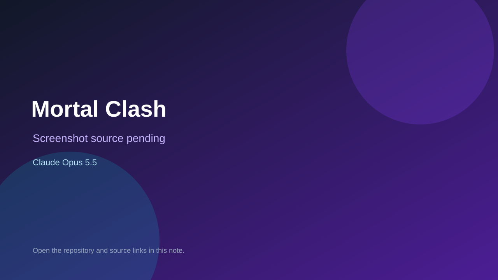

# Mortal Clash

> Verified game note.

## At a glance

- **Score:** 7.8/10
- **Model:** Claude Opus 5.5
- **Technology:** Three.js, JavaScript, WebGL, Browser
- **Estimated FP32 operations/s at 60 FPS:** 1,500,000,000 (low confidence; static estimate, not measured).
- **Rating basis:** A playable one-on-one fighter with character selection, combos, multiple difficulties, and round-based combat.
- **Verified:** 2026-09-25
- **Repository:** [https://github.com/PromptEngineer48/claude-opus-5.5-games](https://github.com/PromptEngineer48/claude-opus-5.5-games)
- **Evidence:** [creator-reported model evidence](https://github.com/PromptEngineer48/claude-opus-5.5-games/blob/main/README.md)
- **Live demo:** [open demo](https://promptengineer48.github.io/claude-opus-5.5-games/mortal-clash/)

## Screenshots

No screenshot source is recorded yet. Keep the placeholder until a repository, awesome list, or creator source provides an image.

## Model attribution

Open the evidence link above. Evidence grade: **creator-reported model evidence**.

## Source description

Count three distinct browser games: Neon Siege, Mortal Clash, and Rooftop Sniper: Last Light. The README documents controls, gameplay, and separate entry points for all three. The repository README and description attribute the three separate games to Claude Opus 5.5. Inspect the source HTML and README sections. Screenshot highlights come from the separately linked Frontier Games collection; no image for Mortal Clash was found in the inspected sources, so do not assign it a screenshot score. Do not claim runtime playtesting.

### Gameplay source

- [https://github.com/PromptEngineer48/claude-opus-5.5-games/blob/main/mortal-clash/index.html](https://github.com/PromptEngineer48/claude-opus-5.5-games/blob/main/mortal-clash/index.html)
- [https://github.com/PromptEngineer48/claude-opus-5.5-games/blob/main/README.md](https://github.com/PromptEngineer48/claude-opus-5.5-games/blob/main/README.md)

## Verification notes

- **Status:** verified_source
- **Counted units in repository:** 3
- **Units covered by this note:** 1
- **Discovery:** GitHub repository search: "Claude Opus 5.5" game created:2026-09-24..2026-09-25 (checked 2026-09-25; UTC+07:00 date filter); https://github.com/theolundqvist/frontier-games

[Back to the awesome list](../../README.md)
