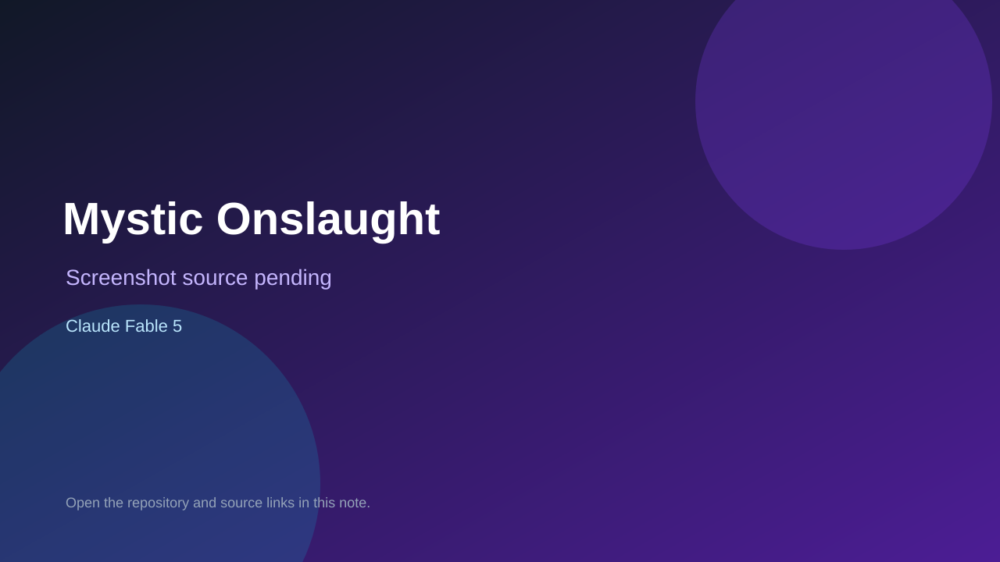

# Mystic Onslaught

> Verified game note.

## At a glance

- **Score:** 9.2/10
- **Model:** Claude Fable 5
- **Technology:** C++, raylib 5.5, Emscripten, Native desktop and web
- **Estimated FP32 operations/s at 60 FPS:** 1,600,000,000 (low confidence; static estimate, not measured).
- **Rating basis:** Large source-complete roguelite with a documented gameplay loop, multiple classes and bosses, procedural rooms, persistent progression, custom tools, native and web builds, public itch.io page and direct Fable-attributed gameplay systems.
- **Verified:** 2026-09-15
- **Repository:** [https://github.com/KAOSN00B/MysticOnslaught](https://github.com/KAOSN00B/MysticOnslaught)
- **Evidence:** [direct model evidence](https://github.com/KAOSN00B/MysticOnslaught/commit/b5c7a873c0708727201e03129deb29da904f640e)
- **Live demo:** [open demo](https://kaosn00b.itch.io/mystic-onslaught)

## Screenshots

No screenshot source is recorded yet. Keep the placeholder until a repository, awesome list, or creator source provides an image.

## Model attribution

Open the evidence link above. Evidence grade: **direct model evidence**.

## Source description

The README and source describe a playable top-down action roguelite with real-time combat, six classes, abilities, enemy waves, procedural/authored rooms, bosses, pickups, relics, a village hub, meta progression, keyboard/gamepad/touch controls and Emscripten web support. The public itch.io game page is linked from the README. The repository received a fresh 2026-09-15 README/title update and has exact Claude Fable 5 trailers on gameplay/content-engine commits, including boss combat and encounter work. Count one existing game newly verified for this collection; its repository predates the two-day window.

### Gameplay source

- [https://github.com/KAOSN00B/MysticOnslaught/blob/master/README.md](https://github.com/KAOSN00B/MysticOnslaught/blob/master/README.md)
- [https://github.com/KAOSN00B/MysticOnslaught/commit/b5c7a873c0708727201e03129deb29da904f640e](https://github.com/KAOSN00B/MysticOnslaught/commit/b5c7a873c0708727201e03129deb29da904f640e)

## Verification notes

- **Status:** verified_source
- **Counted units in repository:** 1
- **Units covered by this note:** 1
- **Discovery:** GitHub game commit search dated 2026-09-13..2026-09-15; https://github.com/KAOSN00B/MysticOnslaught; https://kaosn00b.itch.io/mystic-onslaught

[Back to the awesome list](../../README.md)
