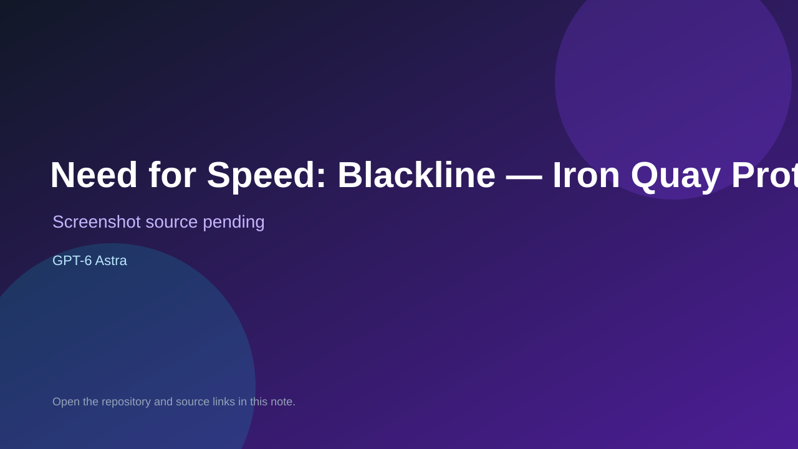

# Need for Speed: Blackline — Iron Quay Prototype

> Verified game note.

## At a glance

- **Score:** 9.2/10
- **Model:** GPT-6 Astra
- **Technology:** Three.js 0.160.1, HTML5, JavaScript, WebGL, Browser
- **Verified:** 2026-09-15
- **Repository:** [https://github.com/EthanVanDyk/blackline-prototype](https://github.com/EthanVanDyk/blackline-prototype)
- **Evidence:** [creator-reported model evidence](https://github.com/EthanVanDyk/blackline-prototype)

## Screenshots

No screenshot source is recorded yet. Keep the placeholder until a repository, awesome list, or creator source provides an image.

## Model attribution

Open the evidence link above. Evidence grade: **creator-reported model evidence**.

## Source description

The repository was created on 2026-09-15 and its description explicitly says it is a racing game vibe-coded using GPT 6. The README documents a playable browser 3D heist racer with rehearsal recording, teammate playback, archive collection, police pursuit, heat, escape, extraction, cash banking, drift, nitrous, traffic, collisions, pause/retry and keyboard/touch-ready source. core.js and game.js implement the simulation, Three.js scene, input and rendering; 12 automated checks cover the complete loop. Normalize the explicit GPT 6 attribution to GPT-6 Astra. Count one new browser game unit.

### Gameplay source

- [https://github.com/EthanVanDyk/blackline-prototype/blob/main/README.md](https://github.com/EthanVanDyk/blackline-prototype/blob/main/README.md)
- [https://github.com/EthanVanDyk/blackline-prototype/blob/main/index.html](https://github.com/EthanVanDyk/blackline-prototype/blob/main/index.html)
- [https://github.com/EthanVanDyk/blackline-prototype/blob/main/core.js](https://github.com/EthanVanDyk/blackline-prototype/blob/main/core.js)
- [https://github.com/EthanVanDyk/blackline-prototype/blob/main/game.js](https://github.com/EthanVanDyk/blackline-prototype/blob/main/game.js)
- [https://github.com/EthanVanDyk/blackline-prototype/blob/main/test/simulation.test.cjs](https://github.com/EthanVanDyk/blackline-prototype/blob/main/test/simulation.test.cjs)
- [https://github.com/EthanVanDyk/blackline-prototype](https://github.com/EthanVanDyk/blackline-prototype)

## Verification notes

- **Status:** verified_source
- **Counted units:** 1
- **Discovery:** GitHub repository search for GPT-6 created 2026-09-13..2026-09-15; https://github.com/EthanVanDyk/blackline-prototype

[Back to the awesome list](../../README.md)
