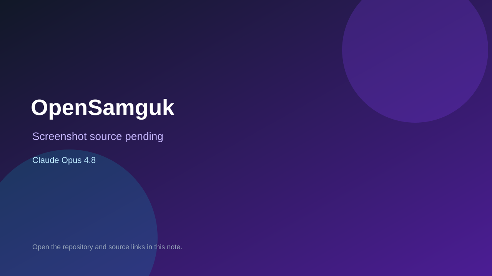

# OpenSamguk

> Verified game note.

## At a glance

- **Score:** 9.6/10
- **Model:** Claude Opus 4.8
- **Technology:** Kotlin, Spring Boot, Next.js, TypeScript, SVG/isometric map, PostgreSQL, Redis, Browser strategy game
- **Estimated FP32 operations/s at 60 FPS:** 950,000,000 (low confidence; static estimate, not measured).
- **Rating basis:** Large source-complete strategy game with deterministic engine, persistent world, map and supply systems, diplomacy, governance, combat, replay, AI, tested browser client and exact Opus gameplay attribution.
- **Verified:** 2026-09-10
- **Repository:** [https://github.com/peppone-choi/opensamguk](https://github.com/peppone-choi/opensamguk)
- **Evidence:** [direct model evidence](https://github.com/peppone-choi/opensamguk/commit/a4dc4d43d0554d6297cd98f6d5d3e5b3b3811a93)

## Screenshots

No screenshot source is recorded yet. Keep the placeholder until a repository, awesome list, or creator source provides an image.

## Model attribution

Open the evidence link above. Evidence grade: **direct model evidence**.

## Source description

The Korean README identifies OpenSamguk as an independent web strategy game. It documents an asynchronous operations room and living chronicle loop, deterministic Kotlin game engine, Next.js game client, world/map systems, movement and supply, personal and national commands, diplomacy, governance, field/siege/naval WEGO combat, replay, AI turns, persistence, tutorials and test gates. The repository contains game-engine handlers, game-api controllers, map data and a large web/game client with board, battle, command, map, replay and tutorial tests. The cited game-status HUD commit adds game-over, initiative and round-clock behavior and contains exact Co-Authored-By: Claude Opus 4.8 trailers. Count the current grand-strategy game once; exclude terrain generation, admin tools and documentation plans.

### Gameplay source

- [https://github.com/peppone-choi/opensamguk#readme](https://github.com/peppone-choi/opensamguk#readme)
- [https://github.com/peppone-choi/opensamguk/commit/a4dc4d43d0554d6297cd98f6d5d3e5b3b3811a93](https://github.com/peppone-choi/opensamguk/commit/a4dc4d43d0554d6297cd98f6d5d3e5b3b3811a93)

## Verification notes

- **Status:** verified_source
- **Counted units in repository:** 1
- **Units covered by this note:** 1
- **Discovery:** GitHub commit search for Co-Authored-By Claude Opus game; https://github.com/peppone-choi/opensamguk

[Back to the awesome list](../../README.md)
