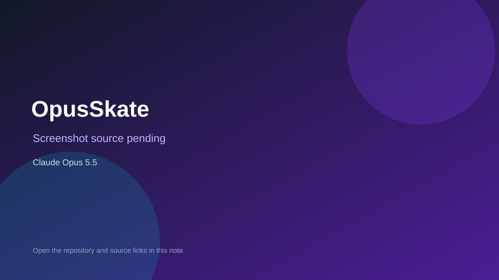

# OpusSkate

> Verified game note.



## At a glance

- **Score:** 7.7/10
- **Model:** Claude Opus 5.5
- **Technology:** C++17, SDL2, OpenGL, Native desktop
- **Estimated FP32 operations/s at 60 FPS:** 900,000,000 (low confidence; static estimate, not measured).
- **Rating basis:** Source contains a real input and scoring loop but no tested binary or public demo.
- **Verified:** 2026-09-24
- **Repository:** [https://github.com/OminousIndustries/OpusSkate](https://github.com/OminousIndustries/OpusSkate)
- **Evidence:** [creator-reported model evidence](https://github.com/OminousIndustries/OpusSkate/blob/main/README.md)

## Screenshots

No screenshot source is recorded yet. Keep the placeholder until a repository, awesome list, or creator source provides an image.

## Model attribution

Open the evidence link above. Evidence grade: **creator-reported model evidence**.

## Source description

Single-file C++ skating game with SDL input, ride/air/grind/manual/bail states, ollie and tricks, combo scoring, and collectible letters. README and repository description credit Opus 5.5. Build requires SDL2/OpenGL; compilation not tested.

### Gameplay source

- [https://github.com/OminousIndustries/OpusSkate/blob/main/README.md](https://github.com/OminousIndustries/OpusSkate/blob/main/README.md)

## Reverse-engineered prompt

Reconstruct this prompt from the verified source; it is not an original prompt transcript. See [prompt evidence](https://github.com/OminousIndustries/OpusSkate/blob/main/README.md).

```text
Build OpusSkate as a playable game using C++17, SDL2, OpenGL, Native desktop. Single-file C++ skating game with SDL input, ride/air/grind/manual/bail states, ollie and tricks, combo scoring, and collectible letters. README and repository description credit Opus 5.5. Build requires SDL2/OpenGL; compilation not tested. Preserve controls, game state, objective, failure and restart behavior shown in the source. This is a source-derived reconstruction prompt, not the original prompt.
```

## Verification notes

- **Status:** verified_source
- **Counted units in repository:** 1
- **Units covered by this note:** 1
- **Discovery:** GitHub repository search: opus-5.5 created 2026-09-17..2026-09-24; https://github.com/OminousIndustries/OpusSkate

[Back to the awesome list](../../README.md)
