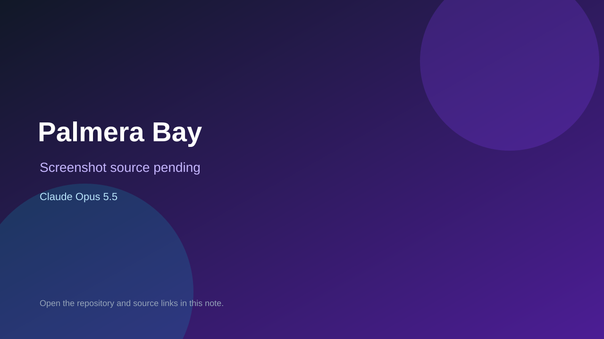

# Palmera Bay

> Top-list entry: **this week** (#11).

## At a glance

- **Score:** 8.2/10
- **Model:** Claude Opus 5.5
- **Technology:** Three.js, JavaScript, WebGL, Browser
- **Verified:** 2026-09-24
- **Repository:** [https://github.com/vcahlik/palmera-bay](https://github.com/vcahlik/palmera-bay)
- **Evidence:** [creator-reported model evidence](https://github.com/vcahlik/palmera-bay/blob/master/README.md)
- **Live demo:** [open demo](https://cahlik.net/palmera-bay/)

## Screenshots

No screenshot source is recorded yet. Keep the placeholder until a repository, awesome list, or creator source provides an image.

## Model attribution

Open the evidence link above. Evidence grade: **creator-reported model evidence**.

## Source description

Playable free-roam driving prototype with keyboard controls, a fast convertible, coastal city, road reset, camera options, nitro and procedural audio. Creator README explicitly attributes Claude Opus 5.5. No opponents or win objective; classify as a driving game prototype, not a racing game. Live URL returned HTTP 200; no interactive playtest.

### Gameplay source

- [https://github.com/vcahlik/palmera-bay/blob/master/README.md](https://github.com/vcahlik/palmera-bay/blob/master/README.md)
- [https://github.com/vcahlik/palmera-bay/blob/master/src/main.js](https://github.com/vcahlik/palmera-bay/blob/master/src/main.js)
- [https://github.com/vcahlik/palmera-bay/blob/master/src/car.js](https://github.com/vcahlik/palmera-bay/blob/master/src/car.js)
- [https://github.com/vcahlik/palmera-bay/blob/master/src/world.js](https://github.com/vcahlik/palmera-bay/blob/master/src/world.js)

## Verification notes

- **Status:** verified_source
- **Counted units:** 1
- **Discovery:** GitHub repository search: opus-5.5 created 2026-09-17..2026-09-24; https://github.com/vcahlik/palmera-bay

[Back to the awesome list](../../README.md)
