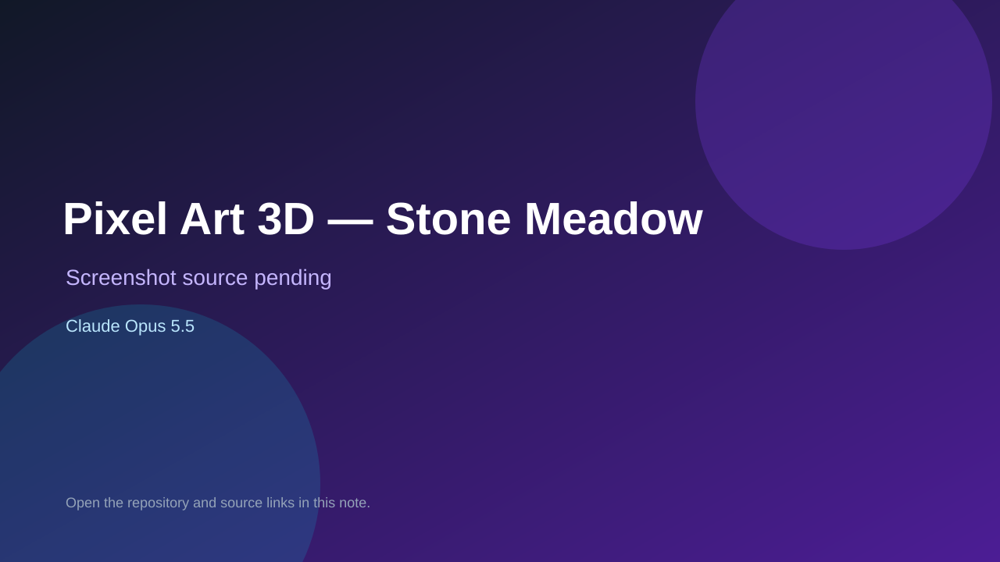

# Pixel Art 3D — Stone Meadow

> Top-list entry: **today** (#7).

## At a glance

- **Score:** 7.5/10
- **Model:** Claude Opus 5.5
- **Technology:** Three.js, JavaScript, WebGL, Browser
- **Estimated FP32 operations/s at 60 FPS:** 1,000,000,000 (low confidence; static estimate, not measured).
- **Rating basis:** The source provides a controllable exploration sandbox with stateful inventory and time-of-day mechanics, but no explicit campaign, challenge, or win/loss goal; retain as a modest prototype rather than a high-confidence game recommendation.
- **Verified:** 2026-09-25
- **Repository:** [https://github.com/AnthonyFl27/pixelart_3d](https://github.com/AnthonyFl27/pixelart_3d)
- **Evidence:** [creator-reported model evidence](https://github.com/AnthonyFl27/pixelart_3d)

## Screenshots

No screenshot source is recorded yet. Keep the placeholder until a repository, awesome list, or creator source provides an image.

## Model attribution

Open the evidence link above. Evidence grade: **creator-reported model evidence**.

## Source description

A playable first-person pixel-art exploration sandbox with movement, jump/fly modes, an inventory torch, object storage, and a changing day/night cycle. The GitHub repository description names an Opus 5.5-built game. Inspect the README and controls. Keep its exploration-sandbox status clear: it has movement, inventory, and a dynamic world but no documented win/loss objective. No source-hosted screenshots or public deployment were identified, so do not assign a screenshot rating.

### Gameplay source

- [https://github.com/AnthonyFl27/pixelart_3d/blob/main/index.html](https://github.com/AnthonyFl27/pixelart_3d/blob/main/index.html)
- [https://github.com/AnthonyFl27/pixelart_3d](https://github.com/AnthonyFl27/pixelart_3d)

## Verification notes

- **Status:** verified_source
- **Counted units in repository:** 1
- **Units covered by this note:** 1
- **Discovery:** GitHub repository search: "Opus 5.5" game created:2026-09-24..2026-09-25 (checked 2026-09-25; UTC+07:00 date filter)

[Back to the awesome list](../../README.md)
