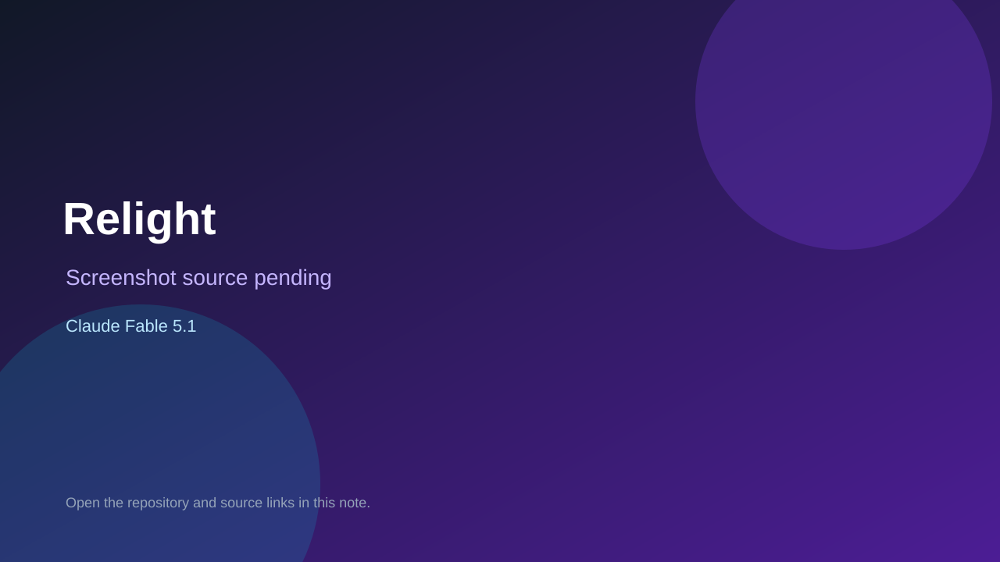

# Relight

> Verified game note.

## At a glance

- **Score:** 9.2/10
- **Model:** Claude Fable 5.1
- **Technology:** Phaser 4, TypeScript, Vite, Tauri v2, Native desktop, Browser
- **Estimated FP32 operations/s at 60 FPS:** 1,400,000,000 (low confidence; static estimate, not measured).
- **Rating basis:** The project has a separated simulation and renderer, a documented game loop, extensive tests and evidence screenshots, plus both browser and native Tauri targets with exact Fable attribution.
- **Verified:** 2026-09-10
- **Repository:** [https://github.com/Deedubsy/Relight](https://github.com/Deedubsy/Relight)
- **Evidence:** [direct model evidence](https://github.com/Deedubsy/Relight/commit/b3a3f6c8f42a09841102287ac195a424c1f05e1f)

## Screenshots

No screenshot source is recorded yet. Keep the placeholder until a repository, awesome list, or creator source provides an image.

## Model attribution

Open the evidence link above. Evidence grade: **direct model evidence**.

## Source description

The README describes a 2D city-reclamation factory game with a pure simulation and a Phaser renderer, and documents both browser development and Tauri desktop packaging. sim.ts implements the game state transition loop; worldScene.ts and cityMapScene.ts render the playable world and city views. The repository includes gameplay screenshots and the cited merge commit includes an exact Co-Authored-By: Claude Fable 5.1 trailer.

### Gameplay source

- [https://github.com/Deedubsy/Relight/blob/b3a3f6c8f42a09841102287ac195a424c1f05e1f/packages/sim/src/sim.ts](https://github.com/Deedubsy/Relight/blob/b3a3f6c8f42a09841102287ac195a424c1f05e1f/packages/sim/src/sim.ts)
- [https://github.com/Deedubsy/Relight/commit/b3a3f6c8f42a09841102287ac195a424c1f05e1f](https://github.com/Deedubsy/Relight/commit/b3a3f6c8f42a09841102287ac195a424c1f05e1f)

## Verification notes

- **Status:** verified_source
- **Counted units in repository:** 1
- **Units covered by this note:** 1
- **Discovery:** GitHub code search for Phaser game Co-Authored-By Claude Fable; https://github.com/Deedubsy/Relight

[Back to the awesome list](../../README.md)
