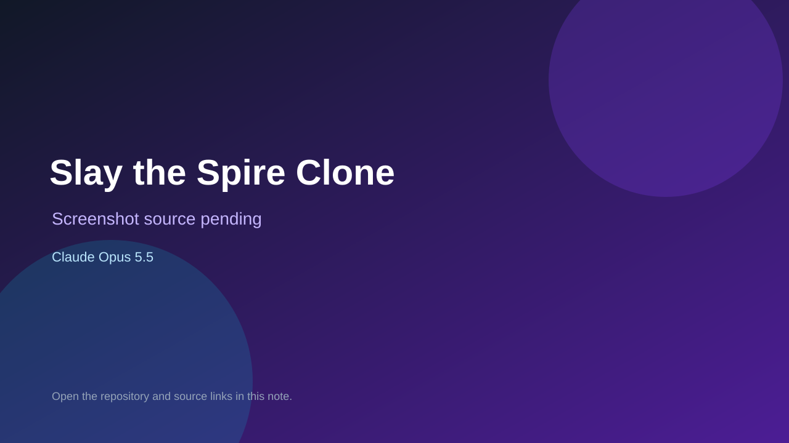

# Slay the Spire Clone

> Verified game note.

## At a glance

- **Score:** 8.1/10
- **Model:** Claude Opus 5.5
- **Technology:** React, TypeScript, Vite, Canvas, Three.js, Browser
- **Estimated FP32 operations/s at 60 FPS:** 1,500,000,000 (low confidence; static estimate, not measured).
- **Rating basis:** Four source-separated browser games: a MOBA simulation, voxel sandbox, lane-defense game and card roguelike. README attributes all four one-shot projects to Claude Opus 5.5; each has a source directory and listed deployment.
- **Verified:** 2026-09-26
- **Repository:** [https://github.com/icebear0828/vibe-games](https://github.com/icebear0828/vibe-games)
- **Evidence:** [creator-reported model evidence](https://github.com/icebear0828/vibe-games/blob/main/README.md)
- **Live demo:** [open demo](https://icebear0828.github.io/vibe-games/sts/)

## Screenshots

No screenshot source is recorded yet. Keep the placeholder until a repository, awesome list, or creator source provides an image.

## Model attribution

Open the evidence link above. Evidence grade: **creator-reported model evidence**.

## Source description

Four source-separated browser games: a MOBA simulation, voxel sandbox, lane-defense game and card roguelike. README attributes all four one-shot projects to Claude Opus 5.5; each has a source directory and listed deployment. Repository creation date is not treated as a game publication date; live demos were not playtested.

### Gameplay source

- [https://github.com/icebear0828/vibe-games/tree/main/slay-the-spire-clone/src](https://github.com/icebear0828/vibe-games/tree/main/slay-the-spire-clone/src)
- [https://github.com/icebear0828/vibe-games/blob/main/README.md](https://github.com/icebear0828/vibe-games/blob/main/README.md)

## Verification notes

- **Status:** verified_source
- **Counted units in repository:** 4
- **Units covered by this note:** 1
- **Discovery:** GitHub repository search: model/game, created:2026-09-25..2026-09-26 (checked 2026-09-26)

[Back to the awesome list](../../README.md)
