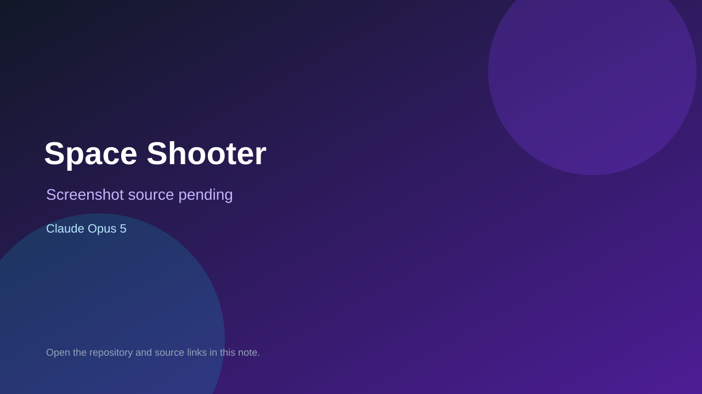

# Space Shooter

> Verified game note.

## At a glance

- **Score:** 8.8/10
- **Model:** Claude Opus 5
- **Technology:** HTML5 Canvas, JavaScript, CSS3, Browser
- **Verified:** 2026-09-15
- **Repository:** [https://github.com/jansmakr/space-shooter-web](https://github.com/jansmakr/space-shooter-web)
- **Evidence:** [direct model evidence](https://github.com/jansmakr/space-shooter-web/commit/2d6ca4489a4d2ee4e5c7c59b33ef893a53faf0f8)

## Screenshots

No screenshot source is recorded yet. Keep the placeholder until a repository, awesome list, or creator source provides an image.

## Model attribution

Open the evidence link above. Evidence grade: **direct model evidence**.

## Source description

The repository was created on 2026-09-15 and contains a standalone index.html Canvas game. The source implements title/start/pause/game-over states, keyboard, mouse and touch controls, a player ship, bullets, meteors, enemies, enemy fire, collisions, power-ups, sectors, lives, score and local best-score persistence. The cited creation commit contains an exact Co-Authored-By: Claude Opus 5 trailer. Count one new browser game unit.

### Gameplay source

- [https://github.com/jansmakr/space-shooter-web/commit/2d6ca4489a4d2ee4e5c7c59b33ef893a53faf0f8](https://github.com/jansmakr/space-shooter-web/commit/2d6ca4489a4d2ee4e5c7c59b33ef893a53faf0f8)
- [https://github.com/jansmakr/space-shooter-web/blob/main/index.html](https://github.com/jansmakr/space-shooter-web/blob/main/index.html)

## Verification notes

- **Status:** verified_source
- **Counted units:** 1
- **Discovery:** GitHub commit search for game Co-Authored-By Claude Opus, committer-date 2026-09-13..2026-09-15; https://github.com/jansmakr/space-shooter-web

[Back to the awesome list](../../README.md)
