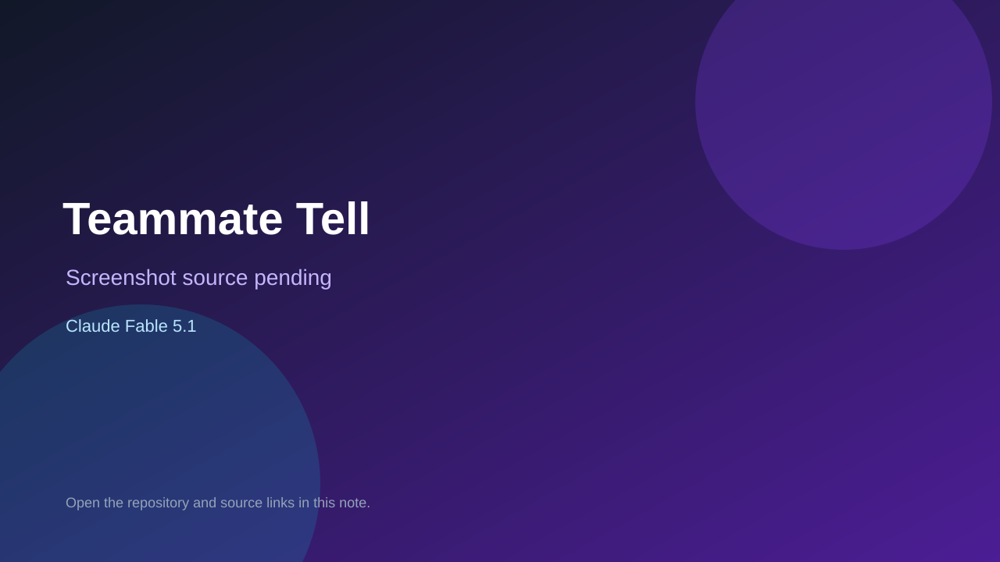

# Teammate Tell

> Verified game note.

## At a glance

- **Score:** 8.9/10
- **Model:** Claude Fable 5.1
- **Technology:** React, Vite, TypeScript, Hono, Cloudflare Workers, Cloudflare Durable Objects, Cloudflare D1/KV/R2, Native web
- **Verified:** 2026-09-15
- **Repository:** [https://github.com/cuongluu8/tenable](https://github.com/cuongluu8/tenable)
- **Evidence:** [direct model evidence](https://github.com/cuongluu8/tenable/commit/1a7b4c2145a136617a80f32e6bdee62b23ee2d89)
- **Live demo:** [open demo](https://top-10-tension.cuong-luu.workers.dev)

## Screenshots

No screenshot source is recorded yet. Keep the placeholder until a repository, awesome list, or creator source provides an image.

## Model attribution

Open the evidence link above. Evidence grade: **direct model evidence**.

## Source description

The repository is a live football-trivia game platform with four independently playable modes: daily Top-10 category guessing, Club Run, Teammate Tell and Roll of Honour. README and source show answer validation, lives, scoring, pass-and-play, remote multiplayer, lobbies, timed hints, chat, rematches and server-side state; the live Worker URL is public. Current 2026-09-14 and 2026-09-15 commits contain exact Claude Fable 5.1 trailers while implementing and hardening remote gameplay, WebSockets, multiplayer state and load testing. Count four distinct game units from one canonical repository; the repo predates the two-day window but received current game-platform evidence during it.

### Gameplay source

- [https://github.com/cuongluu8/tenable/blob/main/README.md](https://github.com/cuongluu8/tenable/blob/main/README.md)
- [https://github.com/cuongluu8/tenable/tree/main/src/react-app](https://github.com/cuongluu8/tenable/tree/main/src/react-app)
- [https://github.com/cuongluu8/tenable/tree/main/src/react-app/clubBadges](https://github.com/cuongluu8/tenable/tree/main/src/react-app/clubBadges)
- [https://github.com/cuongluu8/tenable/tree/main/src/react-app/rollOfHonour](https://github.com/cuongluu8/tenable/tree/main/src/react-app/rollOfHonour)
- [https://github.com/cuongluu8/tenable/tree/main/src/react-app/remote](https://github.com/cuongluu8/tenable/tree/main/src/react-app/remote)
- [https://github.com/cuongluu8/tenable/commit/1a7b4c2145a136617a80f32e6bdee62b23ee2d89](https://github.com/cuongluu8/tenable/commit/1a7b4c2145a136617a80f32e6bdee62b23ee2d89)

## Verification notes

- **Status:** verified_source
- **Counted units:** 4
- **Discovery:** GitHub commit search for Claude Fable 5.1 dated 2026-09-13..2026-09-15; https://github.com/cuongluu8/tenable

[Back to the awesome list](../../README.md)
