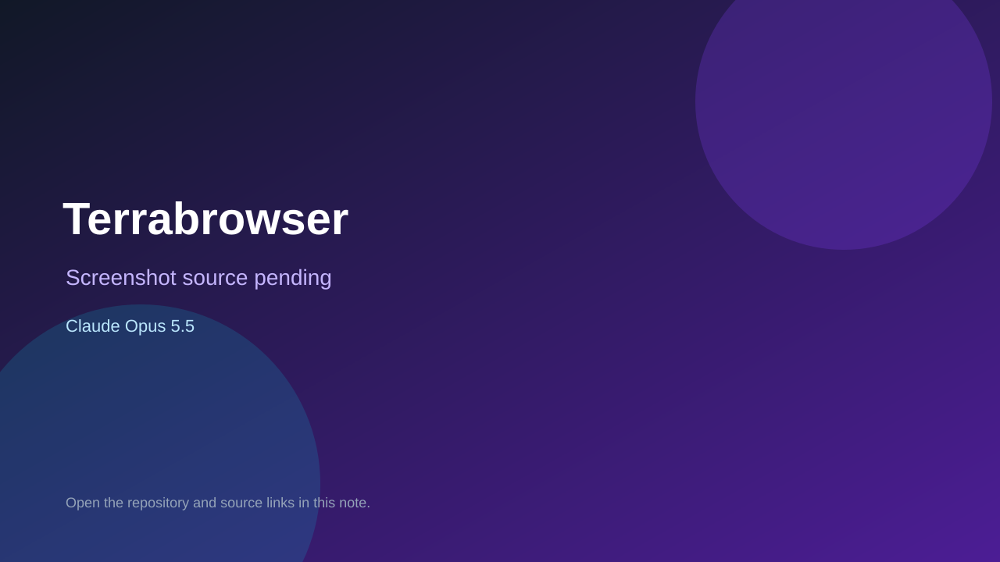

# Terrabrowser

> Top-list entry: **today** (#7), **this week** (#7).



## At a glance

- **Score:** 9.1/10
- **Model:** Claude Opus 5.5
- **Technology:** JavaScript, Canvas 2D, Web Audio, Browser
- **Estimated FP32 operations/s at 60 FPS:** 600,000,000 (low confidence; static estimate, not measured).
- **Rating basis:** Source contains controls and stateful gameplay; quality is a subjective source-based estimate, not a runtime playtest.
- **Verified:** 2026-09-24
- **Repository:** [https://github.com/Wimmboo2/Terrabrowser](https://github.com/Wimmboo2/Terrabrowser)
- **Evidence:** [direct model evidence](https://github.com/Wimmboo2/Terrabrowser/commit/53eb19ba3401ac79d6c44455789ee998b9930c06)
- **Live demo:** [open demo](https://terrabrowser.vercel.app)

## Screenshots

No screenshot source is recorded yet. Keep the placeholder until a repository, awesome list, or creator source provides an image.

## Model attribution

Open the evidence link above. Evidence grade: **direct model evidence**.

## Source description

Browser sandbox action-adventure with movement, mining, crafting, combat, bosses, progression, world generation and saves. Gameplay commit has an exact Claude Opus 5.5 trailer. Live URL returned HTTP 200; no runtime playtest.

### Gameplay source

- [https://github.com/Wimmboo2/Terrabrowser/blob/main/README.md](https://github.com/Wimmboo2/Terrabrowser/blob/main/README.md)
- [https://github.com/Wimmboo2/Terrabrowser/commit/53eb19ba3401ac79d6c44455789ee998b9930c06](https://github.com/Wimmboo2/Terrabrowser/commit/53eb19ba3401ac79d6c44455789ee998b9930c06)

## Reverse-engineered prompt

Reconstruct this prompt from the verified source; it is not an original prompt transcript. See [prompt evidence](https://github.com/Wimmboo2/Terrabrowser/blob/main/README.md).

```text
Build a playable Terrabrowser using JavaScript, Canvas 2D, Web Audio, Browser. Browser sandbox action-adventure with movement, mining, crafting, combat, bosses, progression, world generation and saves. Gameplay commit has an exact Claude Opus 5.5 trailer. Live URL returned HTTP 200; no runtime playtest. Preserve the observed controls, state transitions, goals and feedback. This is reconstructed from source, not an original prompt.
```

## Verification notes

- **Status:** verified_source
- **Counted units in repository:** 1
- **Units covered by this note:** 1
- **Discovery:** GitHub repository search: opus-5.5 created 2026-09-17..2026-09-24; https://github.com/Wimmboo2/Terrabrowser

[Back to the awesome list](../../README.md)
