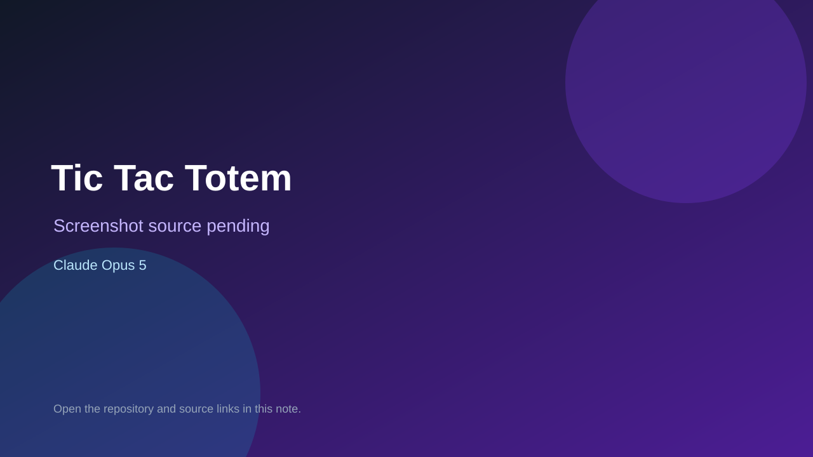

# Tic Tac Totem

> Verified game note.

## At a glance

- **Score:** 8.8/10
- **Model:** Claude Opus 5
- **Technology:** Unity, C#, Photon PUN, WebGL, Online multiplayer
- **Estimated FP32 operations/s at 60 FPS:** 300,000,000 (low confidence; static estimate, not measured).
- **Rating basis:** The repository has a complete online ruleset, bot opponent, Unity scenes, Photon integration, published WebGL target and direct recent Opus gameplay evidence.
- **Verified:** 2026-09-15
- **Repository:** [https://github.com/LeandroMagonza/TicTacTotem](https://github.com/LeandroMagonza/TicTacTotem)
- **Evidence:** [direct model evidence](https://github.com/LeandroMagonza/TicTacTotem/commit/67e9cc44a97e6b5c25231ed17deaf9152b574bed)
- **Live demo:** [open demo](https://leandromagonza.github.io/TicTacTotem/)

## Screenshots

No screenshot source is recorded yet. Keep the placeholder until a repository, awesome list, or creator source provides an image.

## Model attribution

Open the evidence link above. Evidence grade: **direct model evidence**.

## Source description

The repository contains a real Unity/Photon WebGL online board game. Its metadata describes the rules: players place or move ranked pieces orthogonally, capture lower-ranked pieces, rotate colors after matches and play against another player or the bot. Assets/Scripts/GameManager.cs, MatchManager.cs, Piece.cs, Launcher.cs, scenes and the published GitHub Pages target provide the game entry, turn state, piece movement, win logic and online room flow. The cited recent gameplay commit contains an exact Co-Authored-By: Claude Opus 5 trailer and reports bot regression testing. Count one newly found native-engine game with fresh qualifying gameplay evidence.

### Gameplay source

- [https://github.com/LeandroMagonza/TicTacTotem/blob/master/Assets/Scripts/GameManager.cs](https://github.com/LeandroMagonza/TicTacTotem/blob/master/Assets/Scripts/GameManager.cs)
- [https://github.com/LeandroMagonza/TicTacTotem/commit/67e9cc44a97e6b5c25231ed17deaf9152b574bed](https://github.com/LeandroMagonza/TicTacTotem/commit/67e9cc44a97e6b5c25231ed17deaf9152b574bed)

## Verification notes

- **Status:** verified_source
- **Counted units in repository:** 1
- **Units covered by this note:** 1
- **Discovery:** GitHub commit search for game Co-Authored-By Claude Opus, committer-date 2026-09-13..2026-09-15; https://github.com/LeandroMagonza/TicTacTotem

[Back to the awesome list](../../README.md)
