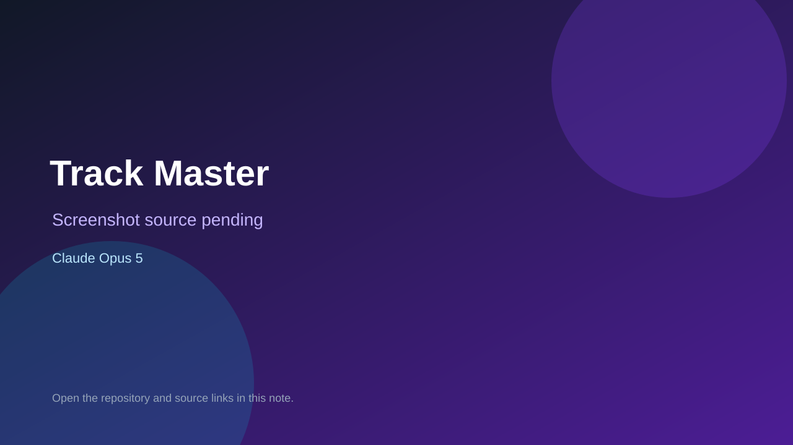

# Track Master

> Verified game note.

## At a glance

- **Score:** 9.1/10
- **Model:** Claude Opus 5
- **Technology:** Node.js, WebSocket, Canvas 2D, JavaScript, Browser multiplayer
- **Verified:** 2026-09-15
- **Repository:** [https://github.com/Akajek/Track-Master](https://github.com/Akajek/Track-Master)
- **Evidence:** [direct model evidence](https://github.com/Akajek/Track-Master/commit/71b666e45724f9d41759707f8917b9b5e455af4e)

## Screenshots

No screenshot source is recorded yet. Keep the placeholder until a repository, awesome list, or creator source provides an image.

## Model attribution

Open the evidence link above. Evidence grade: **direct model evidence**.

## Source description

The repository was created on 2026-09-13 and describes a complete asymmetric multiplayer browser tower-defense game. The README documents Mastermind track editing, towers, traps, abilities, runner movement, escape objectives, upgrades, victory points, rooms and setup. package.json identifies a Node.js server and ws dependency; server.js and public/index.html, game.js and rules.js provide the multiplayer entry point and game state. The cited gameplay commit contains an exact Co-Authored-By: Claude Opus 5 trailer and reports tested gameplay systems. Count one new browser game unit.

### Gameplay source

- [https://github.com/Akajek/Track-Master/blob/main/README.md](https://github.com/Akajek/Track-Master/blob/main/README.md)
- [https://github.com/Akajek/Track-Master/blob/main/server.js](https://github.com/Akajek/Track-Master/blob/main/server.js)
- [https://github.com/Akajek/Track-Master/tree/main/public](https://github.com/Akajek/Track-Master/tree/main/public)
- [https://github.com/Akajek/Track-Master/blob/main/package.json](https://github.com/Akajek/Track-Master/blob/main/package.json)
- [https://github.com/Akajek/Track-Master/commit/71b666e45724f9d41759707f8917b9b5e455af4e](https://github.com/Akajek/Track-Master/commit/71b666e45724f9d41759707f8917b9b5e455af4e)

## Verification notes

- **Status:** verified_source
- **Counted units:** 1
- **Discovery:** GitHub repository search for Claude game created 2026-09-13..2026-09-15; https://github.com/Akajek/Track-Master

[Back to the awesome list](../../README.md)
