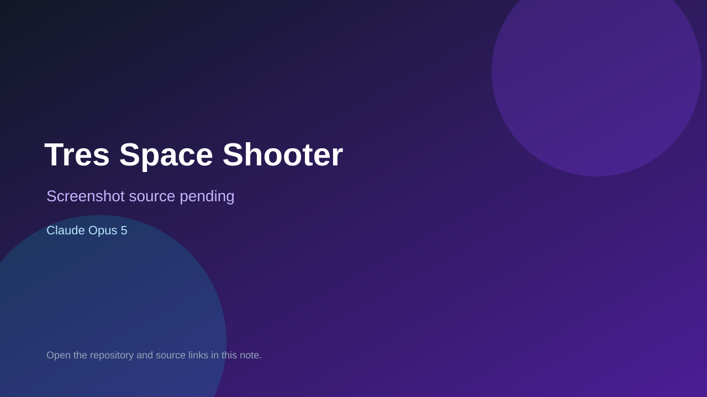

# Tres Space Shooter

> Verified game note.

## At a glance

- **Score:** 9.0/10
- **Model:** Claude Opus 5
- **Technology:** Nuxt 3, Vue 3, TresJS, Three.js, TypeScript, Pinia, Native web
- **Verified:** 2026-09-15
- **Repository:** [https://github.com/SilvioDoMine/tres-spaceshooter](https://github.com/SilvioDoMine/tres-spaceshooter)
- **Evidence:** [repository-level model evidence](https://github.com/SilvioDoMine/tres-spaceshooter/commit/a8502003f4c589b2e8f03509485adf9e22428f55)

## Screenshots

No screenshot source is recorded yet. Keep the placeholder until a repository, awesome list, or creator source provides an image.

## Model attribution

Open the evidence link above. Evidence grade: **repository-level model evidence**.

## Source description

The README and TresJS source identify a real browser space-shooter with a 3D world, player ship controls, enemy managers and AI, projectiles, collision/combat state, health, loot, skills, equipment, missions, chapters, boss encounters, lobby/progression and a frame-driven game loop. Current commits on 2026-09-14 and 2026-09-15 add game-speed simulation, combat audio, health testing, hyperdrive effects, ship updates and chapter repagination. The repository also contains exact Claude Opus 5 attribution on its recent release/deploy commits. Count one fresh game unit with two-day gameplay evidence; model attribution is recorded at repository level rather than claimed for every gameplay commit.

### Gameplay source

- [https://github.com/SilvioDoMine/tres-spaceshooter/blob/main/README.md](https://github.com/SilvioDoMine/tres-spaceshooter/blob/main/README.md)
- [https://github.com/SilvioDoMine/tres-spaceshooter/blob/main/app/components/game/GameOrchestrator.vue](https://github.com/SilvioDoMine/tres-spaceshooter/blob/main/app/components/game/GameOrchestrator.vue)
- [https://github.com/SilvioDoMine/tres-spaceshooter/tree/main/app/components/game](https://github.com/SilvioDoMine/tres-spaceshooter/tree/main/app/components/game)
- [https://github.com/SilvioDoMine/tres-spaceshooter/commit/a8502003f4c589b2e8f03509485adf9e22428f55](https://github.com/SilvioDoMine/tres-spaceshooter/commit/a8502003f4c589b2e8f03509485adf9e22428f55)
- [https://github.com/SilvioDoMine/tres-spaceshooter/commit/2af9d5ff8a0f6a8198d481679e9d6d40bd16cb87](https://github.com/SilvioDoMine/tres-spaceshooter/commit/2af9d5ff8a0f6a8198d481679e9d6d40bd16cb87)

## Verification notes

- **Status:** verified_source
- **Counted units:** 1
- **Discovery:** GitHub game commit search dated 2026-09-13..2026-09-15; https://github.com/SilvioDoMine/tres-spaceshooter

[Back to the awesome list](../../README.md)
