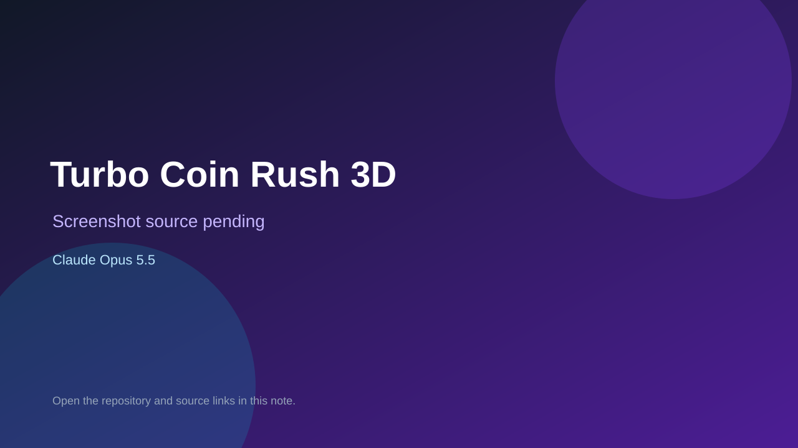

# Turbo Coin Rush 3D

> Top-list entry: **this week** (#14).



## At a glance

- **Score:** 8.1/10
- **Model:** Claude Opus 5.5
- **Technology:** Three.js, JavaScript, WebGL, Browser
- **Estimated FP32 operations/s at 60 FPS:** 900,000,000 (low confidence; static estimate, not measured).
- **Rating basis:** Source contains controls and stateful gameplay; quality is a subjective source-based estimate, not a runtime playtest.
- **Verified:** 2026-09-24
- **Repository:** [https://github.com/inteligenciamilgrau/carrinho_opus55](https://github.com/inteligenciamilgrau/carrinho_opus55)
- **Evidence:** [direct model evidence](https://github.com/inteligenciamilgrau/carrinho_opus55/commit/cebd0908b7f7d0345f5113fdf23e44be0d28f096)

## Screenshots

No screenshot source is recorded yet. Keep the placeholder until a repository, awesome list, or creator source provides an image.

## Model attribution

Open the evidence link above. Evidence grade: **direct model evidence**.

## Source description

Single-file 3D car game with player-versus-AI and AI-versus-AI modes, coin goal, score, wins, cameras and turbo. Commit explicitly credits Claude Opus 5.5. Source verified; no public demo or runtime playtest.

### Gameplay source

- [https://github.com/inteligenciamilgrau/carrinho_opus55/blob/main/index.html](https://github.com/inteligenciamilgrau/carrinho_opus55/blob/main/index.html)
- [https://github.com/inteligenciamilgrau/carrinho_opus55/commit/cebd0908b7f7d0345f5113fdf23e44be0d28f096](https://github.com/inteligenciamilgrau/carrinho_opus55/commit/cebd0908b7f7d0345f5113fdf23e44be0d28f096)

## Reverse-engineered prompt

Reconstruct this prompt from the verified source; it is not an original prompt transcript. See [prompt evidence](https://github.com/inteligenciamilgrau/carrinho_opus55/blob/main/index.html).

```text
Build a playable Turbo Coin Rush 3D using Three.js, JavaScript, WebGL, Browser. Single-file 3D car game with player-versus-AI and AI-versus-AI modes, coin goal, score, wins, cameras and turbo. Commit explicitly credits Claude Opus 5.5. Source verified; no public demo or runtime playtest. Preserve the observed controls, state transitions, goals and feedback. This is reconstructed from source, not an original prompt.
```

## Verification notes

- **Status:** verified_source
- **Counted units in repository:** 1
- **Units covered by this note:** 1
- **Discovery:** GitHub repository search: opus-5.5 created 2026-09-17..2026-09-24; https://github.com/inteligenciamilgrau/carrinho_opus55

[Back to the awesome list](../../README.md)
