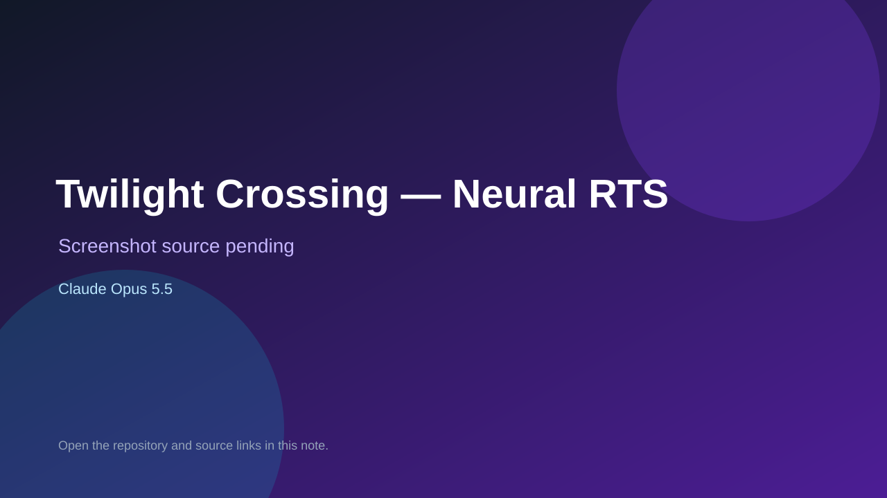

# Twilight Crossing — Neural RTS

> Top-list entry: **this week** (#13).

## At a glance

- **Score:** 8.0/10
- **Model:** Claude Opus 5.5
- **Technology:** Three.js, JavaScript, WebGL, Browser, JEV classifier, OpenRouter
- **Verified:** 2026-09-24
- **Repository:** [https://github.com/MattiTynka/JEV-RTS](https://github.com/MattiTynka/JEV-RTS)
- **Evidence:** [creator-reported model evidence](https://www.reddit.com/r/ClaudeCode/comments/1wo8492/prompts_and_jevcontolled_rts_game_ported_and/)
- **Live demo:** [open demo](https://mattitynka.github.io/JEV-RTS/)

## Screenshots

No screenshot source is recorded yet. Keep the placeholder until a repository, awesome list, or creator source provides an image.

## Model attribution

Open the evidence link above. Evidence grade: **creator-reported model evidence**.

## Source description

Creator reports porting the Unity RTS to the web with Opus 5.5. The source includes RTS simulation, worker gathering, attack, enemy factions, health and winner state. The deployed page returned HTTP 200. Playing with visuals requires downloading the separate original StudioIgor asset pack; neural commands require a user-provided OpenRouter key and may incur cost. No interactive playtest performed.

### Gameplay source

- [https://github.com/MattiTynka/JEV-RTS/blob/main/index.html](https://github.com/MattiTynka/JEV-RTS/blob/main/index.html)
- [https://github.com/MattiTynka/JEV-RTS/blob/main/v/1b428e053cf5/src/sim/world.js](https://github.com/MattiTynka/JEV-RTS/blob/main/v/1b428e053cf5/src/sim/world.js)
- [https://github.com/MattiTynka/JEV-RTS/blob/main/v/1b428e053cf5/app.js](https://github.com/MattiTynka/JEV-RTS/blob/main/v/1b428e053cf5/app.js)
- [https://www.reddit.com/r/ClaudeCode/comments/1wo8492/prompts_and_jevcontolled_rts_game_ported_and/](https://www.reddit.com/r/ClaudeCode/comments/1wo8492/prompts_and_jevcontolled_rts_game_ported_and/)

## Verification notes

- **Status:** verified_source
- **Counted units:** 1
- **Discovery:** Reddit creator post 2026-09-23; https://www.reddit.com/r/ClaudeCode/comments/1wo8492/prompts_and_jevcontolled_rts_game_ported_and/; https://github.com/MattiTynka/JEV-RTS

[Back to the awesome list](../../README.md)
