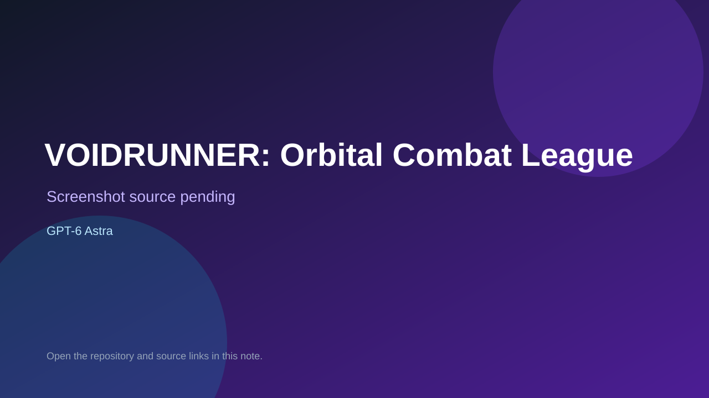

# VOIDRUNNER: Orbital Combat League

> Top-list entry: **this week** (#11).



## At a glance

- **Score:** 8.7/10
- **Model:** GPT-6 Astra
- **Technology:** Three.js, WebGL2, GLSL, JavaScript, Web Audio, Browser
- **Estimated FP32 operations/s at 60 FPS:** 5,500,000,000 (low confidence; static estimate, not measured).
- **Rating basis:** Playable orbital racing/combat game with a working HUD, lap progression, weapons and a publicly verified start state; subjective source-based score, not a new playtest.
- **Verified:** 2026-09-24
- **Repository:** [https://github.com/alesha-pro/bench-portal](https://github.com/alesha-pro/bench-portal)
- **Evidence:** [creator-reported model evidence](https://github.com/alesha-pro/bench-portal#readme)
- **Live demo:** [open demo](https://alesha-pro.github.io/bench-portal/games/voidrunner-astra/)

## Screenshots

No screenshot source is recorded yet. Keep the placeholder until a repository, awesome list, or creator source provides an image.

## Model attribution

Open the evidence link above. Evidence grade: **creator-reported model evidence**.

## Source description

The repository is a static portal that also contains self-contained game source, not a catalog-only link list. Its tree contains separate index.html and game.json files for VOIDRUNNER, VOIDBOUND and Onslaught. The game metadata identifies the Astra or Fable build, and the curated Astra source links the creator posts and exact game directories. Browser verification loaded and started all three public demos: VOIDRUNNER reached lap 01 with hull, weapons and controls HUD; VOIDBOUND reached Wave 01 with health, abilities and ten enemies remaining; Onslaught reached its FPS HUD with weapons, ammunition and deployment state. The non-game RIG showcase folders were excluded. The repository later added OVERRUN — Dockyard Nine: its game.json explicitly identifies Claude Opus 5.5, and commit 30037f2602b662650b19edc47178e09550966ea5 added the shooter on 2026-09-22. The game directory contains a runnable index.html, Three.js/WebGL source and cover.webp; the GitHub Pages game URL returned HTTP 200. Count this one new Opus 5.5 game, not the surrounding portal/catalog entries.

### Gameplay source

- [https://github.com/alesha-pro/bench-portal/tree/main/games/voidrunner-astra](https://github.com/alesha-pro/bench-portal/tree/main/games/voidrunner-astra)
- [https://github.com/alesha-pro/bench-portal#readme](https://github.com/alesha-pro/bench-portal#readme)

## Reverse-engineered prompt

Reconstruct this prompt from the verified source; it is not an original prompt transcript. See [prompt evidence](https://github.com/alesha-pro/bench-portal/commit/30037f2602b662650b19edc47178e09550966ea5).

```text
Rebuild the four separate playable games in this repository rather than merging them into one title: VOIDRUNNER: Orbital Combat League, VOIDBOUND: The Choir of Ash, Onslaught, OVERRUN: Dockyard Nine. Preserve each game's distinct controls, objectives, mechanics, and feedback. The new Opus 5.5 title, OVERRUN: Dockyard Nine, is a first-person horde shooter with three firearms, grenades, melee, explosive barrels, ammunition pickups and escalating synthetic enemy waves. Use the per-game prompts in contained_game_estimates for source-backed reconstructions. Attribute creator model only as each evidence record supports.
```

## Verification notes

- **Status:** verified
- **Counted units in repository:** 4
- **Units covered by this note:** 1
- **Discovery:** https://github.com/magiccreator-ai/awesome-gpt-6-astra; https://x.com/superalesha/status/2095967568825582044; https://x.com/superalesha/status/2095988972879335792; https://github.com/alesha-pro/bench-portal

[Back to the awesome list](../../README.md)
