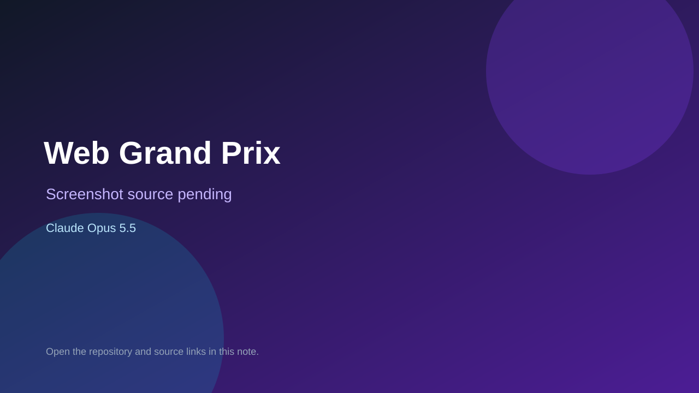

# Web Grand Prix

> Top-list entry: **today** (#9), **this week** (#9).



## At a glance

- **Score:** 9.0/10
- **Model:** Claude Opus 5.5
- **Technology:** Next.js 16, React 19, TypeScript, Three.js, Browser
- **Estimated FP32 operations/s at 60 FPS:** 1,600,000,000 (low confidence; static estimate, not measured).
- **Rating basis:** Subjective source-based estimate from controls, game state and completeness; no runtime playtest.
- **Verified:** 2026-09-24
- **Repository:** [https://github.com/GatoArtStudio/f1-opus-5.5](https://github.com/GatoArtStudio/f1-opus-5.5)
- **Evidence:** [creator-reported model evidence](https://github.com/GatoArtStudio/f1-opus-5.5)
- **Live demo:** [open demo](https://f1-demo.gatoartstudio.com/)

## Screenshots

No screenshot source is recorded yet. Keep the placeholder until a repository, awesome list, or creator source provides an image.

## Model attribution

Open the evidence link above. Evidence grade: **creator-reported model evidence**.

## Source description

F1-style browser race with player controls, AI rivals, 6–8 km circuits, weather, tyres, pit stops, lap/race classification and results. Creator repository description says it was produced using Opus 5.5. Demo returned HTTP 200; no interactive playtest.

### Gameplay source

- [https://github.com/GatoArtStudio/f1-opus-5.5/blob/main/README.md](https://github.com/GatoArtStudio/f1-opus-5.5/blob/main/README.md)
- [https://github.com/GatoArtStudio/f1-opus-5.5](https://github.com/GatoArtStudio/f1-opus-5.5)

## Reverse-engineered prompt

Reconstruct this prompt from the verified source; it is not an original prompt transcript. See [prompt evidence](https://github.com/GatoArtStudio/f1-opus-5.5/blob/main/README.md).

```text
Build a playable Web Grand Prix using Next.js 16, React 19, TypeScript, Three.js, Browser. F1-style browser race with player controls, AI rivals, 6–8 km circuits, weather, tyres, pit stops, lap/race classification and results. Creator repository description says it was produced using Opus 5.5. Demo returned HTTP 200; no interactive playtest. Preserve the observed controls, state transitions, goals and feedback. This is reconstructed from source, not an original prompt.
```

## Verification notes

- **Status:** verified_source
- **Counted units in repository:** 1
- **Units covered by this note:** 1
- **Discovery:** GitHub repository search: opus-5.5 created 2026-09-17..2026-09-24; https://github.com/GatoArtStudio/f1-opus-5.5

[Back to the awesome list](../../README.md)
