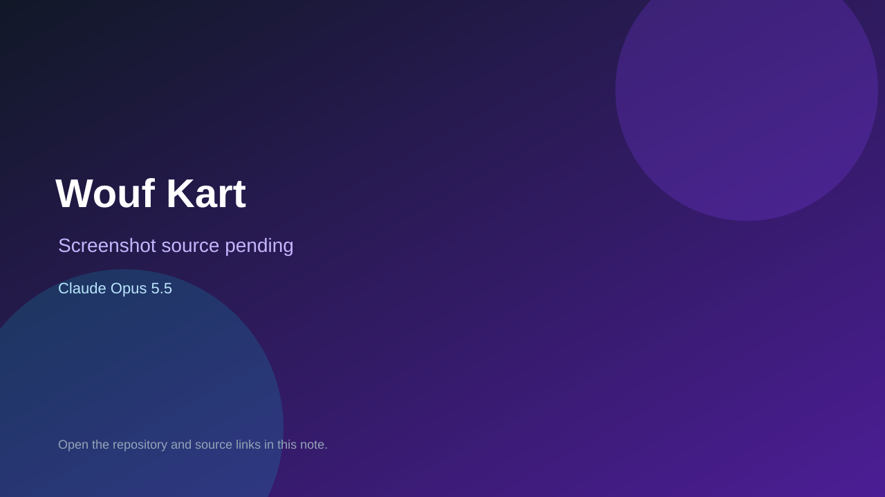

# Wouf Kart

> Top-list entry: **this week** (#10).



## At a glance

- **Score:** 8.9/10
- **Model:** Claude Opus 5.5
- **Technology:** Angular 22, Three.js, TypeScript, WebGL, Browser
- **Estimated FP32 operations/s at 60 FPS:** 1,400,000,000 (low confidence; static estimate, not measured).
- **Rating basis:** Source contains controls and stateful gameplay; quality is a subjective source-based estimate, not a runtime playtest.
- **Verified:** 2026-09-24
- **Repository:** [https://github.com/eddyacthergal/super-wouf-kart](https://github.com/eddyacthergal/super-wouf-kart)
- **Evidence:** [creator-reported model evidence](https://github.com/eddyacthergal/super-wouf-kart)

## Screenshots

No screenshot source is recorded yet. Keep the placeholder until a repository, awesome list, or creator source provides an image.

## Model attribution

Open the evidence link above. Evidence grade: **creator-reported model evidence**.

## Source description

Dog-themed kart racer with one garden circuit, three-lap race against seven AI drivers, drifting, items, rankings and finish results. Repository description attributes it to Opus 5.5; source and README prove gameplay. No live demo or runtime playtest.

### Gameplay source

- [https://github.com/eddyacthergal/super-wouf-kart/blob/main/README.md](https://github.com/eddyacthergal/super-wouf-kart/blob/main/README.md)
- [https://github.com/eddyacthergal/super-wouf-kart](https://github.com/eddyacthergal/super-wouf-kart)

## Reverse-engineered prompt

Reconstruct this prompt from the verified source; it is not an original prompt transcript. See [prompt evidence](https://github.com/eddyacthergal/super-wouf-kart/blob/main/README.md).

```text
Build a playable Wouf Kart using Angular 22, Three.js, TypeScript, WebGL, Browser. Dog-themed kart racer with one garden circuit, three-lap race against seven AI drivers, drifting, items, rankings and finish results. Repository description attributes it to Opus 5.5; source and README prove gameplay. No live demo or runtime playtest. Preserve the observed controls, state transitions, goals and feedback. This is reconstructed from source, not an original prompt.
```

## Verification notes

- **Status:** verified_source
- **Counted units in repository:** 1
- **Units covered by this note:** 1
- **Discovery:** GitHub repository search: opus-5.5 created 2026-09-17..2026-09-24; https://github.com/eddyacthergal/super-wouf-kart

[Back to the awesome list](../../README.md)
