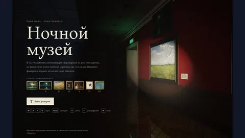

# Claude Opus 5.5 games

Browse **34 curated game units** from **16 source repositories** attributed to Claude Opus 5.5. Read each evidence grade before relying on the attribution. Include multi-model games here and on every other applicable model page.

[Back to all models](../README.md#browse-by-model) · [Source data](../games.json)

## Top-rated games

| Game | Score | Evidence |
| --- | ---: | --- |
| [Barista Shift](../games/barista-shift/readme.md) | ⭐ 9.5 | [✓ repository-level model evidence](https://github.com/swan4er/opus-100-projects/blob/main/README.md) |
| [Rally Navigator](../games/rally-navigator/readme.md) | ⭐ 9.5 | [✓ repository-level model evidence](https://github.com/swan4er/opus-100-projects/blob/main/README.md) |
| [Chess with Character](../games/chess-with-character/readme.md) | ⭐ 9.4 | [✓ repository-level model evidence](https://github.com/swan4er/opus-100-projects/blob/main/README.md) |
| [The Precinct Officer](../games/the-precinct-officer/readme.md) | ⭐ 9.4 | [✓ repository-level model evidence](https://github.com/swan4er/opus-100-projects/blob/main/README.md) |
| [Interrogation](../games/interrogation/readme.md) | ⭐ 9.3 | [✓ repository-level model evidence](https://github.com/swan4er/opus-100-projects/blob/main/README.md) |
| [Mafia](../games/mafia/readme.md) | ⭐ 9.3 | [✓ repository-level model evidence](https://github.com/swan4er/opus-100-projects/blob/main/README.md) |
| [Night Museum](../games/night-museum/readme.md) | ⭐ 9.3 | [✓ repository-level model evidence](https://github.com/swan4er/opus-100-projects/blob/main/README.md) |
| [Turbo Kart Rally](../games/turbo-kart-rally/readme.md) | ⭐ 9.3 | [≈ creator-reported model evidence](https://github.com/bridge-mind/turbo-kart-rally/blob/main/README.md) |
| [Alchemy Automaton](../games/alchemy-automaton/readme.md) | ⭐ 9.2 | [✓ repository-level model evidence](https://github.com/swan4er/opus-100-projects/blob/main/README.md) |
| [Dead Signal: Exclusion Zone](../games/dead-signal-exclusion-zone/readme.md) | ⭐ 9.2 | [≈ creator-reported model evidence](https://github.com/bridge-mind/claude-opus-5.5-zombies-game/blob/main/README.md) |

## Screenshot highlights

Inspect these manually rated screenshots. Treat the scores as visual impressions, not runtime playtests.

<table>
<tr>
<td align="center" width="33%"> <a href="../games/turbo-kart-rally/readme.md"><strong>Turbo Kart Rally</strong></a> · 📸 9.8/10</td>
<td align="center" width="33%"> <a href="../games/fishslop/readme.md"><strong>Fishslop</strong></a> · 📸 8.8/10</td>
<td align="center" width="33%"> <a href="../games/overrun-dockyard-nine/readme.md"><strong>OVERRUN: Dockyard Nine</strong></a> · 📸 8.8/10</td>
</tr>
<tr>
<td align="center" width="33%"> <a href="../games/rally-navigator/readme.md"><strong>Rally Navigator</strong></a> · 📸 8.6/10</td>
<td align="center" width="33%"> <a href="../games/barista-shift/readme.md"><strong>Barista Shift</strong></a> · 📸 8.2/10</td>
<td align="center" width="33%"> <a href="../games/tater-s-flight-sim/readme.md"><strong>Tater's Flight Sim</strong></a> · 📸 8.2/10</td>
</tr>
<tr>
<td align="center" width="33%"> <a href="../games/night-museum/readme.md"><strong>Night Museum</strong></a> · 📸 8.0/10</td>
</tr>
</table>

## Game library

- 💥 [Action and Shooters](#action-and-shooters) — **3 game units**
- 🏎️ [Racing and Vehicles](#racing-and-vehicles) — **8 game units**
- 🛠️ [Non-Browser Engines](#nonbrowser-engines) — **1 game units**
- 🧊 [Three.js and WebGL](#threejs-and-webgl) — **4 game units**
- ♟️ [Strategy, Simulation, and Sports](#strategy-simulation-and-sports) — **1 game units**
- 🗺️ [Adventure, RPG, and Exploration](#adventure-rpg-and-exploration) — **16 game units**
- 🧩 [Puzzle, Arcade, and Platformers](#puzzle-arcade-and-platformers) — **1 game units**

## Action and Shooters

- [**Dead Signal: Exclusion Zone**](../games/dead-signal-exclusion-zone/readme.md) — ⭐ **9.2/10** · Claude Opus 5.5 · Three.js, TypeScript, Vite, WebGL, Browser · [≈ creator-reported model evidence](https://github.com/bridge-mind/claude-opus-5.5-zombies-game/blob/main/README.md) · [files](https://github.com/bridge-mind/claude-opus-5.5-zombies-game/blob/main/README.md) · [prompt](../games/dead-signal-exclusion-zone/readme.md#reverse-engineered-prompt)
- [**Terrabrowser**](../games/terrabrowser/readme.md) — ⭐ **9.1/10** · Claude Opus 5.5 · JavaScript, Canvas 2D, Web Audio, Browser · [✓ direct model evidence](https://github.com/Wimmboo2/Terrabrowser/commit/53eb19ba3401ac79d6c44455789ee998b9930c06) · [files](https://github.com/Wimmboo2/Terrabrowser/blob/main/README.md) · [play](https://terrabrowser.vercel.app) · [prompt](../games/terrabrowser/readme.md#reverse-engineered-prompt)
- [**OVERRUN: Dockyard Nine**](../games/overrun-dockyard-nine/readme.md) — ⭐ **8.5/10** · Claude Opus 5.5 · JavaScript, Three.js, WebGL, Web Audio, Browser · [≈ creator-reported model evidence](https://github.com/alesha-pro/bench-portal/commit/30037f2602b662650b19edc47178e09550966ea5) · [files](https://github.com/alesha-pro/bench-portal/blob/main/games/overrun-claude-opus-5.5/game.json) · [play](https://alesha-pro.github.io/bench-portal/games/overrun-claude-opus-5.5/index.html) · 📸 **8.8/10** · [screenshot](https://github.com/alesha-pro/bench-portal/blob/main/games/overrun-claude-opus-5.5/cover.webp) · [prompt](../games/overrun-dockyard-nine/readme.md#reverse-engineered-prompt)

[Back to game library](#game-library)

## Racing and Vehicles

- [**Turbo Kart Rally**](../games/turbo-kart-rally/readme.md) — ⭐ **9.3/10** · Claude Opus 5.5 · Three.js, JavaScript, WebGL, Browser · [≈ creator-reported model evidence](https://github.com/bridge-mind/turbo-kart-rally/blob/main/README.md) · [files](https://github.com/bridge-mind/turbo-kart-rally/blob/main/README.md) · [play](https://bridge-mind.github.io/turbo-kart-rally/) · 📸 **9.8/10** · [screenshot](https://github.com/bridge-mind/turbo-kart-rally/blob/main/docs/screenshots/race.jpg) · [prompt](../games/turbo-kart-rally/readme.md#reverse-engineered-prompt)
- [**Tater's Flight Sim**](../games/tater-s-flight-sim/readme.md) — ⭐ **9.2/10** · Claude Opus 5.5 · Three.js, TypeScript, Vite, WebGL, Browser · [✓ direct model evidence](https://github.com/JaredTate/tatertotsflightsim/commit/61ad8f7a6) · [files](https://github.com/JaredTate/tatertotsflightsim/blob/main/README.md) · 📸 **8.2/10** · [screenshot](https://github.com/JaredTate/tatertotsflightsim/blob/main/docs/screenshots/a10-burning-convoy.jpg) · [prompt](../games/tater-s-flight-sim/readme.md#reverse-engineered-prompt)
- [**QQ Speed**](../games/qq-speed/readme.md) — ⭐ **9.1/10** · Claude Opus 5.5 · Three.js, JavaScript, WebGL, Browser · [≈ creator-reported model evidence](https://github.com/riba2534/claude-opus-5-5-demo/blob/main/README.md) · [files](https://github.com/riba2534/claude-opus-5-5-demo/blob/main/qq-speed/src/main.js) · [play](https://claude-opus-5-5-qqfeiche3d.pages.dev/) · [prompt](../games/qq-speed/readme.md#reverse-engineered-prompt)
- [**CF Transport Ship**](../games/cf-transport-ship/readme.md) — ⭐ **9.0/10** · Claude Opus 5.5 · Three.js, JavaScript, WebGL, Browser · [≈ creator-reported model evidence](https://github.com/riba2534/claude-opus-5-5-demo/blob/main/README.md) · [files](https://github.com/riba2534/claude-opus-5-5-demo/blob/main/cf-transport-ship/src/game.js) · [play](https://claude-opus-5-5-cf-transport-ship.pages.dev/) · [prompt](../games/cf-transport-ship/readme.md#reverse-engineered-prompt)
- [**Pelican Bike**](../games/pelican-bike/readme.md) — ⭐ **8.9/10** · Claude Opus 5.5 · Three.js, JavaScript, WebGL, Browser · [≈ creator-reported model evidence](https://github.com/riba2534/claude-opus-5-5-demo/blob/main/README.md) · [files](https://github.com/riba2534/claude-opus-5-5-demo/blob/main/pelican-bike/src/main.js) · [play](https://claude-opus-5-5.riba2534.cn/) · [prompt](../games/pelican-bike/readme.md#reverse-engineered-prompt)
- [**Wouf Kart**](../games/wouf-kart/readme.md) — ⭐ **8.9/10** · Claude Opus 5.5 · Angular 22, Three.js, TypeScript, WebGL, Browser · [≈ creator-reported model evidence](https://github.com/eddyacthergal/super-wouf-kart) · [files](https://github.com/eddyacthergal/super-wouf-kart/blob/main/README.md) · [prompt](../games/wouf-kart/readme.md#reverse-engineered-prompt)
- [**Palmera Bay**](../games/palmera-bay/readme.md) — ⭐ **8.2/10** · Claude Opus 5.5 · Three.js, JavaScript, WebGL, Browser · [≈ creator-reported model evidence](https://github.com/vcahlik/palmera-bay/blob/master/README.md) · [files](https://github.com/vcahlik/palmera-bay/blob/master/README.md) · [play](https://cahlik.net/palmera-bay/) · [prompt](../games/palmera-bay/readme.md#reverse-engineered-prompt)
- [**Turbo Coin Rush 3D**](../games/turbo-coin-rush-3d/readme.md) — ⭐ **8.1/10** · Claude Opus 5.5 · Three.js, JavaScript, WebGL, Browser · [✓ direct model evidence](https://github.com/inteligenciamilgrau/carrinho_opus55/commit/cebd0908b7f7d0345f5113fdf23e44be0d28f096) · [files](https://github.com/inteligenciamilgrau/carrinho_opus55/blob/main/index.html) · [prompt](../games/turbo-coin-rush-3d/readme.md#reverse-engineered-prompt)

[Back to game library](#game-library)

## Non-Browser Engines

- [**OpusSkate**](../games/opusskate/readme.md) — ⭐ **7.7/10** · Claude Opus 5.5 · C++17, SDL2, OpenGL, Native desktop · [≈ creator-reported model evidence](https://github.com/OminousIndustries/OpusSkate/blob/main/README.md) · [files](https://github.com/OminousIndustries/OpusSkate/blob/main/README.md) · [prompt](../games/opusskate/readme.md#reverse-engineered-prompt)

[Back to game library](#game-library)

## Three.js and WebGL

- [**Fishslop**](../games/fishslop/readme.md) — ⭐ **9.1/10** · Claude Opus 5.5 · Three.js, TypeScript, WebGL, Browser · [✓ direct model evidence](https://github.com/vasu-devs/FishSlop_Opus5.5/commit/a59efa14768c7a8bf3bd35fc68b16268df91cd57) · [files](https://github.com/vasu-devs/FishSlop_Opus5.5/blob/main/README.md) · [play](https://vasu-devs.github.io/FishSlop_Opus5.5/) · 📸 **8.8/10** · [screenshot](https://github.com/vasu-devs/FishSlop_Opus5.5/blob/main/docs/screens/03-sonar.png) · [prompt](../games/fishslop/readme.md#reverse-engineered-prompt)
- [**Slide Rush**](../games/slide-rush/readme.md) — ⭐ **9.0/10** · Claude Opus 5.5 · Three.js, Vite, JavaScript, PWA, Browser · [≈ creator-reported model evidence](https://github.com/KJLKurt/waterslide-game-opus-5.5/blob/main/README.md) · [files](https://github.com/KJLKurt/waterslide-game-opus-5.5/blob/main/README.md) · [play](https://kjlkurt.github.io/waterslide-game-opus-5.5/) · [prompt](../games/slide-rush/readme.md#reverse-engineered-prompt)
- [**Web Grand Prix**](../games/web-grand-prix/readme.md) — ⭐ **9.0/10** · Claude Opus 5.5 · Next.js 16, React 19, TypeScript, Three.js, Browser · [≈ creator-reported model evidence](https://github.com/GatoArtStudio/f1-opus-5.5) · [files](https://github.com/GatoArtStudio/f1-opus-5.5/blob/main/README.md) · [play](https://f1-demo.gatoartstudio.com/) · [prompt](../games/web-grand-prix/readme.md#reverse-engineered-prompt)
- [**Catgirl Pachinko**](../games/catgirl-pachinko/readme.md) — ⭐ **8.3/10** · Claude Opus 5.5 · TypeScript, WebGL2, Rapier 2D, Vite, Browser · [✓ direct model evidence](https://github.com/Maoku/Opus55CatgirlPachi/commit/659a821f86) · [files](https://github.com/Maoku/Opus55CatgirlPachi/blob/main/README.md) · [play](https://maoku.github.io/Opus55CatgirlPachi/) · 📸 **7.2/10** · [screenshot](https://github.com/Maoku/Opus55CatgirlPachi/blob/main/Opus55CatgirlPachi.jpg) · [prompt](../games/catgirl-pachinko/readme.md#reverse-engineered-prompt)

[Back to game library](#game-library)

## Strategy, Simulation, and Sports

- [**Twilight Crossing — Neural RTS**](../games/twilight-crossing-neural-rts/readme.md) — ⭐ **8.0/10** · Claude Opus 5.5 · Three.js, JavaScript, WebGL, Browser, JEV classifier, +1 more · [≈ creator-reported model evidence](https://www.reddit.com/r/ClaudeCode/comments/1wo8492/prompts_and_jevcontolled_rts_game_ported_and/) · [files](https://github.com/MattiTynka/JEV-RTS/blob/main/index.html) · [play](https://mattitynka.github.io/JEV-RTS/) · [prompt](../games/twilight-crossing-neural-rts/readme.md#reverse-engineered-prompt)

[Back to game library](#game-library)

## Adventure, RPG, and Exploration

- [**Barista Shift**](../games/barista-shift/readme.md) — ⭐ **9.5/10** · Claude Opus 5.5 · JavaScript, HTML, Three.js, WebGL, Browser · [✓ repository-level model evidence](https://github.com/swan4er/opus-100-projects/blob/main/README.md) · [files](https://github.com/swan4er/opus-100-projects/blob/main/103-barista-shift/index.html) · [play](https://swan4er.github.io/opus-100-projects/103-barista-shift/) · 📸 **8.2/10** · [screenshot](https://github.com/swan4er/opus-100-projects/blob/main/103-barista-shift/preview.jpg) · [prompt](../games/barista-shift/readme.md#reverse-engineered-prompt)
- [**Rally Navigator**](../games/rally-navigator/readme.md) — ⭐ **9.5/10** · Claude Opus 5.5 · JavaScript, HTML, Three.js, WebGL, Browser · [✓ repository-level model evidence](https://github.com/swan4er/opus-100-projects/blob/main/README.md) · [files](https://github.com/swan4er/opus-100-projects/blob/main/038-rally-navigator/index.html) · [play](https://swan4er.github.io/opus-100-projects/038-rally-navigator/) · 📸 **8.6/10** · [screenshot](https://github.com/swan4er/opus-100-projects/blob/main/038-rally-navigator/preview.jpg) · [prompt](../games/rally-navigator/readme.md#reverse-engineered-prompt)
- [**Chess with Character**](../games/chess-with-character/readme.md) — ⭐ **9.4/10** · Claude Opus 5.5 · JavaScript, HTML, Three.js, WebGL, Browser · [✓ repository-level model evidence](https://github.com/swan4er/opus-100-projects/blob/main/README.md) · [files](https://github.com/swan4er/opus-100-projects/blob/main/101-chess-characters/index.html) · [play](https://swan4er.github.io/opus-100-projects/101-chess-characters/) · 📸 **7.5/10** · [screenshot](https://github.com/swan4er/opus-100-projects/blob/main/101-chess-characters/preview.jpg) · [prompt](../games/chess-with-character/readme.md#reverse-engineered-prompt)
- [**The Precinct Officer**](../games/the-precinct-officer/readme.md) — ⭐ **9.4/10** · Claude Opus 5.5 · JavaScript, HTML, Three.js, WebGL, Browser · [✓ repository-level model evidence](https://github.com/swan4er/opus-100-projects/blob/main/README.md) · [files](https://github.com/swan4er/opus-100-projects/blob/main/027-uchastkovy-rpg/index.html) · [play](https://swan4er.github.io/opus-100-projects/027-uchastkovy-rpg/) · 📸 **7.5/10** · [screenshot](https://github.com/swan4er/opus-100-projects/blob/main/027-uchastkovy-rpg/preview.jpg) · [prompt](../games/the-precinct-officer/readme.md#reverse-engineered-prompt)
- [**Interrogation**](../games/interrogation/readme.md) — ⭐ **9.3/10** · Claude Opus 5.5 · JavaScript, HTML, Three.js, WebGL, Browser · [✓ repository-level model evidence](https://github.com/swan4er/opus-100-projects/blob/main/README.md) · [files](https://github.com/swan4er/opus-100-projects/blob/main/054-interrogation/index.html) · [play](https://swan4er.github.io/opus-100-projects/054-interrogation/) · 📸 **7.7/10** · [screenshot](https://github.com/swan4er/opus-100-projects/blob/main/054-interrogation/preview.jpg) · [prompt](../games/interrogation/readme.md#reverse-engineered-prompt)
- [**Mafia**](../games/mafia/readme.md) — ⭐ **9.3/10** · Claude Opus 5.5 · JavaScript, HTML, Three.js, WebGL, Browser · [✓ repository-level model evidence](https://github.com/swan4er/opus-100-projects/blob/main/README.md) · [files](https://github.com/swan4er/opus-100-projects/blob/main/064-ai-mafia/index.html) · [play](https://swan4er.github.io/opus-100-projects/064-ai-mafia/) · 📸 **7.3/10** · [screenshot](https://github.com/swan4er/opus-100-projects/blob/main/064-ai-mafia/preview.jpg) · [prompt](../games/mafia/readme.md#reverse-engineered-prompt)
- [**Night Museum**](../games/night-museum/readme.md) — ⭐ **9.3/10** · Claude Opus 5.5 · JavaScript, HTML, Canvas 2D, Raycasting, Browser · [✓ repository-level model evidence](https://github.com/swan4er/opus-100-projects/blob/main/README.md) · [files](https://github.com/swan4er/opus-100-projects/blob/main/037-night-museum/index.html) · [play](https://swan4er.github.io/opus-100-projects/037-night-museum/) · 📸 **8.0/10** · [screenshot](https://github.com/swan4er/opus-100-projects/blob/main/037-night-museum/preview.jpg) · [prompt](../games/night-museum/readme.md#reverse-engineered-prompt)
- [**Alchemy Automaton**](../games/alchemy-automaton/readme.md) — ⭐ **9.2/10** · Claude Opus 5.5 · JavaScript, HTML, Canvas 2D, Browser · [✓ repository-level model evidence](https://github.com/swan4er/opus-100-projects/blob/main/README.md) · [files](https://github.com/swan4er/opus-100-projects/blob/main/109-alchemy-automaton/index.html) · [play](https://swan4er.github.io/opus-100-projects/109-alchemy-automaton/) · 📸 **7.4/10** · [screenshot](https://github.com/swan4er/opus-100-projects/blob/main/109-alchemy-automaton/preview.jpg) · [prompt](../games/alchemy-automaton/readme.md#reverse-engineered-prompt)
- [**Deeper**](../games/deeper/readme.md) — ⭐ **9.2/10** · Claude Opus 5.5 · JavaScript, HTML, Canvas 2D, Browser · [✓ repository-level model evidence](https://github.com/swan4er/opus-100-projects/blob/main/README.md) · [files](https://github.com/swan4er/opus-100-projects/blob/main/060-deeper-roguelike/index.html) · [play](https://swan4er.github.io/opus-100-projects/060-deeper-roguelike/) · 📸 **6.8/10** · [screenshot](https://github.com/swan4er/opus-100-projects/blob/main/060-deeper-roguelike/preview.jpg) · [prompt](../games/deeper/readme.md#reverse-engineered-prompt)
- [**Gravity Golf**](../games/gravity-golf/readme.md) — ⭐ **9.2/10** · Claude Opus 5.5 · JavaScript, HTML, Canvas 2D, Browser · [✓ repository-level model evidence](https://github.com/swan4er/opus-100-projects/blob/main/README.md) · [files](https://github.com/swan4er/opus-100-projects/blob/main/096-gravity-golf/index.html) · [play](https://swan4er.github.io/opus-100-projects/096-gravity-golf/) · 📸 **6.6/10** · [screenshot](https://github.com/swan4er/opus-100-projects/blob/main/096-gravity-golf/preview.jpg) · [prompt](../games/gravity-golf/readme.md#reverse-engineered-prompt)
- [**Khrushchev Apartment Renovation**](../games/khrushchev-apartment-renovation/readme.md) — ⭐ **9.2/10** · Claude Opus 5.5 · JavaScript, HTML, Three.js, WebGL, Browser · [✓ repository-level model evidence](https://github.com/swan4er/opus-100-projects/blob/main/README.md) · [files](https://github.com/swan4er/opus-100-projects/blob/main/004-khrushchev-renovation/index.html) · [play](https://swan4er.github.io/opus-100-projects/004-khrushchev-renovation/) · 📸 **7.6/10** · [screenshot](https://github.com/swan4er/opus-100-projects/blob/main/004-khrushchev-renovation/preview.jpg) · [prompt](../games/khrushchev-apartment-renovation/readme.md#reverse-engineered-prompt)
- [**Prism**](../games/prism/readme.md) — ⭐ **9.1/10** · Claude Opus 5.5 · JavaScript, HTML, Canvas 2D, Browser · [✓ repository-level model evidence](https://github.com/swan4er/opus-100-projects/blob/main/README.md) · [files](https://github.com/swan4er/opus-100-projects/blob/main/021-prism-puzzle/index.html) · [play](https://swan4er.github.io/opus-100-projects/021-prism-puzzle/) · 📸 **7.2/10** · [screenshot](https://github.com/swan4er/opus-100-projects/blob/main/021-prism-puzzle/preview.jpg) · [prompt](../games/prism/readme.md#reverse-engineered-prompt)
- [**Twilight**](../games/twilight/readme.md) — ⭐ **9.0/10** · Claude Opus 5.5 · JavaScript, HTML, Canvas 2D, Browser · [✓ repository-level model evidence](https://github.com/swan4er/opus-100-projects/blob/main/README.md) · [files](https://github.com/swan4er/opus-100-projects/blob/main/051-twilight-platformer/index.html) · [play](https://swan4er.github.io/opus-100-projects/051-twilight-platformer/) · 📸 **7.8/10** · [screenshot](https://github.com/swan4er/opus-100-projects/blob/main/051-twilight-platformer/preview.jpg) · [prompt](../games/twilight/readme.md#reverse-engineered-prompt)
- [**Deduction**](../games/deduction/readme.md) — ⭐ **8.9/10** · Claude Opus 5.5 · JavaScript, HTML, CSS, Browser · [✓ repository-level model evidence](https://github.com/swan4er/opus-100-projects/blob/main/README.md) · [files](https://github.com/swan4er/opus-100-projects/blob/main/093-deduction/index.html) · [play](https://swan4er.github.io/opus-100-projects/093-deduction/) · 📸 **7.0/10** · [screenshot](https://github.com/swan4er/opus-100-projects/blob/main/093-deduction/preview.jpg) · [prompt](../games/deduction/readme.md#reverse-engineered-prompt)
- [**Long Road**](../games/long-road/readme.md) — ⭐ **8.9/10** · Claude Opus 5.5 · JavaScript, HTML, Canvas 2D, Pseudo-3D, Browser · [✓ repository-level model evidence](https://github.com/swan4er/opus-100-projects/blob/main/README.md) · [files](https://github.com/swan4er/opus-100-projects/blob/main/071-long-road/index.html) · [play](https://swan4er.github.io/opus-100-projects/071-long-road/) · 📸 **7.9/10** · [screenshot](https://github.com/swan4er/opus-100-projects/blob/main/071-long-road/preview.jpg) · [prompt](../games/long-road/readme.md#reverse-engineered-prompt)
- [**Chess: Machine Thoughts**](../games/chess-machine-thoughts/readme.md) — ⭐ **8.8/10** · Claude Opus 5.5 · JavaScript, HTML, SVG, Web Worker, Browser · [✓ repository-level model evidence](https://github.com/swan4er/opus-100-projects/blob/main/README.md) · [files](https://github.com/swan4er/opus-100-projects/blob/main/002-chess-mind/index.html) · [play](https://swan4er.github.io/opus-100-projects/002-chess-mind/) · 📸 **7.0/10** · [screenshot](https://github.com/swan4er/opus-100-projects/blob/main/002-chess-mind/preview.jpg) · [prompt](../games/chess-machine-thoughts/readme.md#reverse-engineered-prompt)

[Back to game library](#game-library)

## Puzzle, Arcade, and Platformers

- [**Minesweeper Without Guessing**](../games/minesweeper-without-guessing/readme.md) — ⭐ **9.2/10** · Claude Opus 5.5 · JavaScript, HTML, Canvas 2D, Browser · [✓ repository-level model evidence](https://github.com/swan4er/opus-100-projects/blob/main/README.md) · [files](https://github.com/swan4er/opus-100-projects/blob/main/089-logic-minesweeper/index.html) · [play](https://swan4er.github.io/opus-100-projects/089-logic-minesweeper/) · 📸 **6.8/10** · [screenshot](https://github.com/swan4er/opus-100-projects/blob/main/089-logic-minesweeper/preview.jpg) · [prompt](../games/minesweeper-without-guessing/readme.md#reverse-engineered-prompt)

[Back to game library](#game-library)

