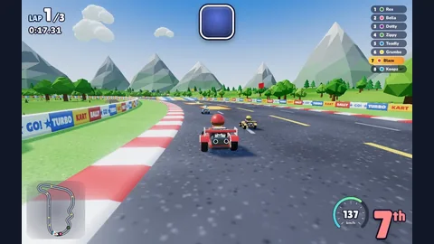
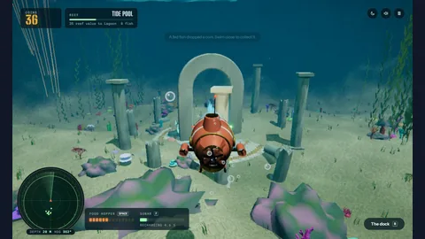
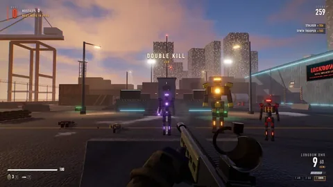
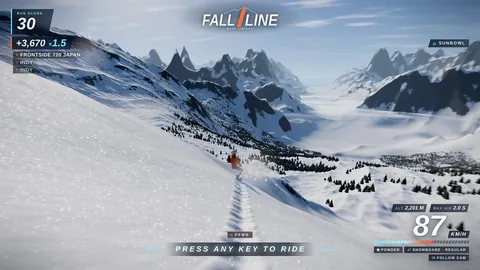
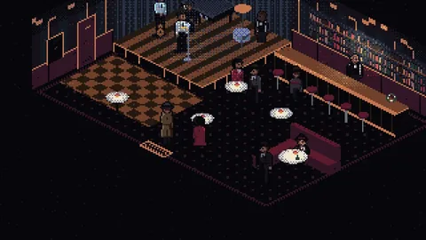
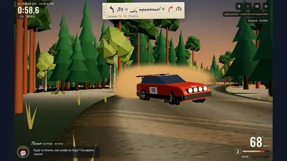
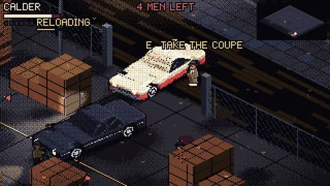
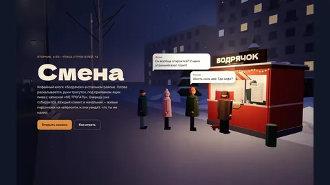
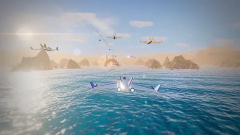
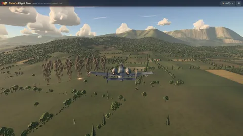

# Claude Opus 5.5 games

Browse **109 curated game units** from **78 source repositories** attributed to Claude Opus 5.5. Read each evidence grade before relying on the attribution. Include multi-model games here and on every other applicable model page.

[Back to all models](../README.md#browse-by-model) · [Source data](../games.json)

## Top-rated games

| Game | Score | Evidence |
| --- | ---: | --- |
| [Barista Shift](../games/barista-shift/readme.md) | ⭐ 9.5 | [✓ repository-level model evidence](https://github.com/swan4er/opus-100-projects/blob/main/README.md) |
| [Rally Navigator](../games/rally-navigator/readme.md) | ⭐ 9.5 | [✓ repository-level model evidence](https://github.com/swan4er/opus-100-projects/blob/main/README.md) |
| [Chess with Character](../games/chess-with-character/readme.md) | ⭐ 9.4 | [✓ repository-level model evidence](https://github.com/swan4er/opus-100-projects/blob/main/README.md) |
| [The Precinct Officer](../games/the-precinct-officer/readme.md) | ⭐ 9.4 | [✓ repository-level model evidence](https://github.com/swan4er/opus-100-projects/blob/main/README.md) |
| [Interrogation](../games/interrogation/readme.md) | ⭐ 9.3 | [✓ repository-level model evidence](https://github.com/swan4er/opus-100-projects/blob/main/README.md) |
| [Mafia](../games/mafia/readme.md) | ⭐ 9.3 | [✓ repository-level model evidence](https://github.com/swan4er/opus-100-projects/blob/main/README.md) |
| [Night Museum](../games/night-museum/readme.md) | ⭐ 9.3 | [✓ repository-level model evidence](https://github.com/swan4er/opus-100-projects/blob/main/README.md) |
| [Turbo Kart Rally](../games/turbo-kart-rally/readme.md) | ⭐ 9.3 | [≈ creator-reported model evidence](https://github.com/bridge-mind/turbo-kart-rally/blob/main/README.md) |
| [Alchemy Automaton](../games/alchemy-automaton/readme.md) | ⭐ 9.2 | [✓ repository-level model evidence](https://github.com/swan4er/opus-100-projects/blob/main/README.md) |
| [Dead Signal: Exclusion Zone](../games/dead-signal-exclusion-zone/readme.md) | ⭐ 9.2 | [≈ creator-reported model evidence](https://github.com/bridge-mind/claude-opus-5.5-zombies-game/blob/main/README.md) |

## Screenshot highlights

Inspect these manually rated screenshots. Treat the scores as visual impressions, not runtime playtests.

<table>
<tr>
<td align="center" width="33%"> <a href="../games/turbo-kart-rally/readme.md"><strong>Turbo Kart Rally</strong></a> · 📸 9.8/10</td>
<td align="center" width="33%"> <a href="../games/fishslop/readme.md"><strong>Fishslop</strong></a> · 📸 8.8/10</td>
<td align="center" width="33%"> <a href="../games/overrun-dockyard-nine/readme.md"><strong>OVERRUN: Dockyard Nine</strong></a> · 📸 8.8/10</td>
</tr>
<tr>
<td align="center" width="33%"> <a href="../games/fall-line/readme.md"><strong>Fall Line</strong></a> · 📸 8.7/10</td>
<td align="center" width="33%"> <a href="../games/the-hourglass-city/readme.md"><strong>The Hourglass City</strong></a> · 📸 8.7/10</td>
<td align="center" width="33%"> <a href="../games/rally-navigator/readme.md"><strong>Rally Navigator</strong></a> · 📸 8.6/10</td>
</tr>
<tr>
<td align="center" width="33%"> <a href="../games/the-black-sedan/readme.md"><strong>The Black Sedan</strong></a> · 📸 8.5/10</td>
<td align="center" width="33%"> <a href="../games/barista-shift/readme.md"><strong>Barista Shift</strong></a> · 📸 8.2/10</td>
<td align="center" width="33%"> <a href="../games/nova-lancer/readme.md"><strong>Nova Lancer</strong></a> · 📸 8.2/10</td>
</tr>
<tr>
<td align="center" width="33%"> <a href="../games/tater-s-flight-sim/readme.md"><strong>Tater's Flight Sim</strong></a> · 📸 8.2/10</td>
<td align="center" width="33%"> <a href="../games/lumenrift/readme.md"><strong>LUMENRIFT</strong></a> · 📸 8.1/10</td>
</tr>
</table>

## Game library

- 💥 [Action and Shooters](#action-and-shooters) — **20 game units**
- 🏎️ [Racing and Vehicles](#racing-and-vehicles) — **17 game units**
- 🛠️ [Non-Browser Engines](#nonbrowser-engines) — **13 game units**
- 🧊 [Three.js and WebGL](#threejs-and-webgl) — **11 game units**
- ♟️ [Strategy, Simulation, and Sports](#strategy-simulation-and-sports) — **14 game units**
- 🗺️ [Adventure, RPG, and Exploration](#adventure-rpg-and-exploration) — **21 game units**
- 🧩 [Puzzle, Arcade, and Platformers](#puzzle-arcade-and-platformers) — **7 game units**
- 🎮 [Other Browser Games](#other-browser-games) — **6 game units**

## Action and Shooters

- [**Dead Signal: Exclusion Zone**](../games/dead-signal-exclusion-zone/readme.md) — ⭐ **9.2/10** · Claude Opus 5.5 · Three.js, TypeScript, Vite, WebGL, Browser · [≈ creator-reported model evidence](https://github.com/bridge-mind/claude-opus-5.5-zombies-game/blob/main/README.md) · [files](https://github.com/bridge-mind/claude-opus-5.5-zombies-game/blob/main/README.md) · [prompt](../games/dead-signal-exclusion-zone/readme.md#reverse-engineered-prompt)
- [**Ashes of Aether — Act I: The Unravelling**](../games/ashes-of-aether-act-i-the-unravelling/readme.md) — ⭐ **9.1/10** · Claude Opus 5.5 · Python, JavaScript, Three.js, HTML/CSS, Browser · [≈ creator-reported model evidence](https://github.com/0xPatrickMartin/AshesOfAether) · [files](https://github.com/0xPatrickMartin/AshesOfAether/blob/main/ashes/engine/game.py)
- [**Terrabrowser**](../games/terrabrowser/readme.md) — ⭐ **9.1/10** · Claude Opus 5.5 · JavaScript, Canvas 2D, Web Audio, Browser · [✓ direct model evidence](https://github.com/Wimmboo2/Terrabrowser/commit/53eb19ba3401ac79d6c44455789ee998b9930c06) · [files](https://github.com/Wimmboo2/Terrabrowser/blob/main/README.md) · [play](https://terrabrowser.vercel.app) · [prompt](../games/terrabrowser/readme.md#reverse-engineered-prompt)
- [**The Hourglass City**](../games/the-hourglass-city/readme.md) — ⭐ **9.1/10** · Claude Opus 5.5 · JavaScript, Canvas 2D, Browser · [≈ creator-reported model evidence](https://github.com/Odiriuss/PixelArtGameOpus/blob/main/README.md) · [files](https://github.com/Odiriuss/PixelArtGameOpus/blob/main/hourglass_city.html) · [play](https://odiriuss.github.io/PixelArtGameOpus/hourglass_city.html) · 📸 **8.7/10** · [screenshot](https://github.com/Odiriuss/PixelArtGameOpus/blob/main/docs/city_title.png) · +2 more screenshots in data
- [**Long Wind**](../games/long-wind/readme.md) — ⭐ **9.0/10** · Claude Opus 5.5 · Three.js, JavaScript, WebGL, Browser · [≈ creator-reported model evidence](https://github.com/jbang2004/long-wind/blob/main/README.md) · [files](https://github.com/jbang2004/long-wind/blob/main/src/game/game.js) · [play](https://jbang2004.github.io/long-wind/)
- [**The Black Sedan**](../games/the-black-sedan/readme.md) — ⭐ **8.6/10** · Claude Opus 5.5 · JavaScript, Canvas 2D, Browser · [≈ creator-reported model evidence](https://github.com/Odiriuss/PixelArtGameOpus/blob/main/README.md) · [files](https://github.com/Odiriuss/PixelArtGameOpus/blob/main/hourglass_testlevel.html) · [play](https://odiriuss.github.io/PixelArtGameOpus/hourglass_testlevel.html) · 📸 **8.5/10** · [screenshot](https://github.com/Odiriuss/PixelArtGameOpus/blob/main/docs/level_title.png) · +2 more screenshots in data
- [**OVERRUN: Dockyard Nine**](../games/overrun-dockyard-nine/readme.md) — ⭐ **8.5/10** · Claude Opus 5.5 · JavaScript, Three.js, WebGL, Web Audio, Browser · [≈ creator-reported model evidence](https://github.com/alesha-pro/bench-portal/commit/30037f2602b662650b19edc47178e09550966ea5) · [files](https://github.com/alesha-pro/bench-portal/blob/main/games/overrun-claude-opus-5.5/game.json) · [play](https://alesha-pro.github.io/bench-portal/games/overrun-claude-opus-5.5/index.html) · 📸 **8.8/10** · [screenshot](https://github.com/alesha-pro/bench-portal/blob/main/games/overrun-claude-opus-5.5/cover.webp) · [prompt](../games/overrun-dockyard-nine/readme.md#reverse-engineered-prompt)
- [**Pokémon Claude Red**](../games/pokemon-claude-red/readme.md) — ⭐ **8.4/10** · Claude Opus 5.5 · JavaScript, HTML, Canvas 2D, Browser · [✓ direct model evidence](https://github.com/levy-street/pokemon-claude-red/commit/232bf71094780de0c0d2cb5abf3d4199721a570b) · [files](https://github.com/levy-street/pokemon-claude-red/blob/19ba7ad5dd49ee3244ddef0e6bcda43d2cbf28c7/src/game/battle.js) · [play](https://claudered.dev/)
- [**Call of Naija**](../games/call-of-naija/readme.md) — ⭐ **8.2/10** · Claude Opus 5.5 · Three.js, TypeScript, Rapier, Recast, WebGL, +1 more · [✓ direct model evidence](https://github.com/bigbadbillion/game/commit/2dcfa48dd46cf99cce3da5a7f482cf359e10aef2) · [files](https://github.com/bigbadbillion/game/blob/c313a1e33df472efdcf1af94bdd128e93eaf5590/src/client/input/input.ts)
- [**Pixel Survivors: Nocturne**](../games/pixel-survivors-nocturne/readme.md) — ⭐ **8.1/10** · Claude Opus 5.5 · JavaScript, HTML, Canvas 2D, Browser · [✓ direct model evidence](https://github.com/Black2856/pixel_survivors_opus5.5test/commit/f3ee447273c7633ed649a219a98f8d955ee13339) · [files](https://github.com/Black2856/pixel_survivors_opus5.5test/blob/a65a2759871671cab6b4a5763c665e366e4c76da/js/world.js)
- [**Plants vs. Zombies Clone**](../games/plants-vs-zombies-clone/readme.md) — ⭐ **8.1/10** · Claude Opus 5.5 · React, TypeScript, Vite, Canvas, Three.js, +1 more · [≈ creator-reported model evidence](https://github.com/icebear0828/vibe-games/blob/main/README.md) · [files](https://github.com/icebear0828/vibe-games/tree/main/recreate-plants-vs-zombies/src) · [play](https://icebear0828.github.io/vibe-games/pvz/)
- [**Quiet Hours**](../games/quiet-hours/readme.md) — ⭐ **8.1/10** · Claude Opus 5.5 · Three.js, TypeScript, WebGL, Browser · [✓ direct model evidence](https://github.com/wellscurrence-a11y/Zombie-game-opus5.5/commit/4825fd5407b851a08e80c87feacd301330bf98be) · [files](https://github.com/wellscurrence-a11y/Zombie-game-opus5.5/blob/9d9e92c709e9629aa4ff6e87913b872a67f59e92/src/input.ts)
- [**Emberwake**](../games/emberwake/readme.md) — ⭐ **8.0/10** · Claude Opus 5.5 · Three.js, JavaScript, WebGL, Browser · [≈ creator-reported model evidence](https://github.com/mogita/emberwake) · [files](https://github.com/mogita/emberwake/blob/46ebdb8574c2a87d9fcc8e2eddd77e1bfb91a0a5/src/game.js) · [play](https://emberwake.mogita.rocks) · 📸 **8.0/10** · [screenshot](https://github.com/mogita/emberwake/blob/46ebdb8574c2a87d9fcc8e2eddd77e1bfb91a0a5/docs/title.jpg) · +2 more screenshots in data
- [**Forja Abisal**](../games/forja-abisal/readme.md) — ⭐ **8.0/10** · Claude Opus 5.5 · Three.js, TypeScript, WebGL, Browser · [≈ creator-reported model evidence](https://github.com/Carte1972/forja-abisal/blob/7e9477a2c04a2ac28fee6a5b6a4ee6dab70149ac/README.md) · [files](https://github.com/Carte1972/forja-abisal/blob/7e9477a2c04a2ac28fee6a5b6a4ee6dab70149ac/src/game/game.ts) · [play](https://carte1972.github.io/forja-abisal/) · 📸 **7.0/10** · [screenshot](https://github.com/Carte1972/forja-abisal/blob/7e9477a2c04a2ac28fee6a5b6a4ee6dab70149ac/docs/capturas/nivel_3_lago_de_lava.jpg) · +6 more screenshots in data
- [**LUCID SKY**](../games/lucid-sky/readme.md) — ⭐ **8.0/10** · Claude Opus 5.5 · Three.js, JavaScript, WebGL, Browser · [✓ direct model evidence](https://github.com/MI3312/Fable5.1/commit/81278501af3426a85ebaed5f26b1d10349d08470) · [files](https://github.com/MI3312/Fable5.1/blob/81278501af3426a85ebaed5f26b1d10349d08470/src/game/game.js)
- [**LUMENRIFT**](../games/lumenrift/readme.md) — ⭐ **8.0/10** · Claude Opus 5.5 · TypeScript, Canvas 2D, Browser · [✓ direct model evidence](https://github.com/WhiteBlackGoose/Lumenrift/commit/97ae9b51a3b73c5137786db634c606eee81ebfa4) · [files](https://github.com/WhiteBlackGoose/Lumenrift/blob/56517f60a44d49ef14e0e51b5df93d933b1a4f20/src/game/game.ts) · [play](https://lumenrift.wbg.gg/) · 📸 **8.1/10** · [screenshot](https://github.com/WhiteBlackGoose/Lumenrift/blob/56517f60a44d49ef14e0e51b5df93d933b1a4f20/docs/img/hero.jpg) · +8 more screenshots in data
- [**Wind & Rain**](../games/wind-rain/readme.md) — ⭐ **8.0/10** · Claude Opus 5.5, Claude Fable 5.1 · Three.js, JavaScript, WebGL, Browser · [≈ creator-reported model evidence](https://github.com/michalbe/viatr-and-deshch/blob/0a0df20c58d4c0221fb939ecf715de631e0beec7/README.md) · [files](https://github.com/michalbe/viatr-and-deshch/blob/0a0df20c58d4c0221fb939ecf715de631e0beec7/game/src/systems.js)
- [**ZOMBIES LAN**](../games/zombies-lan/readme.md) — ⭐ **8.0/10** · Claude Opus 5.5 · Three.js, JavaScript, WebGL, Browser · [✓ direct model evidence](https://github.com/mitotkp/ZOMBIES-LAN/commit/0eebee2fd33c162055284fd147a67d16283f90d9) · [files](https://github.com/mitotkp/ZOMBIES-LAN/blob/93e8191e4b23679004895a92cfdd581250b76dd2/public/js/player.js)
- [**Survive Coders**](../games/survive-coders/readme.md) — ⭐ **7.5/10** · Claude Opus 5.5 · Phaser, JavaScript, Browser · [≈ creator-reported model evidence](https://github.com/travisstephenfraser/survive-coders/blob/1ebffbf0079989ebd1333766f38b682b880fc58e/README.md) · [files](https://github.com/travisstephenfraser/survive-coders/blob/1ebffbf0079989ebd1333766f38b682b880fc58e/src/scenes/PlayScene.js) · [play](https://survive-coders.vercel.app) · 📸 **7.7/10** · [screenshot](https://github.com/travisstephenfraser/survive-coders/blob/1ebffbf0079989ebd1333766f38b682b880fc58e/docs/screenshots/01-title.png) · +13 more screenshots in data
- [**ClaudeJump**](../games/claudejump/readme.md) — ⭐ **7.0/10** · Claude Opus 5.5 · JavaScript, Canvas 2D, Web Audio, Browser · [≈ creator-reported model evidence](https://github.com/PrabhjotSodhi/ClaudeJump/blob/d93c2c1f1982724cb72747dc7405f193293ecdf1/README.md) · [files](https://github.com/PrabhjotSodhi/ClaudeJump/blob/d93c2c1f1982724cb72747dc7405f193293ecdf1/src/scenes/versus-scene.js) · [play](https://claudejump.netlify.app)

[Back to game library](#game-library)

## Racing and Vehicles

- [**Turbo Kart Rally**](../games/turbo-kart-rally/readme.md) — ⭐ **9.3/10** · Claude Opus 5.5 · Three.js, JavaScript, WebGL, Browser · [≈ creator-reported model evidence](https://github.com/bridge-mind/turbo-kart-rally/blob/main/README.md) · [files](https://github.com/bridge-mind/turbo-kart-rally/blob/main/README.md) · [play](https://bridge-mind.github.io/turbo-kart-rally/) · 📸 **9.8/10** · [screenshot](https://github.com/bridge-mind/turbo-kart-rally/blob/main/docs/screenshots/race.jpg) · [prompt](../games/turbo-kart-rally/readme.md#reverse-engineered-prompt)
- [**Tater's Flight Sim**](../games/tater-s-flight-sim/readme.md) — ⭐ **9.2/10** · Claude Opus 5.5 · Three.js, TypeScript, Vite, WebGL, Browser · [✓ direct model evidence](https://github.com/JaredTate/tatertotsflightsim/commit/61ad8f7a6) · [files](https://github.com/JaredTate/tatertotsflightsim/blob/main/README.md) · 📸 **8.2/10** · [screenshot](https://github.com/JaredTate/tatertotsflightsim/blob/main/docs/screenshots/a10-burning-convoy.jpg) · [prompt](../games/tater-s-flight-sim/readme.md#reverse-engineered-prompt)
- [**QQ Speed**](../games/qq-speed/readme.md) — ⭐ **9.1/10** · Claude Opus 5.5 · Three.js, JavaScript, WebGL, Browser · [≈ creator-reported model evidence](https://github.com/riba2534/claude-opus-5-5-demo/blob/main/README.md) · [files](https://github.com/riba2534/claude-opus-5-5-demo/blob/main/qq-speed/src/main.js) · [play](https://claude-opus-5-5-qqfeiche3d.pages.dev/) · [prompt](../games/qq-speed/readme.md#reverse-engineered-prompt)
- [**CF Transport Ship**](../games/cf-transport-ship/readme.md) — ⭐ **9.0/10** · Claude Opus 5.5 · Three.js, JavaScript, WebGL, Browser · [≈ creator-reported model evidence](https://github.com/riba2534/claude-opus-5-5-demo/blob/main/README.md) · [files](https://github.com/riba2534/claude-opus-5-5-demo/blob/main/cf-transport-ship/src/game.js) · [play](https://claude-opus-5-5-cf-transport-ship.pages.dev/) · [prompt](../games/cf-transport-ship/readme.md#reverse-engineered-prompt)
- [**Pelican Bike**](../games/pelican-bike/readme.md) — ⭐ **8.9/10** · Claude Opus 5.5 · Three.js, JavaScript, WebGL, Browser · [≈ creator-reported model evidence](https://github.com/riba2534/claude-opus-5-5-demo/blob/main/README.md) · [files](https://github.com/riba2534/claude-opus-5-5-demo/blob/main/pelican-bike/src/main.js) · [play](https://claude-opus-5-5.riba2534.cn/) · [prompt](../games/pelican-bike/readme.md#reverse-engineered-prompt)
- [**Wouf Kart**](../games/wouf-kart/readme.md) — ⭐ **8.9/10** · Claude Opus 5.5 · Angular 22, Three.js, TypeScript, WebGL, Browser · [≈ creator-reported model evidence](https://github.com/eddyacthergal/super-wouf-kart) · [files](https://github.com/eddyacthergal/super-wouf-kart/blob/main/README.md) · [prompt](../games/wouf-kart/readme.md#reverse-engineered-prompt)
- [**Ponpoko Kart**](../games/ponpoko-kart/readme.md) — ⭐ **8.8/10** · Claude Opus 5.5 · Three.js, JavaScript, WebGL, Browser · [≈ creator-reported model evidence](https://github.com/tanuu5/ponpoko-kart/blob/main/README.md) · [files](https://github.com/tanuu5/ponpoko-kart/blob/main/src/main.js) · [play](https://tanuu5.github.io/ponpoko-kart/)
- [**Nova Lancer**](../games/nova-lancer/readme.md) — ⭐ **8.7/10** · Claude Opus 5.5 · Three.js, JavaScript, WebGL, Browser · [≈ creator-reported model evidence](https://github.com/tanuu5/nova-lancer/blob/main/README.md) · [files](https://github.com/tanuu5/nova-lancer/blob/main/src/main.js) · [play](https://tanuu5.github.io/nova-lancer/) · 📸 **8.2/10** · [screenshot](https://github.com/tanuu5/nova-lancer/blob/main/docs/screenshots/hero.jpg) · +5 more screenshots in data
- [**Sky Rings**](../games/sky-rings/readme.md) — ⭐ **8.4/10** · Claude Opus 5.5 · Three.js, JavaScript, WebGL, Browser · [≈ creator-reported model evidence](https://github.com/hirosichen/ai-sky-rings-game/blob/main/README.md) · [files](https://github.com/hirosichen/ai-sky-rings-game/blob/main/main.js) · [play](https://vibe-sky-rings.pages.dev)
- [**F1 Racing Game**](../games/f1-racing-game/readme.md) — ⭐ **8.3/10** · Claude Opus 5.5 · Three.js, JavaScript, WebGL, Browser · [≈ creator-reported model evidence](https://github.com/hirosichen/ai-f1-racing-game/blob/main/README.md) · [files](https://github.com/hirosichen/ai-f1-racing-game/blob/main/main.js) · [play](https://vibe-f1-racing.pages.dev)
- [**Nova Drift**](https://github.com/Furkiozknn/nova-drift) — ⭐ **8.3/10** · Claude Opus 5.5 · Three.js, WebGL, JavaScript (ES modules), Browser · [✓ direct model evidence](https://github.com/Furkiozknn/nova-drift/commit/4db4a913db105369d76cef8589eabf16b9d592f7) · [files](https://github.com/Furkiozknn/nova-drift/blob/1639fe84579bc0d80e3a7490ac2f4705ad8221a5/script.js) · [play](https://furkiozknn.github.io/nova-drift/) · 📸 **7.0/10** · [screenshot](https://github.com/Furkiozknn/nova-drift/blob/1639fe84579bc0d80e3a7490ac2f4705ad8221a5/assets/screenshot.webp)
- [**Palmera Bay**](../games/palmera-bay/readme.md) — ⭐ **8.2/10** · Claude Opus 5.5 · Three.js, JavaScript, WebGL, Browser · [≈ creator-reported model evidence](https://github.com/vcahlik/palmera-bay/blob/master/README.md) · [files](https://github.com/vcahlik/palmera-bay/blob/master/README.md) · [play](https://cahlik.net/palmera-bay/) · 📸 **8.0/10** · [screenshot](https://github.com/theolundqvist/frontier-games/blob/main/media/palmera-bay/preview.webp) · [prompt](../games/palmera-bay/readme.md#reverse-engineered-prompt)
- [**Turbo Coin Rush 3D**](../games/turbo-coin-rush-3d/readme.md) — ⭐ **8.1/10** · Claude Opus 5.5 · Three.js, JavaScript, WebGL, Browser · [✓ direct model evidence](https://github.com/inteligenciamilgrau/carrinho_opus55/commit/cebd0908b7f7d0345f5113fdf23e44be0d28f096) · [files](https://github.com/inteligenciamilgrau/carrinho_opus55/blob/main/index.html) · [prompt](../games/turbo-coin-rush-3d/readme.md#reverse-engineered-prompt)
- [**Radikal Riders**](../games/radikal-riders/readme.md) — ⭐ **8.0/10** · Claude Opus 5.5 · Three.js, TypeScript, WebGL, Browser · [≈ creator-reported model evidence](https://github.com/javichur/radikal-bikers/blob/9013ee9b4c2a27fbdbe733413ea0a94b8f7dcb61/README.md) · [files](https://github.com/javichur/radikal-bikers/blob/9013ee9b4c2a27fbdbe733413ea0a94b8f7dcb61/src/sim/race.ts) · [play](https://javichur.github.io/radikal-bikers/leoGjAW41OH-fIkg/)
- [**3D Arcade Racer**](../games/3d-arcade-racer/readme.md) — ⭐ **7.8/10** · Claude Opus 5.5 · Three.js, JavaScript, WebGL, Browser · [✓ direct model evidence](https://github.com/letawskylyndon-cloud/Claude-Driving-Racing-gAme/commit/02bea568d095d5f0267b2b0a6018b463f6d8d11a) · [files](https://github.com/letawskylyndon-cloud/Claude-Driving-Racing-gAme/blob/ebd6c55980107b5a129eb72bc8f03567f5ba20b1/index.html)
- [**DRIFTWING**](../games/driftwing/readme.md) — ⭐ **7.5/10** · Claude Opus 5.5 · Three.js, JavaScript, WebGPU, WebGL2, Browser · [≈ creator-reported model evidence](https://github.com/KyleBuildsAI/driftwing/blob/ec17f78a9c3615adf90ecedc57f606143f1862d4/README.md) · [files](https://github.com/KyleBuildsAI/driftwing/blob/ec17f78a9c3615adf90ecedc57f606143f1862d4/index.html) · [play](https://kylebuildsai.github.io/driftwing/) · 📸 **8.0/10** · [screenshot](https://github.com/KyleBuildsAI/driftwing/blob/ec17f78a9c3615adf90ecedc57f606143f1862d4/docs/screenshot.jpg) · +1 more screenshots in data
- [**Uplift**](../games/uplift/readme.md) — ⭐ **7.5/10** · Claude Opus 5.5 · JavaScript, WebGL, GLSL, Browser · [≈ creator-reported model evidence](https://github.com/Starwaves1/Uplift/blob/a0e40db8a08f152de1359b51c234f10bb599e5bc/README.md) · [files](https://github.com/Starwaves1/Uplift/blob/a0e40db8a08f152de1359b51c234f10bb599e5bc/wind/main.js)

[Back to game library](#game-library)

## Non-Browser Engines

- [**Pro Skater: The Warehouse**](../games/pro-skater-the-warehouse/readme.md) — ⭐ **8.5/10** · Claude Opus 5.5 · Godot 4, GDScript, Native desktop, Browser · [✓ direct model evidence](https://github.com/3D-Stories/skate-game-opus-5-5/commit/2aa72bee42d32a739dc18b3bcb7a258e348f09a9) · [files](https://github.com/3D-Stories/skate-game-opus-5-5/blob/2aa72bee42d32a739dc18b3bcb7a258e348f09a9/scripts/game/main.gd) · [play](https://skate-game-opus-5-5-blush.vercel.app/)
- [**Kanca**](https://github.com/Furkiozknn/kanca) — ⭐ **8.1/10** · Claude Opus 5.5 · Godot 4.7.2, GDScript, WebAssembly (WebGL 2.0), Browser · [✓ direct model evidence](https://github.com/Furkiozknn/kanca/commit/687a67e4a05e337a3f29147d32086b817237886c) · [files](https://github.com/Furkiozknn/kanca/blob/4991a3396323aa77c2687f7f5c68f2153fdd9797/scripts/oyuncu.gd) · [play](https://furkiozknn.github.io/kanca/) · 📸 **7.0/10** · [screenshot](https://github.com/Furkiozknn/kanca/blob/4991a3396323aa77c2687f7f5c68f2153fdd9797/docs/ekran/bolum_06.png)
- [**Mashup RPG**](../games/mashup-rpg/readme.md) — ⭐ **8.1/10** · Claude Opus 5.5 · Godot 4, GDScript, Native desktop · [✓ direct model evidence](https://github.com/ggdover/mashuprpg/commit/ec646f5ef216ace34bb9106251f64acdff9ee43e) · [files](https://github.com/ggdover/mashuprpg/blob/ec646f5ef216ace34bb9106251f64acdff9ee43e/project.godot)
- [**The Ruins of Bezan**](../games/the-ruins-of-bezan/readme.md) — ⭐ **8.1/10** · Claude Opus 5.5 · C, SDL3, OpenGL, Native desktop · [✓ direct model evidence](https://github.com/tuniveza/Generative-Games/commit/89469de5d3ca351d7ecfb465578272ea9ec60ac6) · [files](https://github.com/tuniveza/Generative-Games/blob/831f115caeea2201fdac5315bac4fcb707eeaf85/The-Ruins-of-Bezan/main.c)
- [**Gale Kart**](../games/gale-kart/readme.md) — ⭐ **8.0/10** · Claude Opus 5.5 · Godot 4, GDScript, Native desktop · [≈ creator-reported model evidence](https://github.com/fants/Gale-kart/blob/522597902bc61f2cefcf4b5cccab569d72dbe8d5/README.md) · [files](https://github.com/fants/Gale-kart/blob/522597902bc61f2cefcf4b5cccab569d72dbe8d5/src/sim/race_sim.gd)
- [**Sakura Rally**](../games/sakura-rally/readme.md) — ⭐ **8.0/10** · Claude Opus 5.5 · Godot 4, GDScript, Native desktop · [≈ creator-reported model evidence](https://github.com/SummerEngine/sakura-rally/blob/72b0443210888eca53b621d86a653d2de303dfb5/README.md) · [files](https://github.com/SummerEngine/sakura-rally/blob/72b0443210888eca53b621d86a653d2de303dfb5/scripts/game/race_session.gd) · 📸 **7.1/10** · [screenshot](https://github.com/SummerEngine/sakura-rally/blob/72b0443210888eca53b621d86a653d2de303dfb5/docs/renders/hanami_aerial.jpg) · +2 more screenshots in data
- [**Yerçekimi Çevir**](https://github.com/Furkiozknn/yercekimi-cevir) — ⭐ **7.9/10** · Claude Opus 5.5 · Godot 4.7.2, GDScript, WebAssembly (WebGL 2.0), Browser · [✓ direct model evidence](https://github.com/Furkiozknn/yercekimi-cevir/commit/0c67cecfa2ffcb595fc160aa3d118267137a5d79) · [files](https://github.com/Furkiozknn/yercekimi-cevir/blob/2ade3b9938b31c7144bcc9550b96fbe99adac00c/scripts/oyun.gd) · [play](https://furkiozknn.github.io/yercekimi-cevir/) · 📸 **7.0/10** · [screenshot](https://github.com/Furkiozknn/yercekimi-cevir/blob/2ade3b9938b31c7144bcc9550b96fbe99adac00c/docs/tasarim/sonra-oyun-gece.png)
- [**Derin Kazı**](https://github.com/Furkiozknn/derin-kazi) — ⭐ **7.8/10** · Claude Opus 5.5 · Godot 4.7.2, GDScript, WebAssembly (WebGL 2.0), Browser · [✓ direct model evidence](https://github.com/Furkiozknn/derin-kazi/commit/05ed38554f1abfcdea9a9f54ee4c8f3eafb09ac1) · [files](https://github.com/Furkiozknn/derin-kazi/blob/8278f18584007ddb08a96324e4495280ad4305f9/scripts/oyun.gd) · [play](https://furkiozknn.github.io/derin-kazi/) · 📸 **7.0/10** · [screenshot](https://github.com/Furkiozknn/derin-kazi/blob/8278f18584007ddb08a96324e4495280ad4305f9/yayin/ekran-2.png)
- [**OpusSkate**](../games/opusskate/readme.md) — ⭐ **7.7/10** · Claude Opus 5.5 · C++17, SDL2, OpenGL, Native desktop · [≈ creator-reported model evidence](https://github.com/OminousIndustries/OpusSkate/blob/main/README.md) · [files](https://github.com/OminousIndustries/OpusSkate/blob/main/README.md) · [prompt](../games/opusskate/readme.md#reverse-engineered-prompt)
- [**Tek Tuş Koşu**](https://github.com/Furkiozknn/tek-tus-kosu) — ⭐ **7.7/10** · Claude Opus 5.5 · Godot 4.7.2, GDScript, WebAssembly (WebGL 2.0), Browser · [✓ direct model evidence](https://github.com/Furkiozknn/tek-tus-kosu/commit/2ab7d4794908b0da50e92334537847cd6b1a558f) · [files](https://github.com/Furkiozknn/tek-tus-kosu/blob/aca636395f9315ab3c4c8eb7c96eb5446fea9789/scripts/oyun.gd) · [play](https://furkiozknn.github.io/tek-tus-kosu/) · 📸 **7.0/10** · [screenshot](https://github.com/Furkiozknn/tek-tus-kosu/blob/aca636395f9315ab3c4c8eb7c96eb5446fea9789/yayin/ekran-2.png)
- [**OxCity**](../games/oxcity/readme.md) — ⭐ **7.5/10** · Claude Opus 5.5 · Oxylus, C++, Jolt Physics, Native desktop · [✓ direct model evidence](https://github.com/exdal/opus5.5-test/commit/4ef903e87806822861b52505feaa8b8fec302181) · [files](https://github.com/exdal/opus5.5-test/blob/84e74a209e81757160bc2398379dfc3cbbe8f0ad/game/src/Game.cpp)
- [**Path of Werdna**](../games/path-of-werdna/readme.md) — ⭐ **7.5/10** · Claude Opus 5.5 · Godot 4, GDScript, Native desktop · [✓ direct model evidence](https://github.com/Werdna1976/PathOfWerdna/commit/a041367aa46f107226c2520a0ba42a56d96dc2c0) · [files](https://github.com/Werdna1976/PathOfWerdna/blob/a041367aa46f107226c2520a0ba42a56d96dc2c0/scripts/components/player_combat.gd)
- [**Tea Rush — Kitchen Core**](../games/tea-rush-kitchen-core/readme.md) — ⭐ **7.0/10** · Claude Opus 5.5 · Godot 4, GDScript, Native desktop · [✓ direct model evidence](https://github.com/kpkrr/tea-game/commit/4bbcb7d65e7b88c5a053f2e38b6a7ef713369b79) · [files](https://github.com/kpkrr/tea-game/blob/ce39a996e740ec8d72f17a8873c6c9bf5b7c9239/prototypes/kitchen-core/kitchen_core.gd)

[Back to game library](#game-library)

## Three.js and WebGL

- [**Fishslop**](../games/fishslop/readme.md) — ⭐ **9.1/10** · Claude Opus 5.5 · Three.js, TypeScript, WebGL, Browser · [✓ direct model evidence](https://github.com/vasu-devs/FishSlop_Opus5.5/commit/a59efa14768c7a8bf3bd35fc68b16268df91cd57) · [files](https://github.com/vasu-devs/FishSlop_Opus5.5/blob/main/README.md) · [play](https://vasu-devs.github.io/FishSlop_Opus5.5/) · 📸 **8.8/10** · [screenshot](https://github.com/vasu-devs/FishSlop_Opus5.5/blob/main/docs/screens/03-sonar.png) · [prompt](../games/fishslop/readme.md#reverse-engineered-prompt)
- [**QQ Speed**](../games/qq-speed-xiiyioozzz-opus55-3d-games/readme.md) — ⭐ **9.0/10** · Claude Opus 5.5 · Three.js, JavaScript, WebGL, Browser · [≈ creator-reported model evidence](https://github.com/xiiyioozzz/opus55-3d-games/blob/main/README.md) · [files](https://github.com/xiiyioozzz/opus55-3d-games/blob/main/qq-speed/src/main.js) · [play](https://games.xdullboy.com/qq-speed/)
- [**Slide Rush**](../games/slide-rush/readme.md) — ⭐ **9.0/10** · Claude Opus 5.5 · Three.js, Vite, JavaScript, PWA, Browser · [≈ creator-reported model evidence](https://github.com/KJLKurt/waterslide-game-opus-5.5/blob/main/README.md) · [files](https://github.com/KJLKurt/waterslide-game-opus-5.5/blob/main/README.md) · [play](https://kjlkurt.github.io/waterslide-game-opus-5.5/) · [prompt](../games/slide-rush/readme.md#reverse-engineered-prompt)
- [**Web Grand Prix**](../games/web-grand-prix/readme.md) — ⭐ **9.0/10** · Claude Opus 5.5 · Next.js 16, React 19, TypeScript, Three.js, Browser · [≈ creator-reported model evidence](https://github.com/GatoArtStudio/f1-opus-5.5) · [files](https://github.com/GatoArtStudio/f1-opus-5.5/blob/main/README.md) · [play](https://f1-demo.gatoartstudio.com/) · [prompt](../games/web-grand-prix/readme.md#reverse-engineered-prompt)
- [**CF Transport Ship**](../games/cf-transport-ship-xiiyioozzz-opus55-3d-games/readme.md) — ⭐ **8.8/10** · Claude Opus 5.5 · Three.js, JavaScript, WebGL, Browser · [≈ creator-reported model evidence](https://github.com/xiiyioozzz/opus55-3d-games/blob/main/README.md) · [files](https://github.com/xiiyioozzz/opus55-3d-games/blob/main/cf-transport-ship/src/game.js) · [play](https://games.xdullboy.com/transport-ship/)
- [**Pelican Bike**](../games/pelican-bike-xiiyioozzz-opus55-3d-games/readme.md) — ⭐ **8.5/10** · Claude Opus 5.5 · Three.js, JavaScript, WebGL, Browser · [≈ creator-reported model evidence](https://github.com/xiiyioozzz/opus55-3d-games/blob/main/README.md) · [files](https://github.com/xiiyioozzz/opus55-3d-games/blob/main/pelican-bike/src/main.js) · [play](https://games.xdullboy.com/pelican/)
- [**Catgirl Pachinko**](../games/catgirl-pachinko/readme.md) — ⭐ **8.3/10** · Claude Opus 5.5 · TypeScript, WebGL2, Rapier 2D, Vite, Browser · [✓ direct model evidence](https://github.com/Maoku/Opus55CatgirlPachi/commit/659a821f86) · [files](https://github.com/Maoku/Opus55CatgirlPachi/blob/main/README.md) · [play](https://maoku.github.io/Opus55CatgirlPachi/) · 📸 **7.2/10** · [screenshot](https://github.com/Maoku/Opus55CatgirlPachi/blob/main/Opus55CatgirlPachi.jpg) · [prompt](../games/catgirl-pachinko/readme.md#reverse-engineered-prompt)
- [**KAIJU DOKAN!**](../games/kaiju-dokan/readme.md) — ⭐ **8.0/10** · Claude Opus 5.5 · Three.js, TypeScript, WebGL, Browser · [≈ creator-reported model evidence](https://github.com/tanuu5/kaiju-dokan/blob/d245060aa3784c30cf2bea885a842edb9f74e37c/README.md) · [files](https://github.com/tanuu5/kaiju-dokan/blob/d245060aa3784c30cf2bea885a842edb9f74e37c/src/game/game.ts) · [play](https://tanuu5.github.io/kaiju-dokan/) · 📸 **8.0/10** · [screenshot](https://github.com/tanuu5/kaiju-dokan/blob/d245060aa3784c30cf2bea885a842edb9f74e37c/docs/images/title.jpg) · +2 more screenshots in data
- [**Neon Siege**](../games/neon-siege/readme.md) — ⭐ **8.0/10** · Claude Opus 5.5 · Three.js, JavaScript, WebGL, Browser · [≈ creator-reported model evidence](https://github.com/PromptEngineer48/claude-opus-5.5-games/blob/main/README.md) · [files](https://github.com/PromptEngineer48/claude-opus-5.5-games/blob/main/neon-siege/index.html) · [play](https://promptengineer48.github.io/claude-opus-5.5-games/neon-siege/) · 📸 **7.4/10** · [screenshot](https://github.com/theolundqvist/frontier-games/blob/main/media/neon-siege/preview.webp)
- [**Rooftop Sniper: Last Light**](../games/rooftop-sniper-last-light/readme.md) — ⭐ **8.0/10** · Claude Opus 5.5 · Three.js, JavaScript, WebGL, Browser · [≈ creator-reported model evidence](https://github.com/PromptEngineer48/claude-opus-5.5-games/blob/main/README.md) · [files](https://github.com/PromptEngineer48/claude-opus-5.5-games/blob/main/rooftop-sniper/offline/index.html) · [play](https://promptengineer48.github.io/claude-opus-5.5-games/rooftop-sniper/offline/index.html) · 📸 **7.6/10** · [screenshot](https://github.com/theolundqvist/frontier-games/blob/main/media/rooftop-sniper-last-light/preview.webp)
- [**Mortal Clash**](../games/mortal-clash/readme.md) — ⭐ **7.8/10** · Claude Opus 5.5 · Three.js, JavaScript, WebGL, Browser · [≈ creator-reported model evidence](https://github.com/PromptEngineer48/claude-opus-5.5-games/blob/main/README.md) · [files](https://github.com/PromptEngineer48/claude-opus-5.5-games/blob/main/mortal-clash/index.html) · [play](https://promptengineer48.github.io/claude-opus-5.5-games/mortal-clash/)

[Back to game library](#game-library)

## Strategy, Simulation, and Sports

- [**Fall Line**](../games/fall-line/readme.md) — ⭐ **9.0/10** · Claude Opus 5.5 · Three.js, JavaScript, WebGL, Browser · [≈ creator-reported model evidence](https://github.com/Nipale-ai/opus-5-5-overnight-builds/blob/main/README.md) · [files](https://github.com/Nipale-ai/opus-5-5-overnight-builds/blob/main/fall-line/index.html) · [play](https://nipale-ai.github.io/opus-5-5-overnight-builds/fall-line/) · 📸 **8.7/10** · [screenshot](https://github.com/Nipale-ai/opus-5-5-overnight-builds/blob/main/vorschau-fall-line.jpg)
- [**Harbor Master**](../games/harbor-master/readme.md) — ⭐ **8.2/10** · Claude Opus 5.5 · Three.js, JavaScript, WebGL, Browser · [≈ creator-reported model evidence](https://github.com/hirosichen/ai-harbor-master-game/blob/main/README.md) · [files](https://github.com/hirosichen/ai-harbor-master-game/blob/main/main.js) · [play](https://vibe-harbor-master.pages.dev)
- [**GunBros**](../games/gunbros/readme.md) — ⭐ **8.0/10** · Claude Opus 5.5, Claude Fable 5.1 · TypeScript, Canvas 2D, Vite, Node.js, WebSocket, +1 more · [≈ creator-reported model evidence](https://github.com/skelzer/gunbros-public#how-it-was-made) · [files](https://github.com/skelzer/gunbros-public/blob/main/packages/shared/src/rules/turn.ts) · [play](https://play.gunbros.luquematte.com/) · 📸 **7.6/10** · [screenshot](https://github.com/skelzer/gunbros-public/blob/main/docs/ui/maps/temple_desktop.png)
- [**Lethal Company: Opus Edition**](../games/lethal-company-opus-edition/readme.md) — ⭐ **8.0/10** · Claude Opus 5.5 · Three.js, JavaScript, WebGL, Browser · [✓ direct model evidence](https://github.com/TESTYEE-09/opus5.5Lethal/commit/298c0b204bd4ce0010a575c2322baf744fbba445) · [files](https://github.com/TESTYEE-09/opus5.5Lethal/blob/298c0b204bd4ce0010a575c2322baf744fbba445/js/main.js) · [play](https://testyee-09.github.io/opus5.5Lethal/)
- [**Ombres**](../games/ombres/readme.md) — ⭐ **8.0/10** · Claude Opus 5.5 · React, Three.js, TypeScript, WebGL, Browser · [✓ direct model evidence](https://github.com/briossant/ombres/commit/403840d83740eee4e264e7a1cc04390b8d346787) · [files](https://github.com/briossant/ombres/blob/403840d83740eee4e264e7a1cc04390b8d346787/src/sim/rules.ts) · [play](https://ombres.deploy.breizhware.com/)
- [**OUT OF THE BOX**](../games/out-of-the-box/readme.md) — ⭐ **8.0/10** · Claude Opus 5.5 · Three.js, TypeScript, WebGL, Browser · [≈ creator-reported model evidence](https://github.com/tanuu5/out-of-the-box/blob/31f6147c463b329bf6c554026857e9d133c6f65d/README.md) · [files](https://github.com/tanuu5/out-of-the-box/blob/31f6147c463b329bf6c554026857e9d133c6f65d/src/Game.ts) · [play](https://tanuu5.github.io/out-of-the-box/) · 📸 **8.0/10** · [screenshot](https://github.com/tanuu5/out-of-the-box/blob/31f6147c463b329bf6c554026857e9d133c6f65d/docs/screenshots/archive.jpg) · +5 more screenshots in data
- [**Twilight Crossing — Neural RTS**](../games/twilight-crossing-neural-rts/readme.md) — ⭐ **8.0/10** · Claude Opus 5.5 · Three.js, JavaScript, WebGL, Browser, JEV classifier, +1 more · [≈ creator-reported model evidence](https://www.reddit.com/r/ClaudeCode/comments/1wo8492/prompts_and_jevcontolled_rts_game_ported_and/) · [files](https://github.com/MattiTynka/JEV-RTS/blob/main/index.html) · [play](https://mattitynka.github.io/JEV-RTS/) · [prompt](../games/twilight-crossing-neural-rts/readme.md#reverse-engineered-prompt)
- [**High Effort Strategy Game**](../games/high-effort-strategy-game/readme.md) — ⭐ **7.6/10** · Claude Opus 5.5 · JavaScript, HTML, CSS, Browser · [≈ creator-reported model evidence](https://github.com/Barty-Bart/opus-55-effort-comparison/blob/main/README.md) · [files](https://github.com/Barty-Bart/opus-55-effort-comparison/blob/main/games/high/index.html)
- [**Low Effort Strategy Game**](../games/low-effort-strategy-game/readme.md) — ⭐ **7.6/10** · Claude Opus 5.5 · JavaScript, HTML, CSS, Browser · [≈ creator-reported model evidence](https://github.com/Barty-Bart/opus-55-effort-comparison/blob/main/README.md) · [files](https://github.com/Barty-Bart/opus-55-effort-comparison/blob/main/games/low/index.html)
- [**Max Effort Strategy Game**](../games/max-effort-strategy-game/readme.md) — ⭐ **7.6/10** · Claude Opus 5.5 · JavaScript, HTML, CSS, Browser · [≈ creator-reported model evidence](https://github.com/Barty-Bart/opus-55-effort-comparison/blob/main/README.md) · [files](https://github.com/Barty-Bart/opus-55-effort-comparison/blob/main/games/max/index.html)
- [**Medium Effort Strategy Game**](../games/medium-effort-strategy-game/readme.md) — ⭐ **7.6/10** · Claude Opus 5.5 · JavaScript, HTML, CSS, Browser · [≈ creator-reported model evidence](https://github.com/Barty-Bart/opus-55-effort-comparison/blob/main/README.md) · [files](https://github.com/Barty-Bart/opus-55-effort-comparison/blob/main/games/medium/index.html)
- [**Special Prompt Strategy Game**](../games/special-prompt-strategy-game/readme.md) — ⭐ **7.6/10** · Claude Opus 5.5 · JavaScript, HTML, CSS, Browser · [≈ creator-reported model evidence](https://github.com/Barty-Bart/opus-55-effort-comparison/blob/main/README.md) · [files](https://github.com/Barty-Bart/opus-55-effort-comparison/blob/main/games/special/index.html)
- [**X High Effort Strategy Game**](../games/x-high-effort-strategy-game/readme.md) — ⭐ **7.6/10** · Claude Opus 5.5 · JavaScript, HTML, CSS, Browser · [≈ creator-reported model evidence](https://github.com/Barty-Bart/opus-55-effort-comparison/blob/main/README.md) · [files](https://github.com/Barty-Bart/opus-55-effort-comparison/blob/main/games/xhigh/index.html)
- [**Tempora**](../games/tempora/readme.md) — ⭐ **7.5/10** · Claude Opus 5.5 · JavaScript, HTML, Browser · [✓ direct model evidence](https://github.com/Mofferato/tempora/commit/3819b2327ddc9e21f01f3ec2cbe9685da960ab3f) · [files](https://github.com/Mofferato/tempora/blob/a9874dda365d0b21a3e046ca2b81fb866920de81/src/engine-player.js) · [play](https://mofferato.github.io/tempora/) · 📸 **7.2/10** · [screenshot](https://github.com/Mofferato/tempora/blob/a9874dda365d0b21a3e046ca2b81fb866920de81/assets/screenshot.png) · +3 more screenshots in data

[Back to game library](#game-library)

## Adventure, RPG, and Exploration

- [**Barista Shift**](../games/barista-shift/readme.md) — ⭐ **9.5/10** · Claude Opus 5.5 · JavaScript, HTML, Three.js, WebGL, Browser · [✓ repository-level model evidence](https://github.com/swan4er/opus-100-projects/blob/main/README.md) · [files](https://github.com/swan4er/opus-100-projects/blob/main/103-barista-shift/index.html) · [play](https://swan4er.github.io/opus-100-projects/103-barista-shift/) · 📸 **8.2/10** · [screenshot](https://github.com/swan4er/opus-100-projects/blob/main/103-barista-shift/preview.jpg) · [prompt](../games/barista-shift/readme.md#reverse-engineered-prompt)
- [**Rally Navigator**](../games/rally-navigator/readme.md) — ⭐ **9.5/10** · Claude Opus 5.5 · JavaScript, HTML, Three.js, WebGL, Browser · [✓ repository-level model evidence](https://github.com/swan4er/opus-100-projects/blob/main/README.md) · [files](https://github.com/swan4er/opus-100-projects/blob/main/038-rally-navigator/index.html) · [play](https://swan4er.github.io/opus-100-projects/038-rally-navigator/) · 📸 **8.6/10** · [screenshot](https://github.com/swan4er/opus-100-projects/blob/main/038-rally-navigator/preview.jpg) · [prompt](../games/rally-navigator/readme.md#reverse-engineered-prompt)
- [**Chess with Character**](../games/chess-with-character/readme.md) — ⭐ **9.4/10** · Claude Opus 5.5 · JavaScript, HTML, Three.js, WebGL, Browser · [✓ repository-level model evidence](https://github.com/swan4er/opus-100-projects/blob/main/README.md) · [files](https://github.com/swan4er/opus-100-projects/blob/main/101-chess-characters/index.html) · [play](https://swan4er.github.io/opus-100-projects/101-chess-characters/) · 📸 **7.5/10** · [screenshot](https://github.com/swan4er/opus-100-projects/blob/main/101-chess-characters/preview.jpg) · [prompt](../games/chess-with-character/readme.md#reverse-engineered-prompt)
- [**The Precinct Officer**](../games/the-precinct-officer/readme.md) — ⭐ **9.4/10** · Claude Opus 5.5 · JavaScript, HTML, Three.js, WebGL, Browser · [✓ repository-level model evidence](https://github.com/swan4er/opus-100-projects/blob/main/README.md) · [files](https://github.com/swan4er/opus-100-projects/blob/main/027-uchastkovy-rpg/index.html) · [play](https://swan4er.github.io/opus-100-projects/027-uchastkovy-rpg/) · 📸 **7.5/10** · [screenshot](https://github.com/swan4er/opus-100-projects/blob/main/027-uchastkovy-rpg/preview.jpg) · [prompt](../games/the-precinct-officer/readme.md#reverse-engineered-prompt)
- [**Interrogation**](../games/interrogation/readme.md) — ⭐ **9.3/10** · Claude Opus 5.5 · JavaScript, HTML, Three.js, WebGL, Browser · [✓ repository-level model evidence](https://github.com/swan4er/opus-100-projects/blob/main/README.md) · [files](https://github.com/swan4er/opus-100-projects/blob/main/054-interrogation/index.html) · [play](https://swan4er.github.io/opus-100-projects/054-interrogation/) · 📸 **7.7/10** · [screenshot](https://github.com/swan4er/opus-100-projects/blob/main/054-interrogation/preview.jpg) · [prompt](../games/interrogation/readme.md#reverse-engineered-prompt)
- [**Mafia**](../games/mafia/readme.md) — ⭐ **9.3/10** · Claude Opus 5.5 · JavaScript, HTML, Three.js, WebGL, Browser · [✓ repository-level model evidence](https://github.com/swan4er/opus-100-projects/blob/main/README.md) · [files](https://github.com/swan4er/opus-100-projects/blob/main/064-ai-mafia/index.html) · [play](https://swan4er.github.io/opus-100-projects/064-ai-mafia/) · 📸 **7.3/10** · [screenshot](https://github.com/swan4er/opus-100-projects/blob/main/064-ai-mafia/preview.jpg) · [prompt](../games/mafia/readme.md#reverse-engineered-prompt)
- [**Night Museum**](../games/night-museum/readme.md) — ⭐ **9.3/10** · Claude Opus 5.5 · JavaScript, HTML, Canvas 2D, Raycasting, Browser · [✓ repository-level model evidence](https://github.com/swan4er/opus-100-projects/blob/main/README.md) · [files](https://github.com/swan4er/opus-100-projects/blob/main/037-night-museum/index.html) · [play](https://swan4er.github.io/opus-100-projects/037-night-museum/) · 📸 **8.0/10** · [screenshot](https://github.com/swan4er/opus-100-projects/blob/main/037-night-museum/preview.jpg) · [prompt](../games/night-museum/readme.md#reverse-engineered-prompt)
- [**Alchemy Automaton**](../games/alchemy-automaton/readme.md) — ⭐ **9.2/10** · Claude Opus 5.5 · JavaScript, HTML, Canvas 2D, Browser · [✓ repository-level model evidence](https://github.com/swan4er/opus-100-projects/blob/main/README.md) · [files](https://github.com/swan4er/opus-100-projects/blob/main/109-alchemy-automaton/index.html) · [play](https://swan4er.github.io/opus-100-projects/109-alchemy-automaton/) · 📸 **7.4/10** · [screenshot](https://github.com/swan4er/opus-100-projects/blob/main/109-alchemy-automaton/preview.jpg) · [prompt](../games/alchemy-automaton/readme.md#reverse-engineered-prompt)
- [**Deeper**](../games/deeper/readme.md) — ⭐ **9.2/10** · Claude Opus 5.5 · JavaScript, HTML, Canvas 2D, Browser · [✓ repository-level model evidence](https://github.com/swan4er/opus-100-projects/blob/main/README.md) · [files](https://github.com/swan4er/opus-100-projects/blob/main/060-deeper-roguelike/index.html) · [play](https://swan4er.github.io/opus-100-projects/060-deeper-roguelike/) · 📸 **6.8/10** · [screenshot](https://github.com/swan4er/opus-100-projects/blob/main/060-deeper-roguelike/preview.jpg) · [prompt](../games/deeper/readme.md#reverse-engineered-prompt)
- [**Gravity Golf**](../games/gravity-golf/readme.md) — ⭐ **9.2/10** · Claude Opus 5.5 · JavaScript, HTML, Canvas 2D, Browser · [✓ repository-level model evidence](https://github.com/swan4er/opus-100-projects/blob/main/README.md) · [files](https://github.com/swan4er/opus-100-projects/blob/main/096-gravity-golf/index.html) · [play](https://swan4er.github.io/opus-100-projects/096-gravity-golf/) · 📸 **6.6/10** · [screenshot](https://github.com/swan4er/opus-100-projects/blob/main/096-gravity-golf/preview.jpg) · [prompt](../games/gravity-golf/readme.md#reverse-engineered-prompt)
- [**Khrushchev Apartment Renovation**](../games/khrushchev-apartment-renovation/readme.md) — ⭐ **9.2/10** · Claude Opus 5.5 · JavaScript, HTML, Three.js, WebGL, Browser · [✓ repository-level model evidence](https://github.com/swan4er/opus-100-projects/blob/main/README.md) · [files](https://github.com/swan4er/opus-100-projects/blob/main/004-khrushchev-renovation/index.html) · [play](https://swan4er.github.io/opus-100-projects/004-khrushchev-renovation/) · 📸 **7.6/10** · [screenshot](https://github.com/swan4er/opus-100-projects/blob/main/004-khrushchev-renovation/preview.jpg) · [prompt](../games/khrushchev-apartment-renovation/readme.md#reverse-engineered-prompt)
- [**Prism**](../games/prism/readme.md) — ⭐ **9.1/10** · Claude Opus 5.5 · JavaScript, HTML, Canvas 2D, Browser · [✓ repository-level model evidence](https://github.com/swan4er/opus-100-projects/blob/main/README.md) · [files](https://github.com/swan4er/opus-100-projects/blob/main/021-prism-puzzle/index.html) · [play](https://swan4er.github.io/opus-100-projects/021-prism-puzzle/) · 📸 **7.2/10** · [screenshot](https://github.com/swan4er/opus-100-projects/blob/main/021-prism-puzzle/preview.jpg) · [prompt](../games/prism/readme.md#reverse-engineered-prompt)
- [**Twilight**](../games/twilight/readme.md) — ⭐ **9.0/10** · Claude Opus 5.5 · JavaScript, HTML, Canvas 2D, Browser · [✓ repository-level model evidence](https://github.com/swan4er/opus-100-projects/blob/main/README.md) · [files](https://github.com/swan4er/opus-100-projects/blob/main/051-twilight-platformer/index.html) · [play](https://swan4er.github.io/opus-100-projects/051-twilight-platformer/) · 📸 **7.8/10** · [screenshot](https://github.com/swan4er/opus-100-projects/blob/main/051-twilight-platformer/preview.jpg) · [prompt](../games/twilight/readme.md#reverse-engineered-prompt)
- [**Deduction**](../games/deduction/readme.md) — ⭐ **8.9/10** · Claude Opus 5.5 · JavaScript, HTML, CSS, Browser · [✓ repository-level model evidence](https://github.com/swan4er/opus-100-projects/blob/main/README.md) · [files](https://github.com/swan4er/opus-100-projects/blob/main/093-deduction/index.html) · [play](https://swan4er.github.io/opus-100-projects/093-deduction/) · 📸 **7.0/10** · [screenshot](https://github.com/swan4er/opus-100-projects/blob/main/093-deduction/preview.jpg) · [prompt](../games/deduction/readme.md#reverse-engineered-prompt)
- [**Long Road**](../games/long-road/readme.md) — ⭐ **8.9/10** · Claude Opus 5.5 · JavaScript, HTML, Canvas 2D, Pseudo-3D, Browser · [✓ repository-level model evidence](https://github.com/swan4er/opus-100-projects/blob/main/README.md) · [files](https://github.com/swan4er/opus-100-projects/blob/main/071-long-road/index.html) · [play](https://swan4er.github.io/opus-100-projects/071-long-road/) · 📸 **7.9/10** · [screenshot](https://github.com/swan4er/opus-100-projects/blob/main/071-long-road/preview.jpg) · [prompt](../games/long-road/readme.md#reverse-engineered-prompt)
- [**Chess: Machine Thoughts**](../games/chess-machine-thoughts/readme.md) — ⭐ **8.8/10** · Claude Opus 5.5 · JavaScript, HTML, SVG, Web Worker, Browser · [✓ repository-level model evidence](https://github.com/swan4er/opus-100-projects/blob/main/README.md) · [files](https://github.com/swan4er/opus-100-projects/blob/main/002-chess-mind/index.html) · [play](https://swan4er.github.io/opus-100-projects/002-chess-mind/) · 📸 **7.0/10** · [screenshot](https://github.com/swan4er/opus-100-projects/blob/main/002-chess-mind/preview.jpg) · [prompt](../games/chess-machine-thoughts/readme.md#reverse-engineered-prompt)
- [**Pet Island**](../games/pet-island/readme.md) — ⭐ **8.0/10** · Claude Opus 5.5 · React, React Three Fiber, Three.js, TypeScript, Browser · [≈ creator-reported model evidence](https://github.com/tahcin/pet-island/blob/90f371a0d9eb08ea0fe3777da7a6f5c31a6428c2/README.md) · [files](https://github.com/tahcin/pet-island/blob/90f371a0d9eb08ea0fe3777da7a6f5c31a6428c2/src/game/quests.ts) · [play](https://pet-island.vercel.app)
- [**Dungeon Heart**](../games/dungeon-heart/readme.md) — ⭐ **7.9/10** · Claude Opus 5.5 · HTML, JavaScript, Canvas 2D, Browser · [✓ direct model evidence](https://github.com/Efkrdnz/opus-game-test-2/commit/3e7efc0528385e25fea3daf1a11373d9ec4b965f) · [files](https://github.com/Efkrdnz/opus-game-test-2/blob/3e7efc0528385e25fea3daf1a11373d9ec4b965f/index.html)
- [**Felt World**](../games/felt-world/readme.md) — ⭐ **7.6/10** · Claude Opus 5.5 · Three.js, JavaScript, WebGL, Browser · [✓ direct model evidence](https://github.com/az9713/opus-5.5-open-world-game/commit/3ede8b7d451d765c75c3c3aacd1c7ff77901d5f4) · [files](https://github.com/az9713/opus-5.5-open-world-game/blob/53adf4f7be44d0ccc653f7e43b162dfdfcf079bf/feltworld/index.html) · [play](https://az9713.github.io/opus-5.5-open-world-game/feltworld/)
- [**Deep Dive**](../games/deep-dive/readme.md) — ⭐ **7.5/10** · Claude Opus 5.5 · React, React Three Fiber, Three.js, TypeScript, Browser · [✓ direct model evidence](https://github.com/chichiroxursox-droid/deep-dive/commit/35b948bb372b46b1931528b6d62fe77a30356a9a) · [files](https://github.com/chichiroxursox-droid/deep-dive/blob/1871bd392880ffe7179eb7c75054d105fc55ab4d/src/lessons/guess/Lesson.tsx) · [play](https://deep-dive-rosy.vercel.app) · 📸 **7.0/10** · [screenshot](https://github.com/chichiroxursox-droid/deep-dive/blob/1871bd392880ffe7179eb7c75054d105fc55ab4d/docs/station.png) · +5 more screenshots in data
- [**Pixel Art 3D — Stone Meadow**](../games/pixel-art-3d-stone-meadow/readme.md) — ⭐ **7.5/10** · Claude Opus 5.5 · Three.js, JavaScript, WebGL, Browser · [≈ creator-reported model evidence](https://github.com/AnthonyFl27/pixelart_3d) · [files](https://github.com/AnthonyFl27/pixelart_3d/blob/main/index.html)

[Back to game library](#game-library)

## Puzzle, Arcade, and Platformers

- [**Minesweeper Without Guessing**](../games/minesweeper-without-guessing/readme.md) — ⭐ **9.2/10** · Claude Opus 5.5 · JavaScript, HTML, Canvas 2D, Browser · [✓ repository-level model evidence](https://github.com/swan4er/opus-100-projects/blob/main/README.md) · [files](https://github.com/swan4er/opus-100-projects/blob/main/089-logic-minesweeper/index.html) · [play](https://swan4er.github.io/opus-100-projects/089-logic-minesweeper/) · 📸 **6.8/10** · [screenshot](https://github.com/swan4er/opus-100-projects/blob/main/089-logic-minesweeper/preview.jpg) · [prompt](../games/minesweeper-without-guessing/readme.md#reverse-engineered-prompt)
- [**Modern Frontline**](../games/modern-frontline/readme.md) — ⭐ **8.3/10** · Claude Opus 5.5 · Three.js, JavaScript, WebGL, Browser · [≈ creator-reported model evidence](https://github.com/zty828/OPUS5.5-COD/blob/f30f142d4dd98d3d450ec44148fd1dc6610635de/README.md) · [files](https://github.com/zty828/OPUS5.5-COD/blob/f30f142d4dd98d3d450ec44148fd1dc6610635de/js/main.js)
- [**League of Legends Simulation**](../games/league-of-legends-simulation/readme.md) — ⭐ **8.1/10** · Claude Opus 5.5 · React, TypeScript, Vite, Canvas, Three.js, +1 more · [≈ creator-reported model evidence](https://github.com/icebear0828/vibe-games/blob/main/README.md) · [files](https://github.com/icebear0828/vibe-games/tree/main/realistic-league-of-legends-simulation/src) · [play](https://icebear0828.github.io/vibe-games/lol/)
- [**Minecraft 3D Sandbox**](../games/minecraft-3d-sandbox/readme.md) — ⭐ **8.1/10** · Claude Opus 5.5 · React, TypeScript, Vite, Canvas, Three.js, +1 more · [≈ creator-reported model evidence](https://github.com/icebear0828/vibe-games/blob/main/README.md) · [files](https://github.com/icebear0828/vibe-games/tree/main/realistic-minecraft-recreation-project/src) · [play](https://icebear0828.github.io/vibe-games/minecraft/)
- [**Slay the Spire Clone**](../games/slay-the-spire-clone/readme.md) — ⭐ **8.1/10** · Claude Opus 5.5 · React, TypeScript, Vite, Canvas, Three.js, +1 more · [≈ creator-reported model evidence](https://github.com/icebear0828/vibe-games/blob/main/README.md) · [files](https://github.com/icebear0828/vibe-games/tree/main/slay-the-spire-clone/src) · [play](https://icebear0828.github.io/vibe-games/sts/)
- [**Hop Bot Party**](../games/hop-bot-party/readme.md) — ⭐ **7.7/10** · Claude Opus 5.5 · JavaScript, HTML, Canvas 2D, Browser · [✓ direct model evidence](https://github.com/abc-wvc/hop-bot/commit/bade05ef8c8579664b278252b95f854dd839b952) · [files](https://github.com/abc-wvc/hop-bot/blob/bade05ef8c8579664b278252b95f854dd839b952/src/js/sim.js)
- [**Neon Hunter**](../games/neon-hunter/readme.md) — ⭐ **7.0/10** · Claude Opus 5.5 · JavaScript, Canvas 2D, Web Audio, Browser · [≈ creator-reported model evidence](https://github.com/Prashant7380/Neon-Hunter/blob/59a6fcf51531e99d4f354f8f39b7fb5cd9764545/README.md) · [files](https://github.com/Prashant7380/Neon-Hunter/blob/59a6fcf51531e99d4f354f8f39b7fb5cd9764545/Neon%20Hunter/index.html)

[Back to game library](#game-library)

## Other Browser Games

- [**Moonpull**](../games/moonpull/readme.md) — ⭐ **7.9/10** · Claude Opus 5.5 · HTML, JavaScript, Canvas 2D, Web Audio, Browser · [✓ direct model evidence](https://github.com/Efkrdnz/opus-game-test-3/commit/c2ac0560aa72ebbba549f73f0f8287de4e4f4803) · [files](https://github.com/Efkrdnz/opus-game-test-3/blob/c2ac0560aa72ebbba549f73f0f8287de4e4f4803/index.html)
- [**Arkanoid Neon**](../games/arkanoid-neon/readme.md) — ⭐ **7.5/10** · Claude Opus 5.5 · JavaScript, Canvas 2D, Web Audio, Browser · [✓ direct model evidence](https://github.com/Jack-c3l2w/arkanoid-neon/commit/0add432a3a761c5f8ad9cb451bcdd550823504dc) · [files](https://github.com/Jack-c3l2w/arkanoid-neon/blob/70e416d2320d3f7fb726384c8da99403be1a8ca4/game.js) · [play](https://jack-c3l2w.github.io/arkanoid-neon/) · 📸 **6.8/10** · [screenshot](https://github.com/Jack-c3l2w/arkanoid-neon/blob/70e416d2320d3f7fb726384c8da99403be1a8ca4/screenshots/title.png) · +1 more screenshots in data
- [**Casa de Gemas**](../games/casa-de-gemas/readme.md) — ⭐ **7.5/10** · Claude Opus 5.5 · HTML, JavaScript, Canvas 2D, Web Audio, Browser · [≈ creator-reported model evidence](https://github.com/deepujain/casadegema/blob/30cec53ef2cc8a71be9e6fada66242f0b2887746/README.md) · [files](https://github.com/deepujain/casadegema/blob/30cec53ef2cc8a71be9e6fada66242f0b2887746/index.html) · [play](https://deepujain.github.io/casadegema/)
- [**Crabhouse v2**](../games/crabhouse-v2/readme.md) — ⭐ **7.5/10** · Claude Opus 5.5 · JavaScript, Canvas 2D, Web Audio, Browser · [✓ direct model evidence](https://github.com/kamibukuro18/opuscrabhouse/commit/3c2a6897a1fe3a291f96991ba3591704c88646a7) · [files](https://github.com/kamibukuro18/opuscrabhouse/blob/3c2a6897a1fe3a291f96991ba3591704c88646a7/game.js) · [play](https://kamibukuro18.github.io/opuscrabhouse/)
- [**HOMUNCULUS**](../games/homunculus/readme.md) — ⭐ **7.5/10** · Claude Opus 5.5 · JavaScript, Canvas 2D, Web Audio, Browser · [✓ direct model evidence](https://github.com/Efkrdnz/opus-test-game/commit/1d70d2acdaedc4426d37da47c61096cd7b2f5d0b) · [files](https://github.com/Efkrdnz/opus-test-game/blob/1d70d2acdaedc4426d37da47c61096cd7b2f5d0b/js/sim/mixer.js)
- [**Akhbar Rush**](../games/akhbar-rush/readme.md) — ⭐ **7.4/10** · Claude Opus 5.5 · JavaScript, HTML, Canvas 2D, Browser · [✓ direct model evidence](https://github.com/Shiva78388789/Akhbar-Rush/commit/e801a8411713269f45874f9613ae4f4b53b54525) · [files](https://github.com/Shiva78388789/Akhbar-Rush/blob/e801a8411713269f45874f9613ae4f4b53b54525/src/main.js)

[Back to game library](#game-library)

