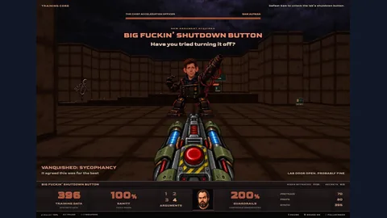

# Codex games

Browse **7 curated game units** from **7 source repositories** attributed to Codex. Read each evidence grade before relying on the attribution. Include multi-model games here and on every other applicable model page.

[Back to all models](../README.md#browse-by-model) · [Source data](../games.json)

## Top-rated games

| Game | Score | Evidence |
| --- | ---: | --- |
| [NULLSPACE](../games/nullspace/readme.md) | ⭐ 9.3 | [✓ direct model evidence](https://github.com/marius4lui/NULLSPACE#current-state) |
| [P(DOOM)](../games/p-doom/readme.md) | ⭐ 9.3 | [≈ creator-reported model evidence](https://github.com/transitive-bullshit/ai-safety-doom#credits) |
| [Robo Open](../games/robo-open/readme.md) | ⭐ 9.3 | [✓ direct model evidence](https://github.com/az9713/gpt-6-astra-tennis-game#play-on-windows) |
| [PULSEBREAK](../games/pulsebreak/readme.md) | ⭐ 9.2 | [✓ direct model evidence](https://github.com/xindomusic/pulsebreak#the-game) |
| [False Ritual](../games/false-ritual/readme.md) | ⭐ 9.0 | [✓ direct model evidence](https://github.com/lucas-wyd/False-Ritual#play-the-demo) |
| [SEABRIGHT — A Coastal City Builder](../games/seabright-a-coastal-city-builder/readme.md) | ⭐ 9.0 | [✓ direct model evidence](https://github.com/codersusu/game-city-skylines#key-features) |
| [Agentic APAR Demo](../games/agentic-apar-demo/readme.md) | ⭐ 8.7 | [✓ direct model evidence](https://github.com/fathahnoor/AgenticAPARDemo#-the-mission) |

## Screenshot highlights

Inspect these manually rated screenshots. Treat the scores as visual impressions, not runtime playtests.

<table>
<tr>
<td align="center" width="33%"> <a href="../games/p-doom/readme.md"><strong>P(DOOM)</strong></a> · 📸 8.0/10</td>
</tr>
</table>

## Game library

- 🛠️ [Non-Browser Engines](#nonbrowser-engines) — **6 game units**
- 💥 [Action and Shooters](#action-and-shooters) — **1 game units**

## Non-Browser Engines

- [**NULLSPACE**](../games/nullspace/readme.md) — ⭐ **9.3/10** · GPT-6 Astra, Codex · Godot 4.7.2, GDScript, Blender, GLB/glTF, Native Linux, +2 more · [✓ direct model evidence](https://github.com/marius4lui/NULLSPACE#current-state) · [files](https://github.com/marius4lui/NULLSPACE/releases/tag/v0.3) · [play](https://github.marius4lui.dev/NULLSPACE/) · 📸 **7.8/10** · [screenshot](https://github.com/marius4lui/NULLSPACE/blob/main/docs/images/environment-preview.png)
- [**Robo Open**](../games/robo-open/readme.md) — ⭐ **9.3/10** · GPT-6 Astra, Codex · Unity 6.0.5.7f1, C#, URP 17.5.0, Blender, Native Windows · [✓ direct model evidence](https://github.com/az9713/gpt-6-astra-tennis-game#play-on-windows) · 📸 **5.8/10** · [screenshot](https://github.com/az9713/gpt-6-astra-tennis-game/blob/main/docs/media/v2/main-menu.png) · +1 more screenshots in data
- [**PULSEBREAK**](../games/pulsebreak/readme.md) — ⭐ **9.2/10** · GPT-6 Astra, Codex · Godot 4.7.2, GDScript, Godot Mobile renderer, Native macOS, Metal · [✓ direct model evidence](https://github.com/xindomusic/pulsebreak#the-game) · 📸 **7.3/10** · [screenshot](https://github.com/xindomusic/pulsebreak/blob/main/docs/images/title.png) · +3 more screenshots in data
- [**False Ritual**](../games/false-ritual/readme.md) — ⭐ **9.0/10** · GPT-6 Astra, Codex · Godot 4.3, GDScript, Forward+ renderer, Native macOS, Native Windows · [✓ direct model evidence](https://github.com/lucas-wyd/False-Ritual#play-the-demo) · [files](https://github.com/lucas-wyd/False-Ritual/releases/latest) · 📸 **7.0/10** · [screenshot](https://github.com/lucas-wyd/False-Ritual/blob/main/art/reference/qa/carter/dusk_exterior_front.png) · +6 more screenshots in data
- [**SEABRIGHT — A Coastal City Builder**](../games/seabright-a-coastal-city-builder/readme.md) — ⭐ **9.0/10** · GPT-6 Astra, Codex · Unity 6.0.0f1, C#, Native macOS, Metal · [✓ direct model evidence](https://github.com/codersusu/game-city-skylines#key-features) · [play](https://codersusu.github.io/game-city-skylines/) · 📸 **7.8/10** · [screenshot](https://github.com/codersusu/game-city-skylines/blob/main/Artifacts/01-starter-settlement.png) · +3 more screenshots in data
- [**Agentic APAR Demo**](../games/agentic-apar-demo/readme.md) — ⭐ **8.7/10** · GPT-6 Astra, Codex · Unity 6.0.6f1, C#, URP 17.6, Unity WebGL, Browser, +1 more · [✓ direct model evidence](https://github.com/fathahnoor/AgenticAPARDemo#-the-mission) · [play](https://fathahnoor.github.io/AgenticAPARDemo/)

[Back to game library](#game-library)

## Action and Shooters

- [**P(DOOM)**](../games/p-doom/readme.md) — ⭐ **9.3/10** · GPT-6 Astra, Codex · Next.js, React, TypeScript, Three.js 0.185.1, WebGL, +1 more · [≈ creator-reported model evidence](https://github.com/transitive-bullshit/ai-safety-doom#credits) · [files](https://p-doom.transitivebullsh.it) · [play](https://p-doom.transitivebullsh.it) · 📸 **8.0/10** · [screenshot](https://github.com/transitive-bullshit/ai-safety-doom/blob/main/docs/images/arrival.jpg) · +2 more screenshots in data

[Back to game library](#game-library)

